# 后台管理系统权限设计

> 版本：8.0 | 更新：2026-06-11
> 范围：Vue 3 管理后台 + 审核 App + Gin API + PostgreSQL + Redis
> 状态：现有权限实现规格 + 审核 App 下一阶段建设方案
> 会议讲解：[权限方案会议讲解稿](./permission-review-guide.md)

---

## 目录

0. [评审摘要](#0-评审摘要)
1. [系统概述](#1-系统概述)
2. [数据库设计](#2-数据库设计)
3. [后端实现](#3-后端实现)
4. [前端实现](#4-前端实现)
5. [前后端接口契约](#5-前后端接口契约)
6. [新增权限模块手册](#6-新增权限模块手册)
7. [已知缺陷与上线检查](#7-已知缺陷与上线检查)
8. [审核 App 与后台管理系统一体化方案](#8-审核-app-与后台管理系统一体化方案)

---

## 0. 评审摘要

### 0.1 方案结论

本方案在现有 RBAC 模型上增加“权限节点可视化维护”，管理员可以在界面中新增、编辑、
启停、移动和删除目录、列表页、隐藏页、Tab、按钮权限，无需直接操作数据库。角色仍通过
勾选权限树完成授权，前端负责交互显隐，后端 API 负责最终鉴权。

本文 §0-§7 描述当前已经实现的 RBAC 权限体系，没有引入新的权限引擎、组织架构或通用
工作流，数据库权限主链仍保持“管理员 → 角色 → 权限节点”三层关系。§8 在该权限体系之上
增加审核中心、审核 App、可信设备和扫码登录方案；审核任务属于独立业务域，不塞入
`menus` 权限表。

| 问题 | 方案 | 结果 |
| --- | --- | --- |
| 新增权限依赖开发人员手工写数据库 | 提供权限节点管理界面和 CRUD API | 运行期可维护任意类型的权限节点 |
| 菜单、页面、Tab、按钮权限分散 | 统一存入 `menus` 树并使用稳定 key | 前后端使用同一权限契约 |
| 前端隐藏可能被绕过 | 每个业务 API 独立校验权限 key | 后端成为唯一安全边界 |
| 权限节点维护和账号重置可被重复执行 | 统一六格 2FA + 一次性 challenge + 防重放 | 节点写操作和账号重置具备二次确认 |
| 系统角色、权限树和事务可能被破坏 | 内置对象保护、祖先启用校验、事务和并发防环 | 保住系统可管理性和数据一致性 |

### 0.2 范围边界

**当前 RBAC 已交付：**

- 权限节点新增、编辑、删除、启停、移动和排序
- 目录、列表页、隐藏页、Tab、按钮五类节点
- 角色授权、祖先链补全、权限版本实时失效
- 前端菜单、路由、Tab、按钮显隐
- 后端 API 鉴权、系统对象保护、最后一个超级管理员保护
- 高风险操作统一 2FA、失败限流、challenge 防串用和 TOTP 防重放
- 权限验证中心、单元测试、集成测试和 E2E 验收

**审核 App 下一阶段建设范围：**

- App 与 Web 共用管理员账号、角色、权限、2FA 和审核任务
- 审核流程、任务、步骤、分配、动作流水和可靠结果通知
- Web 审核任务、流程配置、审核审计和 App 设备管理
- App 待办、详情、通过、驳回、转交、可选生物识别解锁和推送
- 后台生成本人一次性登录二维码，审核 App 扫码完成安全登录和设备绑定
- 已登录 App 扫码授权 Web 登录
- 设备级会话、单设备撤销、审核并发控制和业务审计

**仍不在范围：**

- 根据权限节点自动生成 Vue 页面、业务 API 或数据库表
- 行级/字段级数据权限、部门组织树、租户隔离
- 通用 BPMN 工作流引擎、权限申请审批流和临时授权
- 普通角色“可授予权限上限”；该项仍是下放角色管理能力前必须评审的 P1

因此，“可增加任意权限”指可以维护任意业务需要的权限节点和层级；业务页面、按钮和 API
仍需使用同一个权限 key 接入。这个边界既满足动态配置，也避免把权限系统扩展成代码生成器。

### 0.3 实施与验收依据

后续开发人员或 AI 必须以本文以下内容作为实现契约：

1. §1：权限类型、key 命名和安全原则
2. §2：表关系、事务边界和系统对象约束
3. §3-4：前后端落点和统一 2FA 组件
4. §5：API 路径、请求字段、权限 key、2FA action/target
5. §6：新增业务模块的完整步骤和代码模板
6. §7：剩余风险和上线回归基线
7. §8：审核 App、审核中心、扫码登录、设备会话和实施阶段

接口新增或修改必须遵守项目级规则：动态路径参数只能位于 URL 最后一个片段；列表、
筛选和分页优先使用 `POST` 请求体。实现与本文不一致时，应先核对并同步代码、测试和文档，
不能只修改其中一处。

### 0.4 会议决策点

权限部分已按当前实现核对。审核 App 评审还需确认以下事项：

1. 同意在现有 RBAC 上提供权限节点可视化维护，不建设新的权限引擎
2. 产品内置权限继续用迁移固化，运行期新增权限通过管理界面维护
3. 当前版本仅向可信管理员开放角色管理；向普通运营管理员下放前，先完成“可授予权限上限”P1
4. 审核 App 与 Web 后台共用账号、角色、权限和审核中心，不建设独立 App 账号库
5. App 快速登录以“后台本人生成短期票据 + 双端确认 + 设备密钥 + 一次性交换”为主，
   二维码不携带长期凭据
6. 审核结果、动作流水和结果 Outbox 在同一数据库事务中提交

权限部分满足前 3 项边界时可以上线；审核 App 按 §8 分阶段实施。如果本期就要向低权限账号
开放角色授权，则“可授予权限上限”P1 必须纳入本期，不能只依赖操作规范。

---

## 1. 系统概述

### 1.1 RBAC 三层结构

```
管理员账号 → 角色（并集）→ 权限节点（menus 树）
```

- 一个管理员可绑定多个角色，权限取并集
- 权限节点统一存入 `menus` 表，用 `type` 区分节点类型
- 前端根据权限控制导航和按钮可见性；后端对每个 API 独立鉴权

### 1.2 安全边界原则

1. 前端菜单隐藏、按钮隐藏、路由守卫只是体验层，**不是安全边界**
2. 后端权限校验才是**唯一安全边界**；静态权限优先使用 `RequireAnyPermission`，确需按请求内容分支时由 Handler 动态校验
3. 权限 key 全局唯一，前后端用同一个 key 对接；创建后不可修改

### 1.3 权限节点类型（`menus.type`）

| `type` | Go 常量 | 语义 | 侧边栏 | 路由 | 允许的父节点 |
| --- | --- | --- | --- | --- | --- |
| `1` | `MenuTypeDir` | 目录（不可点，如"系统管理"） | 是 | 否 | 根节点或目录 |
| `2` | `MenuTypePage` | 列表页（可点击，进侧边栏） | 是 | 是 | 目录 |
| `3` | `MenuTypeHidden` | 隐藏业务页（不进侧边栏，需独立授权） | 否 | 是 | 列表页 |
| `4` | `MenuTypeButton` | 按钮/操作（无路由） | 否 | 否 | 列表页或 Tab |
| `5` | `MenuTypeTab` | 页面内 Tab（可挂子 Tab 或按钮） | 否 | 前端本地注册 | 列表页或 Tab |

### 1.4 权限 key 命名规则

```
目录：          systemManage
列表页：        accountManage
隐藏页面：      accountManage-add
按钮：          accountManage-resetPassword
Tab：           accountManage-auditTab
Tab 内按钮：    accountManage-auditTab-approve
```

> 同一业务动作（如新增账号）的按钮、隐藏页入口和 API 权限统一用同一个 key（如 `accountManage-add`），避免入口可见但接口被拒。
>
> 权限 key 是代码与数据之间的稳定契约，节点创建后不可修改。业务确需更名时，应新增目标 key，迁移前端路由、按钮、Tab、后端鉴权和角色授权，验证完成后再停用或删除旧 key。

### 1.5 安全加固的必要性与最小化取舍

§0-§7 的权限安全加固只处理已经能通过接口、并发请求或事务故障复现的问题，不新增权限
引擎、不引入权限业务表，也不改变现有 RBAC 三层关系。§8 的审核中心属于后续独立业务域，
会按方案新增 `review_*`、设备和会话表。

| 已复现风险 | 最小实现 | 未采用方案及原因 |
| --- | --- | --- |
| 系统角色、系统权限节点可被破坏 | Service 层按稳定 key 保护内置对象；Repository 检查新增节点是否真实授权给 `superadmin` | 未新增 `is_system` 字段，避免为固定基线扩大数据库迁移和维护面 |
| 禁用父节点后子权限仍可通过后端校验 | 权限查询使用递归 CTE，只返回自身及全部祖先均启用的节点 | 未级联改写整棵子树状态，保留子节点原始配置，父节点重新启用后可恢复 |
| 并发执行 `A → B`、`B → A` 可形成循环 | 父级变更事务使用一个 PostgreSQL 事务级 advisory lock，拿锁后重新查环 | 未引入分布式锁；权限树写入低频，数据库锁已覆盖真实竞争点 |
| 同一 TOTP 可重复执行高风险操作 | 复用现有 `GoogleCode.vue`，Redis 保存短期 challenge、失败窗口和已用时间片，Lua 原子消费 | 未改变登录和首次绑定流程；仅高风险写操作增加一次性约束 |
| 角色或账号基本信息与关联关系可能只成功一半 | Repository 提供复合事务方法，Service 不再跨两次提交拼接 | 未引入通用 Unit of Work 抽象，当前只有两个明确复合写入场景 |

系统权限保护采用固定 key 白名单的前提是权限 key 创建后不可修改。该选择与现有前后端静态 key 契约一致，也比增加数据库标志位更小；新增新的内置系统权限时，必须同时更新种子迁移、后端保护白名单和本文档。

---

## 2. 数据库设计

### 2.1 表关系

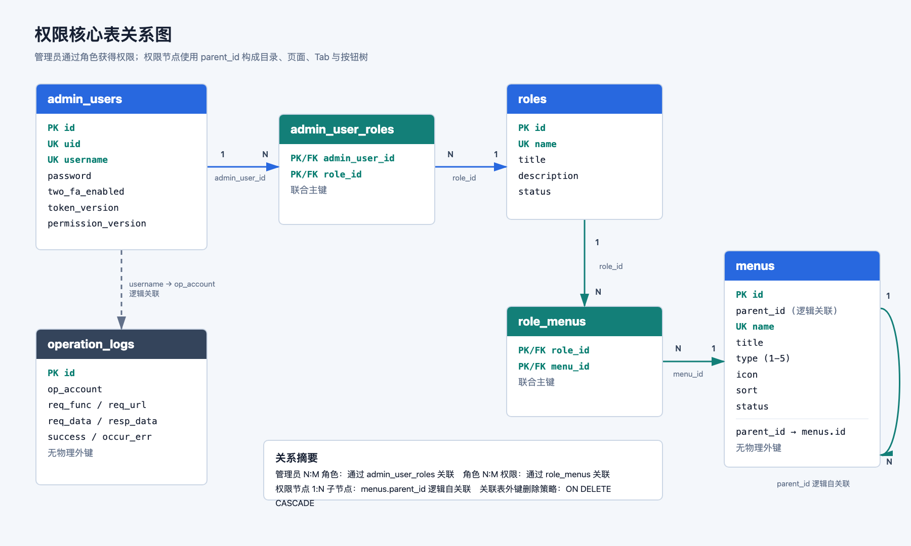

> PNG 关系图随文档版本化保存，可在 Markdown 预览和代码仓库中直接查看。

权限查询主链路：

```text
admin_users.id
  → admin_user_roles.admin_user_id
  → roles.id
  → role_menus.role_id
  → menus.id
```

| 关系 | 基数 | 说明 |
| --- | --- | --- |
| `admin_users → admin_user_roles` | `1:N` | 一个管理员可关联多个角色；当前 UI 暂时只配置单角色 |
| `roles → admin_user_roles` | `1:N` | 一个角色可分配给多个管理员 |
| `roles → role_menus` | `1:N` | 一个角色可拥有多个权限节点 |
| `menus → role_menus` | `1:N` | 一个权限节点可授予多个角色 |
| `menus → menus` | `1:N` | `parent_id` 自关联形成目录、页面、Tab、按钮树 |
| `admin_users → operation_logs` | 逻辑关联 | 通过账号名关联，不设置数据库外键，避免历史日志随账号删除 |

因此业务关系整体为：

```text
管理员 N:M 角色 N:M 权限节点
权限节点 1:N 子权限节点
```

### 2.2 `admin_users` — 管理员账号

**设计决策：**
- 对外用 `uid`（UUID），内部 SQL Join 用 `id`（自增整数），防止业务 ID 暴露内部规律
- `password` 存 bcrypt 哈希，序列化时 `json:"-"` 隐藏
- `token_version` 是 JWT 版本号，安全事件发生后递增，旧 token 立即失效，无需等待 JWT 过期
- `permission_version` 是前端权限缓存版本号，权限来源变化后递增，通知前端主动刷新菜单和页面子权限树

| 字段 | 类型 | 说明 |
| --- | --- | --- |
| `id` | `BIGINT PK` | 内部自增主键，仅用于 SQL join |
| `uid` | `VARCHAR(36) UNIQUE` | 对外稳定 ID（UUID） |
| `username` | `VARCHAR(64) UNIQUE` | 登录账号 |
| `real_name` | `VARCHAR(64)` | 真实姓名（迁移 010 新增） |
| `email` | `VARCHAR(255)` | 邮箱 |
| `phone` | `VARCHAR(32)` | 手机号 |
| `password` | `VARCHAR(255)` | bcrypt 哈希；`json:"-"` |
| `two_fa_enabled` | `BOOLEAN DEFAULT FALSE` | 是否已完成 2FA 绑定 |
| `two_fa_secret` | `VARCHAR(128) NULL` | TOTP 密钥；`json:"-"`；重置时清空 |
| `status` | `SMALLINT DEFAULT 1` | `1` 启用、`2` 禁用、`3` 冻结 |
| `token_version` | `INT DEFAULT 1` | JWT 版本，安全事件时递增 |
| `permission_version` | `BIGINT DEFAULT 1` | 前端权限缓存版本，权限来源变化时递增（迁移 011 新增） |

**`token_version` 递增时机：**

| 操作 | Repository 方法 | SQL 行为 |
| --- | --- | --- |
| 密码重置 | `UpdatePassword` | `token_version+1` |
| 2FA 绑定成功 | `EnableTwoFA` | `token_version+1` |
| 重置 2FA | `ResetTwoFA` | `token_version+1` |
| 状态变更 | `Update` | `CASE WHEN status <> $5 THEN token_version+1` |

**`permission_version` 主动失效机制：**

| 操作 | Repository 方法 | 影响范围 |
| --- | --- | --- |
| 管理员改绑角色 | `AdminUserRepository.SetRole` | 目标管理员 |
| 角色基本信息或状态变化 | `RoleRepository.Update` | 已绑定该角色的管理员 |
| 删除角色 | `RoleRepository.Delete` | 已绑定该角色的管理员 |
| 覆盖角色权限 | `RoleRepository.SetMenus` | 已绑定该角色的管理员 |
| 权限节点新增/编辑/删除/启停/移动 | `MenuRepository.runMutation` | 全部管理员 |

`AuthMiddleware` 会在每个鉴权响应中写入 `X-Permission-Version`。前端将最近一次版本存入 `sessionStorage`；发现响应版本变化时执行 `sidebarStore.refreshPermissions()`，重新加载导航树并清空页面子权限缓存。

跨域部署时，Gin CORS 配置必须将 `X-Permission-Version` 加入 `ExposeHeaders`，否则浏览器端 Axios 无法读取该响应头。复刻时需要同时落地：

1. `admin_users.permission_version` 字段和模型扫描
2. Repository 权限变更后的版本递增
3. `AuthMiddleware` 响应头
4. CORS `ExposeHeaders`
5. 前端 `sessionStorage` 版本记录和 Axios 响应拦截刷新

权限节点新增、编辑、删除、启停、移动由 `MenuRepository.runMutation` 在同一事务中完成
节点写入和全员权限版本递增，使所有在线管理员在后续鉴权响应中收到新版本。
通过迁移脚本直接写入 `menus` 或 `role_menus` 时不会经过 Service，因此迁移仍必须显式递增
`permission_version`。

### 2.3 `roles` — 角色

**设计决策：** `name` 是唯一角色标识，`title` 是展示名。新接口应分别提交这两个字段，
其中系统角色 `superadmin` 的 `name` 固定不变。当前前端兼容接口 `/roles/add-update`
会将 `roleName` 同时写入 `name` 和 `title`，因此业务代码不得依赖普通角色的 `name`；
后续移除兼容接口时再恢复标识与展示名分离。`status != 1` 的角色不参与权限计算。

`superadmin` 是系统角色：不可重命名、禁用、删除或覆盖权限集合。只有当前已启用的
`superadmin` 账号可以把该角色分配给其他账号；禁用账号或移除角色时，事务内必须保证
至少仍有一个启用账号绑定启用的 `superadmin` 角色。

| 字段 | 类型 | 说明 |
| --- | --- | --- |
| `id` | `BIGINT PK` | 主键 |
| `name` | `VARCHAR(64) UNIQUE` | 角色标识，如 `superadmin` |
| `title` | `VARCHAR(64)` | 展示名称，如 `超级管理员` |
| `description` | `VARCHAR(255)` | 备注 |
| `status` | `SMALLINT DEFAULT 1` | `1` 启用；其他值角色失效 |

### 2.4 `menus` — 权限节点

**设计决策：** 用一张表统一存储目录、菜单页、隐藏页、按钮、Tab，`parent_id=0` 表示根节点。`name` 即权限 key，全局唯一且创建后不可修改，前后端以此对接。不使用自关联外键，由 Service 校验父子合法性。

| 字段 | 类型 | 说明 |
| --- | --- | --- |
| `id` | `BIGINT PK` | 主键 |
| `parent_id` | `BIGINT DEFAULT 0` | `0` = 根节点 |
| `name` | `VARCHAR(128) UNIQUE` | 权限 key（全局唯一，创建后不可修改） |
| `title` | `VARCHAR(64)` | 展示标题或 i18n key |
| `type` | `SMALLINT CHECK(1-5)` | 节点类型，见 §1.3 |
| `icon` | `VARCHAR(64)` | 图标，主要用于目录和列表页 |
| `sort` | `INT DEFAULT 0` | 同级排序，越小越靠前 |
| `status` | `SMALLINT DEFAULT 1` | `1` 启用；节点及全部祖先均启用时才参与权限计算 |

**树操作说明：**
- **构建**：`model.BuildMenuTree()` 用 `nodeMap[id]` 一次遍历，O(n)
- **删除**：Repository 用递归 CTE 删除整个子树，外键级联清理 `role_menus`
- **启用链**：权限查询从启用根节点递归向下，只返回自身及全部祖先均启用的节点
- **并发移动**：父级变更事务使用固定 `pg_advisory_xact_lock` 串行化，拿锁后重新用递归 CTE 查环
- **保存角色权限时祖先链补全**：Service 自动补齐所有祖先。例如只提交 `accountManage-auditTab-approve`，后端会同时写入 `systemManage → accountManage → accountManage-auditTab → accountManage-auditTab-approve`

系统管理基线节点（`systemManage`、角色与权限、账号管理、操作日志及其系统操作子节点）
不可删除、禁用、移动或改变父级/类型。界面通过 `protected=true` 禁用对应操作，后端
Service 再次强制校验；展示名称、图标和排序仍可维护。

当前受保护 key 基线如下，必须与 `012_permission_seed.up.sql` 和
`menu_service.go` 的 `systemPermissionKeys` 保持一致：

```text
systemManage
operationLog
rolePermissions
rolePermissions-add
rolePermissions-view
rolePermissions-edit
rolePermissions-delete
rolePermissions-menuManage
accountManage
accountManage-add
accountManage-edit
accountManage-disable
accountManage-resetPassword
accountManage-reset2FA
```

### 2.5 关联表

**`admin_user_roles`：** 表结构支持多角色（联合主键），权限取并集。当前 `SetRole` 是先删后插单角色（UI 也只做单角色选择），与表结构存在不一致（见 §7.1 P2）。

| 字段 | 说明 |
| --- | --- |
| `admin_user_id` | PK, FK → `admin_users.id` ON DELETE CASCADE |
| `role_id` | PK, FK → `roles.id` ON DELETE CASCADE |

**`role_menus`：** `SetMenus` 在事务内先删后批量插入。角色新增/编辑页面使用
`CreateWithMenus` / `UpdateWithMenus`，角色基本信息与权限集合在同一事务提交。

**账号复合写入：** `CreateWithRole` / `UpdateWithRole` 将账号基本信息、状态和角色绑定
放在同一事务。超级管理员成员关系变更使用事务级 advisory lock，并在提交前检查最后一个
启用超级管理员。

| 字段 | 说明 |
| --- | --- |
| `role_id` | PK, FK → `roles.id` ON DELETE CASCADE |
| `menu_id` | PK, FK → `menus.id` ON DELETE CASCADE |

### 2.6 `operation_logs` — 操作日志

**设计决策：** 异步写入；中间件拦截所有鉴权路由；写入前递归脱敏 `password`、`token`、`secret`、`code`、`facode`、`otpauth_url`（替换为 `[REDACTED]`）；正文最多保留 4096 字节。

| 字段 | 类型 | 说明 |
| --- | --- | --- |
| `id` | `BIGINT PK` | 主键 |
| `op_account` | `VARCHAR(64)` | 操作账号 |
| `op_time` | `TIMESTAMPTZ` | 操作时间 |
| `ip` | `VARCHAR(64)` | 客户端 IP |
| `req_func` | `VARCHAR(128)` | Gin 路由模板（如 `/api/v1/admin/menus/:id`） |
| `req_url` | `VARCHAR(512)` | 实际请求 URL |
| `req_data` | `TEXT` | 已脱敏请求体 |
| `resp_data` | `TEXT` | 已脱敏响应体 |
| `req_method` | `VARCHAR(16)` | HTTP 方法 |
| `elapsed_time` | `BIGINT` | 耗时（毫秒） |
| `occur_err` | `BOOLEAN` | 是否发生错误 |
| `success` | `BOOLEAN` | HTTP 状态码 < 400 |

### 2.7 索引与约束

| 项目 | 作用 |
| --- | --- |
| `admin_users.uid UNIQUE` | 对外 ID 唯一 |
| `admin_users.username UNIQUE` | 登录账号唯一 |
| `roles.name UNIQUE` | 角色标识唯一 |
| `menus.name UNIQUE` | 权限 key 唯一 |
| `CHECK menus.type BETWEEN 1 AND 5` | 拒绝未定义节点类型 |
| `idx_menus_parent_id` | 加速权限树查询 |
| `idx_role_menus_role_id` | 加速按角色查权限 |
| `idx_role_menus_menu_id` | 加速按权限反查角色 |
| `idx_operation_logs_op_account` | 加速按账号查日志 |
| `idx_operation_logs_op_time` | 加速按时间倒序查日志 |

### 2.8 权限基线与验证数据迁移

| 迁移 | 用途 |
| --- | --- |
| `012_permission_seed` | 可重复创建 `superadmin`、系统管理目录、角色权限、账号管理和操作日志基础节点，完成超级管理员授权并递增权限版本 |
| `013_permission_lab` | 创建权限验证中心的 13 个目录、列表页、隐藏页、Tab 和按钮节点，用于组合权限验收 |

迁移使用 `ON CONFLICT` 保证重复执行不会产生重复 key。涉及 `menus` 或 `role_menus`
变化的迁移必须递增 `admin_users.permission_version`。

---

## 3. 后端实现

### 3.1 目录结构

```
backend/
├── cmd/server/main.go              # 程序入口，加载 .env，调用 app.Run
├── internal/
│   ├── app/app.go                  # 依赖装配 + 路由初始化 + 优雅退出
│   ├── config/
│   │   ├── config.go               # 从环境变量加载 Config 结构体
│   │   ├── db.go                   # 初始化 PostgreSQL 连接池
│   │   ├── redis.go                # 初始化 Redis 客户端
│   │   └── jwt.go                  # JWT 签发与解析（JWTManager）
│   ├── consts/
│   │   ├── code.go                 # 业务状态码（复用 HTTP 语义）
│   │   └── iv.go                   # IV 相关常量
│   ├── crypto/aes_gcm.go           # AES-GCM 加解密（密码传输）
│   ├── handler/
│   │   ├── handler.go              # Handler 结构体 + 路由注册（RegisterRoutes）
│   │   ├── me_handler.go           # GET /userInfo、GET /user/info
│   │   ├── menu_handler.go         # 菜单查询、权限节点新增/编辑/删除/启停/移动 + 2FA
│   │   ├── role_handler.go         # 角色 CRUD + 权限设置
│   │   ├── admin_user_handler.go   # 账号管理
│   │   ├── security_handler.go     # 当前操作者密码/2FA 安全校验
│   │   └── operation_log_handler.go# 操作日志查询
│   ├── middleware/
│   │   ├── auth_middleware.go      # AuthMiddleware + RequireAnyPermission
│   │   └── operation_log_middleware.go # 请求/响应自动记录
│   ├── model/                      # 数据结构（AdminUser / Menu / Role / OperationLog）
│   ├── repository/                 # SQL 与 Redis 操作封装，含 two_fa_repository.go
│   ├── response/response.go        # 统一响应包装 Success[T] / Error
│   └── service/
│       ├── interfaces.go           # UserStore / MenuStore / RoleStore 接口
│       ├── user_service.go         # 登录、2FA、账号 CRUD
│       ├── permission_service.go   # GetMyMenus / GetMyPagePermissions / HasAnyPermission
│       ├── menu_service.go         # 权限树查询、父子校验、维护和权限版本刷新
│       ├── role_service.go         # 角色 CRUD + SetMenus（含祖先链补全）
│       ├── iv_service.go           # AES-GCM IV 挑战值
│       └── operation_log_service.go# 操作日志查询
├── migrations/                     # *.up.sql / *.down.sql
├── .env.example
├── docker-compose.yml
└── go.mod                          # 模块名：auth-service
```

### 3.2 分层职责与依赖方向

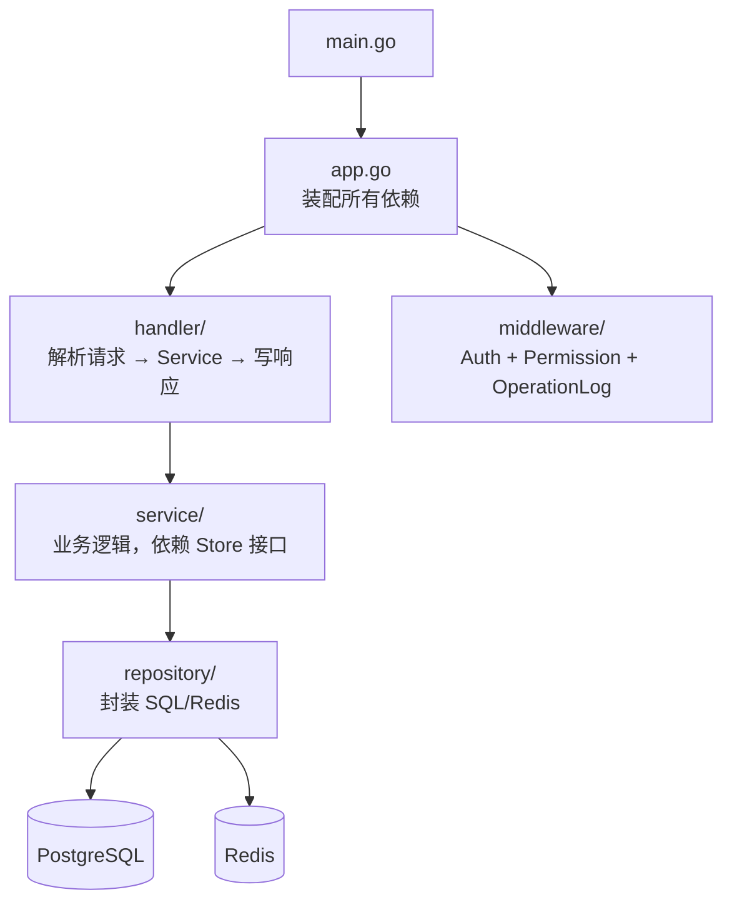

**核心原则：**
- 所有依赖通过构造函数注入，仅在 `app.go` 完成装配，无全局变量
- Service 只依赖 `interfaces.go` 定义的接口，不直接引用 Repository 类型
- Handler 只做翻译：请求解析 → 调用 Service → 写 HTTP 响应
- Repository 只写 SQL/Redis，不含业务逻辑

**`app.go` 装配顺序：**

```go
db          = config.OpenDB(ctx, cfg.DatabaseDSN)
redisClient = config.NewRedisClient(cfg)
jwtManager  = config.NewJWTManager(cfg.JWTSecret, cfg.JWTExpirePeriod)

// Repository
ivRepo      = repository.NewIVRepository(redisClient)
twoFARepo   = repository.NewTwoFARepository(redisClient, cfg.AppEnv)
userRepo    = repository.NewAdminUserRepository(db)
menuRepo    = repository.NewMenuRepository(db)
roleRepo    = repository.NewRoleRepository(db)
opLogRepo   = repository.NewOperationLogRepository(db)

// Service
ivService   = service.NewIVService(ivRepo)
userService = service.NewUserService(
    userRepo,
    roleRepo,
    ivService,
    twoFARepo,
    jwtManager,
    cfg.PasswordCryptoKey,
    cfg.AppName,
)
permService = service.NewPermissionService(roleRepo, menuRepo)
menuService = service.NewMenuService(menuRepo)
roleService = service.NewRoleService(roleRepo, menuRepo)
opLogService= service.NewOperationLogService(opLogRepo)

// Handler
h = handler.New(userService, ivService, permService, menuService, roleService, opLogService, jwtManager)
handler.RegisterRoutes(router, h, middleware.OperationLogMiddleware(opLogRepo))
```

### 3.3 环境变量

| 变量 | 必填 | 默认值 | 说明 |
| --- | --- | --- | --- |
| `DATABASE_DSN` | **是** | 无 | PostgreSQL 连接串 |
| `JWT_SECRET` | 生产必填 | `dev-secret-change-me` | HS256 签名密钥 |
| `PASSWORD_CRYPTO_KEY` | 生产必填 | `dev-password-crypto-key` | AES-GCM 密钥原文，服务端经 SHA-256 派生为 32 字节密钥 |
| `REDIS_ADDR` | 否 | `127.0.0.1:6379` | Redis 地址 |
| `REDIS_PASSWORD` | 否 | 空 | Redis 密码 |
| `REDIS_DB` | 否 | `0` | Redis DB 编号 |
| `JWT_EXPIRE` | 否 | `24h` | JWT 有效期 |
| `HTTP_ADDR` | 否 | `:8800` | HTTP 监听地址 |
| `APP_ENV` | 否 | `development` | `production` 时启用 ReleaseMode，禁止默认密钥 |
| `APP_NAME` | 否 | `Auth Service` | 2FA TOTP 发行方名称 |
| `CORS_ORIGINS` | 否 | `http://localhost:60001` | 允许跨域来源（逗号分隔） |
| `SEED_USERNAME` / `SEED_PASSWORD` | 否 | 空 | 开发环境种子用户 |

### 3.4 统一响应格式与错误码

所有接口统一返回（`internal/response/response.go`）：

```json
{ "code": 200, "msg": "请求成功", "data": { ... } }
```

- `code` 与 HTTP 状态码一致，错误时 `data` 为 `null`

| `code` | 语义 | 前端行为 |
| --- | --- | --- |
| `200` | 成功 | 返回 `data` 字段 |
| `400` | 参数错误或凭据校验失败 | 弹出 `msg` |
| `401` | 未登录或 token 失效 | 清除 token → 跳转 `/login` |
| `403` | 权限不足 | 弹出 `msg`（特例：`403 + msg="请先完成 2FA 绑定"` → 跳转登录） |
| `404` | 资源不存在 | 弹出 `msg` |
| `409` | 数据冲突（如用户名重复） | 弹出 `msg` |
| `500` | 服务内部错误 | 弹出 `msg` |

### 3.5 登录与 2FA 流程

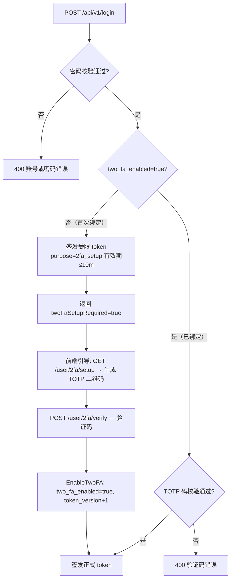

**JWT Payload（`internal/config/jwt.go`）：**

```json
{
  "uid": "管理员 UID",
  "username": "登录账号",
  "token_version": 1,
  "purpose": "(可选) 2fa_setup",
  "iat": 1717286400,
  "exp": 1717372800
}
```

两类 token：

| 类型 | 签发场景 | `purpose` | 可访问范围 |
| --- | --- | --- | --- |
| 正式 token | 2FA 验证通过 | 空 | 全部鉴权路由 |
| 受限 token | 未绑定 2FA 的首次登录 | `2fa_setup` | 仅 2FA 设置相关接口 |

> **为何不把权限列表写入 JWT：** 避免角色变更后旧 token 带有失效权限。每次请求实时从数据库查询权限，`token_version` 保证安全事件后立即吊销。

### 3.6 鉴权中间件链

两个中间件在 `RegisterRoutes` 中按序叠加，文件均在 `internal/middleware/auth_middleware.go`。

#### `AuthMiddleware`（JWT 校验）

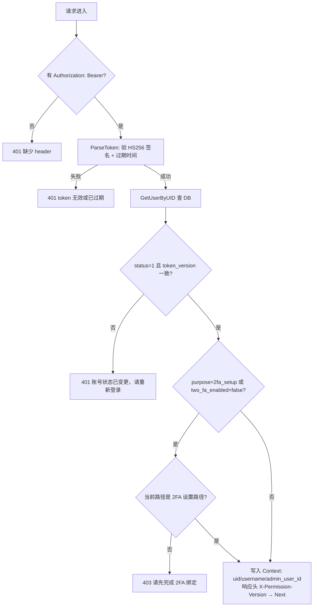

#### `RequireAnyPermission`（权限校验）

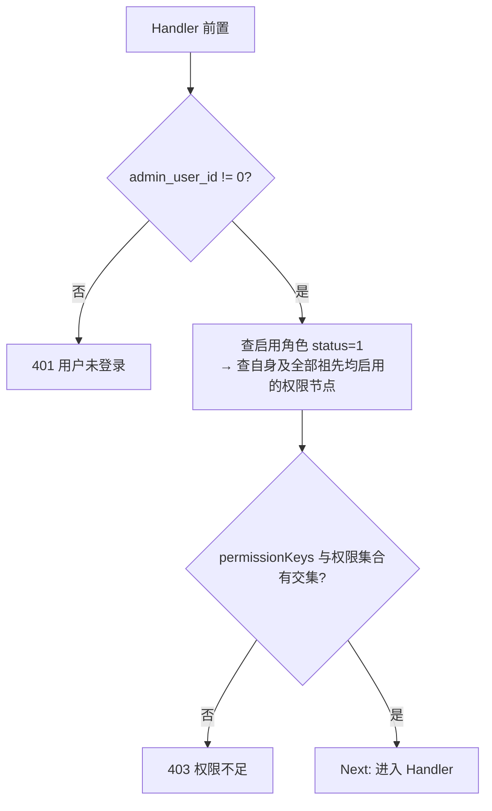

路由注册示例（`internal/handler/handler.go`）：

```go
// 单一权限
r.POST("/roles", RequireAnyPermission(permSvc, "rolePermissions-add"))

// 多选一（view 或 edit 任意一个均可访问）
r.GET("/roles/info/:id", RequireAnyPermission(permSvc, "rolePermissions-view", "rolePermissions-edit"))
```

### 3.7 权限计算逻辑（`permission_service.go`）

```
admin_user_id
  → roles.GetByAdminUserID: 查启用角色（AND r.status=1）
  → menus.GetByRoleIDs: 从启用根节点递归向下，只保留自身及全部祖先均启用的关联节点
  → HasAnyPermission: menu.Name 集合与 permissionKeys 是否有交集
```

- `GetMyMenus`：只返回 type=1/2，用于侧边栏导航树
- `GetMyPagePermissions(pageKey)`：返回 type≥3 的子树，根节点 `parentId` 重置为 0

### 3.8 角色权限保存（祖先链补全）


示例：前端只勾选 `accountManage-auditTab-approve`，后端自动写入：
```
systemManage → accountManage → accountManage-auditTab → accountManage-auditTab-approve
```

**菜单节点类型校验（新增/编辑时）：**
- 目录只能挂在根节点或目录
- 列表页只能挂在目录
- 隐藏页面只能挂在列表页
- 按钮/Tab 只能挂在列表页或 Tab
- 不允许循环父链或将自身/后代设为父节点

Service 的首次校验用于快速反馈；Repository 在父级更新事务中获取菜单树 advisory lock 后
再次查环，避免两个管理员并发执行 `A → B`、`B → A` 时同时通过校验。

### 3.9 权限节点可视化维护

权限节点不再要求开发人员直接修改数据库。拥有 `rolePermissions-menuManage` 的管理员可以在角色权限页中打开“管理权限节点”，完成以下操作：

| 操作 | 后端行为 | 附加规则 |
| --- | --- | --- |
| 新增 | 校验父子类型和 `status` 后写入 `menus` | 自动授予 `superadmin`；显式传 `0` 可创建为禁用，未传时兼容默认启用 |
| 编辑 | 更新父级、标题、类型、图标、排序、状态 | 权限 key 创建后不可修改；类型变更不得破坏已有子节点 |
| 删除 | 删除当前节点或整棵子树 | 有子节点且 `cascade=false` 时拒绝 |
| 启用/禁用 | 更新 `status` | 停用父节点后整棵子树立即不参与权限计算 |
| 移动/排序 | 更新 `parent_id` 和 `sort` | 禁止移动到自身或后代 |

所有写操作必须同时满足：

1. 当前账号拥有 `rolePermissions-menuManage`
2. 当前账号已绑定 2FA
3. 通用弹窗先申请绑定当前账号、动作和目标的一次性 `fa_challenge_id`
4. 请求体同时携带 6 位 TOTP 验证码 `facode` 和 `fa_challenge_id`
5. `UserService.ValidateCurrentTwoFA` 校验 challenge、失败窗口、TOTP 和防重放标记后才允许写库
6. 同一账号同一 30 秒 TOTP 时间片只能执行一次高风险操作
7. 10 分钟内连续失败 5 次返回 `429`，窗口到期后自动恢复
8. 权限节点写入、超级管理员授权和权限版本递增在同一数据库事务内完成
9. 若 `superadmin` 角色不存在，事务整体回滚并返回服务端配置错误，不允许出现“节点创建成功但零行授权”

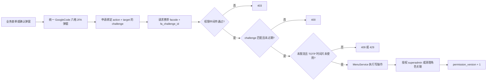

> `facode` 和 `fa_challenge_id` 是敏感字段，操作日志中会被统一替换为 `[REDACTED]`。

---

## 4. 前端实现

### 4.1 目录结构与模块职责

```
frontend/src/
├── routes/permissionRoutes.ts        # 所有受权限控制的路由声明
├── setup/router-setup.ts             # beforeEach 守卫
├── store/sideBar.ts                  # 权限核心状态（Pinia Store）
├── api/sys/role.ts                   # 权限相关 API 封装
├── plugins/http.ts                   # Axios 请求/响应拦截器
├── components/GoogleCode.vue         # 通用六格 2FA 验证弹窗
├── use/
│   ├── useButtonRole.ts              # 普通页面按钮权限 hook
│   └── useTabsRole.ts                # Tab 和 Tab 内按钮权限 hook
├── components/TableSearchWrap/
│   └── components/PermissionButton.vue # 列表页工具栏按钮鉴权组件
└── views/SystemManage/role-permissions/modal/
    ├── PermissionNodeManagerDrawer.vue # 权限树管理、搜索、筛选和节点操作
    └── PermissionNodeFormDrawer.vue    # 权限节点新增/编辑表单
```

### 4.2 `sideBar` Store — 核心权限状态

文件：`src/store/sideBar.ts`

**所有权限判断收口到 `sidebarStore.hasPermission(key)`，组件/hook 只负责拼装 key。**

**状态字段：**

| 字段 | 类型 | 写入时机 | 用途 |
| --- | --- | --- | --- |
| `roleMenu` | `MenuItem[]` | `fetchSidebarRoutes` 完成后 | 侧边栏渲染源；拍平提供 type=1/2 权限 key |
| `pagePermissionTrees` | `Record<string, MenuItem[]>` | `fetchPagePermissions(pageKey)` 首次进入该页面时 | 按父页面缓存 type=3/4/5 子树 |
| `routes` | `RouteRecordRaw[]` | `fetchSidebarRoutes` 完成后 | 注入 Vue Router 的动态路由 |
| `permissionKeySet` | `computed Set<string>` | 响应上述两个 ref 变化 | 所有 `hasPermission` 的数据源 |
| `hasFetchedRoleMenu` | `boolean` | `fetchSidebarRoutes` 完成后置 true | 守卫判断是否需要触发导航树加载 |

**数据流向：**

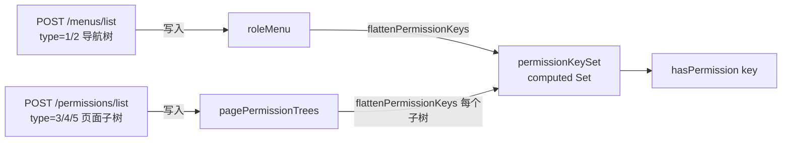

`flattenPermissionKeys` 递归遍历节点，取 `item.component || item.name` 作为权限 key。

**生命周期：**

```
登录成功
  → 首次访问受保护页面 → fetchSidebarRoutes → roleMenu / routes 填充
  → 进入列表页或隐藏页 → fetchPagePermissions → pagePermissionTrees 填充

登出 / token 失效 / 刷新侧边栏
  → resetPermissions() → 全部清空

任意鉴权响应返回新的 X-Permission-Version
  → http.ts 检测到版本变化 → refreshPermissions()
  → 重新加载导航树 + 清空页面子权限缓存
```

**并发保护：** 同一 `pageKey` 只有一个 in-flight 请求（`fetchPagePromises Map`）。

### 4.3 路由守卫（`beforeEach`）

文件：`src/setup/router-setup.ts`

`beforeEach` 并行执行 4 个 handler：`setLanguage`、`setTitle`、`setRequiresAuth`（核心）、`setRedirect`。

**`setRequiresAuth` 完整流程：**

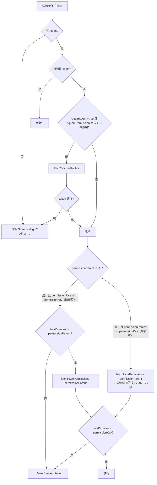

> 列表页（type=2）在代码里 `permissionParent` 等于 `permissionKey`，守卫也会调用 `fetchPagePermissions` 加载按钮/Tab 权限，但不需要额外校验父页面权限（因为是同一个 key）。

### 4.4 路由 meta 字段约定

```ts
interface RouteMeta {
    requiresAuth?: boolean        // true = 必须登录
    ignorePermission?: boolean    // true = 跳过权限校验（首页等公共页面）
    permissionKey?: string        // 对应 menus.name；缺省时取 route.name
    permissionParent?: string     // 隐藏页面的父列表页 key（type=3 路由必填）
}
```

### 4.5 按钮与 Tab 权限

所有路径最终收口到 `sidebarStore.hasPermission(key)`：

**列表页工具栏按钮（`PermissionButton.vue`）：**

```html
<PermissionButton button-key="add">新增</PermissionButton>
```

`PermissionButton` 默认按 `${route.name}-${buttonKey}` 拼出完整权限 key。

**普通页面按钮（`useButtonRole.ts`）：**

```ts
const { isShowBtn } = useButtonRole()
isShowBtn('resetPassword')      // → hasPermission('accountManage-resetPassword')
isShowBtn('edit', 'otherPage')  // → hasPermission('otherPage-edit')
```

> 自动拼接 `${route.name}-${btnRole}`，跨模块时传第二个参数覆盖 routeName。

**Tab 和 Tab 内按钮（`useTabsRole.ts`）：**

```ts
const { fetchShowTabs, isShowTabsBtn } = useTabsRole(tabs, defaultKey)
// fetchShowTabs: 过滤出 hasPermission(item.role) 为 true 的 Tab
// isShowTabsBtn: 直接传完整 key，如 'accountManage-auditTab-approve'
```

支持任意深度嵌套：`列表页(type=2) → Tab(type=5) → 子Tab(type=5) → 按钮(type=4)`

### 4.6 HTTP 拦截器（`src/plugins/http.ts`）

**请求拦截（自动附加）：**

| Header | 值 |
| --- | --- |
| `Authorization` | `Bearer <token>` |
| `Token` | `<token>`（兼容旧字段） |
| `pretreatment` | `true` |
| `X-B3-Traceid` | 随机 trace ID |
| `language` | 当前 i18n 语言 |

**响应拦截逻辑：**

```
每次鉴权响应:
  X-Permission-Version 变化 → refreshPermissions()，重新加载导航树和页面子权限

pretreatment=true（默认）:
  code [-1, 10005, 10021] → 跳转登录（兼容旧业务码）
  code 200               → 返回 data 字段（调用方直接拿业务数据）
  其他 code              → Message.error(msg)，Promise.reject

HTTP 错误:
  401                           → 清除 token + 跳转登录
  403 + "请先完成 2FA 绑定"    → 清除 token + 跳转登录
  403（其他）                  → 弹出 msg，不跳转
  其他                         → 弹出 msg，Promise.reject
```

**API 类约定：** 所有 API 类继承 `Api` 基类，`this.api` 已配置 `baseURL = VITE_APP_BASE_URL`（对应 `/api/v1`），方法路径不含版本前缀。

### 4.7 权限节点管理 UI 与统一 2FA

角色权限新增/编辑页只有在非查看模式并拥有 `rolePermissions-menuManage` 时显示“管理权限节点”入口。

管理 Drawer 提供：

- 完整权限树、名称/key 搜索和类型筛选
- 新增根节点、新增子节点、编辑节点
- 启用、禁用、移动排序、删除和级联删除
- 节点详情、完整父链、子节点数量和当前状态
- 操作成功后同步刷新管理树、角色授权树和侧边栏权限缓存

节点表单字段：

| 字段 | 规则 |
| --- | --- |
| 父级权限 | 根据目标类型禁用不合法父节点；编辑时禁止选择自身和后代 |
| 权限类型 | `1` 目录、`2` 列表页、`3` 隐藏页、`4` 按钮、`5` Tab |
| 权限名称 | 面向管理员的展示文本 |
| 权限 key | 新增时填写；以字母开头，只允许字母、数字和中划线，全局唯一；编辑时只读 |
| 图标 | 主要用于目录和列表页 |
| 排序 | 同级越小越靠前 |
| 状态 | `1` 启用、其他值停用 |

所有 2FA 输入统一复用 `src/components/GoogleCode.vue`：

1. 先完成业务字段校验
2. 删除、启停、移动等操作先完成业务确认
3. 再打开独立的六格验证码弹窗
4. `GoogleCode.vue` 根据 `action`、`target` 自动申请一次性 challenge
5. `@set-code` 返回完整验证码和 challenge ID 后发起请求
6. 请求进行中禁止重复提交，成功后关闭弹窗

禁止在业务 Form、Modal 或 Drawer 内直接增加普通 `facode` 输入框。

---

## 5. 前后端接口契约

### 5.1 权限 key 与路由对照（当前已注册）

> 列表页（type=2）的 `permissionParent` 在代码里写等于自身的 key，守卫会调用 `fetchPagePermissions(permissionParent)` 加载该页面的按钮/Tab 子权限。隐藏页（type=3）的 `permissionParent` 填父列表页 key，守卫还会额外检查父列表页权限。

| 路由 path | `route.name` | `permissionKey` | `permissionParent` | type |
| --- | --- | --- | --- | --- |
| `/systemManage/operationLog` | `operationLog` | `operationLog` | `operationLog`（自身） | 2 |
| `/systemManage/rolePermissions` | `rolePermissions` | `rolePermissions` | `rolePermissions`（自身） | 2 |
| `/systemManage/addRolePermissions` | `addRolePermissions` | `rolePermissions-add` | `rolePermissions` | 3 |
| `/systemManage/viewRolePermissions/:id/:see` | `viewRolePermissions` | `rolePermissions-view` | `rolePermissions` | 3 |
| `/systemManage/editRolePermissions/:id` | `editRolePermissions` | `rolePermissions-edit` | `rolePermissions` | 3 |
| `/systemManage/accountManage` | `accountManage` | `accountManage` | `accountManage`（自身） | 2 |
| `/systemManage/addAccount` | `addAccount` | `accountManage-add` | `accountManage` | 3 |
| `/systemManage/editAccount/:id` | `editAccount` | `accountManage-edit` | `accountManage` | 3 |
| `/permissionLab/orders` | `permissionLabOrders` | `permissionLabOrders` | `permissionLabOrders`（自身） | 2 |
| `/permissionLab/orderDetail/:id` | `permissionLabOrderDetail` | `permissionLabOrders-detail` | `permissionLabOrders` | 3 |

### 5.2 API 权限矩阵

| 接口 | 中间件 | 所需权限 key |
| --- | --- | --- |
| `POST /api/v1/login` | 无 | 公开 |
| `GET /api/v1/security/iv` | 无 | 公开 |
| `GET /api/v1/userInfo`、`GET /api/v1/user/info` | Auth | 登录态；前者为兼容路径 |
| `POST /api/v1/menus/list` | Auth | 登录态 |
| `POST /api/v1/permissions/list` | Auth | 登录态 |
| `POST /api/v1/security/2fa/challenges` | Auth | 登录态；仅允许服务端白名单中的 action |
| `POST /api/v1/user/password` | Auth + 当前密码 + 当前操作者 2FA | 修改当前账号密码 |
| `POST /api/v1/user/password/check` | Auth + 当前密码 | 当前账号密码校验 |
| `POST /api/v1/user/password/2fa/check` | Auth + 当前密码 + 当前操作者 2FA | 当前账号敏感操作前置校验 |
| `GET /api/v1/user/2fa/setup` | Auth | 登录态（含受限 token） |
| `POST /api/v1/user/2fa/replace/setup` | Auth + 当前密码 + 当前操作者 2FA | 替换当前账号 2FA |
| `POST /api/v1/user/2fa/verify` | Auth | 登录态（含受限 token） |
| `POST /api/v1/admin/menus/list` | Auth + Permission | `rolePermissions-add/view/edit/menuManage` 任一 |
| `POST /api/v1/admin/menus` | Auth + Permission | `rolePermissions-menuManage` |
| `PUT /api/v1/admin/menus/:id` | Auth + Permission | `rolePermissions-menuManage` |
| `DELETE /api/v1/admin/menus/:id` | Auth + Permission | `rolePermissions-menuManage` |
| `POST /api/v1/admin/menus/status/:id` | Auth + Permission | `rolePermissions-menuManage` |
| `POST /api/v1/admin/menus/move/:id` | Auth + Permission | `rolePermissions-menuManage` |
| `POST /api/v1/roles/list` | Auth + Permission | `rolePermissions` 或 `accountManage` |
| `POST /api/v1/roles` | Auth + Permission | `rolePermissions-add` |
| `PUT /api/v1/roles/:id` | Auth + Permission | `rolePermissions-edit` |
| `DELETE /api/v1/roles/:id` | Auth + Permission | `rolePermissions-delete` |
| `GET /api/v1/roles/info/:id` | Auth + Permission | `rolePermissions-view/edit` 任一 |
| `GET /api/v1/roles/menus/:id` | Auth + Permission | `rolePermissions-view/edit` 任一 |
| `PUT /api/v1/roles/menus/:id` | Auth + Permission | `rolePermissions-edit` |
| `POST /api/v1/roles/add-update` | Auth + Handler 动态权限 | 新增校验 `rolePermissions-add`；编辑校验 `rolePermissions-edit` |
| `POST /api/v1/admin-users/list` | Auth + Permission | `accountManage` |
| `GET /api/v1/admin-users/detail/:userId` | Auth + Permission | `accountManage-edit` |
| `GET /api/v1/admin-users/detail?userId=...`（兼容） | Auth + Permission | `accountManage-edit` |
| `POST /api/v1/admin-users` | Auth + Handler 动态权限 | 新增/编辑/状态切换按请求内容校验（见 §5.3） |
| `POST /api/v1/admin-users/reset-password` | Auth + Permission + 当前操作者 2FA | `accountManage-resetPassword` |
| `POST /api/v1/admin-users/reset-2fa` | Auth + Permission + 当前操作者 2FA | `accountManage-reset2FA` |
| `POST /api/v1/operation-logs/list` | Auth + Permission | `operationLog` |
| `POST /api/v1/users`（兼容旧接口） | Auth + Permission | `accountManage-add` |
| `POST /api/v1/users/list`（兼容旧接口） | Auth + Permission | `accountManage` |

> `/roles/add-update` 和 `/admin-users` 因一个接口承载多种动作，权限校验在 Handler 内通过
> `ensureAnyPermission` 按请求内容动态完成，并非仅登录即可访问。新接口如果动作和权限固定，
> 应优先在路由层使用 `RequireAnyPermission`。

> 权限节点写操作、管理员重置密码和重置 2FA 除上表权限外，还必须先调用
> `POST /api/v1/security/2fa/challenges`，再在请求体中提交 `facode` 和
> `fa_challenge_id`。动态路径参数均位于 URL 最后一个片段。

### 5.3 接口 Request / Response 完整示例

> 响应拦截器自动解包，下面展示的是 `data` 字段内容（`code=200` 时）。

---

#### `POST /api/v1/login`

Request:
```json
{
  "username": "admin",
  "password": "<AES-GCM 加密后的密码>",
  "iv_id": "<GET /security/iv 返回的 iv_id>",
  "two_fa_code": "123456"
}
```

> 新客户端必须先请求 IV 挑战值并提交 `iv_id`。后端暂时兼容不传 `iv_id` 的旧客户端明文或遗留全局 IV 流程，见 §7.1 P1。

Response — 首次登录，未绑定 2FA:
```json
{
  "token": "<受限 JWT，purpose=2fa_setup>",
  "twoFaSetupRequired": true,
  "user": { "uid": "...", "username": "admin", "two_fa_enabled": false, "status": 1 }
}
```

Response — 已绑定 2FA，需要输入验证码:
```json
{ "twoFaRequired": true }
```

Response — 验证码正确，登录成功:
```json
{
  "token": "<正式 JWT>",
  "twoFaRequired": false,
  "user": { "uid": "...", "username": "admin", ... }
}
```

---

#### `GET /api/v1/security/iv`

Response:
```json
{ "iv_id": "uuid-string", "iv": "<12 字节随机 IV 的十六进制字符串>" }
```

---

#### `POST /api/v1/menus/list` — 当前用户导航树（type=1/2）

Request: `{}`

Response（树形）:
```json
[
  {
    "id": 1, "parent_id": 0, "name": "systemManage", "title": "系统管理", "type": 1,
    "children": [
      { "id": 2, "parent_id": 1, "name": "accountManage", "component": "accountManage",
        "title": "账号管理", "type": 2, "children": null }
    ]
  }
]
```

> 前端 `sysRoleApi.menuList()` 经 `normalizeMenuItem` 处理，保证 `name` 和 `component` 均有值，对应前端路由 `name` 即权限 key。

---

#### `POST /api/v1/permissions/list` — 页面子权限树（type=3/4/5）

Request:
```json
{ "parentKey": "accountManage" }
```

Response（根节点 `parentId` 重置为 0）:
```json
[
  { "id": 10, "parent_id": 0, "name": "accountManage-add",           "title": "新增",   "type": 3, "component": "accountManage-add" },
  { "id": 11, "parent_id": 0, "name": "accountManage-edit",          "title": "编辑",   "type": 3, "component": "accountManage-edit" },
  { "id": 12, "parent_id": 0, "name": "accountManage-resetPassword", "title": "重置密码","type": 4, "component": "accountManage-resetPassword" }
]
```

---

#### `POST /api/v1/admin-users/list`

Request:
```json
{ "account": "", "realName": "", "pageNo": 1, "pageSize": 20 }
```

Response:
```json
{
  "list": [
    {
      "userId": "uid-string", "account": "admin", "realName": "管理员",
      "roleId": "1", "roleName": "超级管理员",
      "state": 1, "lastLoginTime": "2026-06-02 10:00:00", "isFACode": 1
    }
  ],
  "total": 1
}
```

> `state`: `1` 启用、`2` 禁用、`3` 冻结；`isFACode`: `1` 已绑定 2FA、`0` 未绑定

---

#### `POST /api/v1/admin-users` — 新增 / 编辑 / 状态切换（共用接口）

**权限分支逻辑（Handler 内 `ensureAnyPermission` 动态校验）：**
- `id==""` → 新增，需要 `accountManage-add`
- `id` 非空 + 有实质字段 → 编辑，需要 `accountManage-edit`
- `id` 非空 + 只有 `state` → 状态切换，需要 `accountManage-disable`

Request（新增）:
```json
{ "id": "", "account": "newuser", "fullName": "新用户", "roleId": "2", "state": 1 }
```

Request（编辑）:
```json
{ "id": "uid-string", "account": "newuser", "fullName": "修改后", "roleId": "2", "state": 1 }
```

Request（仅状态切换）:
```json
{ "id": "uid-string", "state": 2 }
```

Response: `{}`

---

#### `GET /api/v1/admin-users/detail/:userId`

Response:
```json
{ "userId": "uid-string", "account": "admin", "fullName": "管理员", "roleId": "1", "roleName": "超级管理员", "state": 1 }
```

---

#### `POST /api/v1/admin-users/reset-password`

Request:
```json
{
  "userId": "uid-string",
  "password": "<使用当前操作者 UID 和一次性 IV 加密后的新密码>",
  "iv_id": "<GET /security/iv 返回的 iv_id>",
  "facode": "123456",
  "fa_challenge_id": "uuid",
  "type": 1
}
```

Response: `{}`

> 先按 `admin.password.reset`、`user:<目标UID>` 申请 challenge。后端校验当前操作者的
> `facode` 和 challenge 后，再使用当前操作者 UID 和 `iv_id` 解密新密码，最后写入目标管理员的 bcrypt 密码哈希。

---

#### `POST /api/v1/admin-users/reset-2fa`

Request:
```json
{ "userId": "uid-string", "facode": "123456", "fa_challenge_id": "uuid" }
```

Response: `{}`

> 先按 `admin.2fa.reset`、`user:<目标UID>` 申请 challenge。重置 2FA 不要求额外密码字段；
> 后端校验当前操作者的 `facode` 和 challenge 后才重置目标管理员的 2FA。

---

#### `POST /api/v1/roles/list`

Request: `{}`

Response:
```json
{
  "roles": [
    { "id": 1, "name": "superadmin", "title": "超级管理员", "description": "", "status": 1 }
  ]
}
```

> 前端 `sysRoleApi.sysRoleList()` 将其转换为 `{ roleId: "1", roleName: "超级管理员" }` 供下拉使用。

---

#### `POST /api/v1/roles/add-update` — 新增 / 编辑角色

Request（新增，`roleId` 为空）:
```json
{
  "roleId": "", "roleName": "运营角色", "remark": "只读操作日志", "state": 1,
  "menuIdList": [{ "menuId": 1 }, { "menuId": 3 }]
}
```

Request（编辑，`roleId` 非空）:
```json
{
  "roleId": "2", "roleName": "运营角色", "remark": "修改后", "state": 1,
  "menuIdList": [{ "menuId": 1 }, { "menuId": 3 }, { "menuId": 7 }]
}
```

Response: `{}`

---

#### `GET /api/v1/roles/info/:id`

Response:
```json
{ "roleId": "2", "roleName": "运营角色", "remark": "只读操作日志", "state": 1 }
```

---

#### `GET /api/v1/roles/menus/:id`

Response:
```json
{ "menu_ids": [1, 3, 7] }
```

---

#### `POST /api/v1/admin/menus/list` — 完整权限树（角色配置用）

Request: `{}`

Response（树形，含全部 type）:
```json
[
  {
    "id": 1, "parent_id": 0, "name": "systemManage", "title": "系统管理", "type": 1,
    "children": [
      {
        "id": 2, "parent_id": 1, "name": "accountManage", "title": "账号管理", "type": 2,
        "children": [
          { "id": 10, "parent_id": 2, "name": "accountManage-add",           "title": "新增",   "type": 3 },
          { "id": 12, "parent_id": 2, "name": "accountManage-resetPassword", "title": "重置密码","type": 4 }
        ]
      }
    ]
  }
]
```

> 前端 `sysRoleApi.sysRoleMenuList()` 转换为 `{ menuId, menuName, parentId, type, children }` 供勾选树组件使用。

---

#### 高风险操作 2FA 契约

所有高风险操作先申请 challenge，再提交 6 位 `facode` 和返回的
`fa_challenge_id`。challenge 有效期为 120 秒，并绑定当前账号、action 和 target。

| 场景 | action | target 格式 |
| --- | --- | --- |
| 新增权限节点 | `permission.menu.create` | `parent:<父ID>:key:<权限key>` |
| 编辑权限节点 | `permission.menu.update` | `menu:<节点ID>` |
| 删除权限节点 | `permission.menu.delete` | `menu:<节点ID>` |
| 启停权限节点 | `permission.menu.status` | `menu:<节点ID>` |
| 移动权限节点 | `permission.menu.move` | `menu:<节点ID>` |
| 重置管理员密码 | `admin.password.reset` | `user:<目标UID>` |
| 重置管理员 2FA | `admin.2fa.reset` | `user:<目标UID>` |
| 修改当前账号密码 | `security.password.update` | `current` |
| 替换当前账号 2FA | `security.2fa.replace` | `current` |
| 密码 + 2FA 前置校验 | `security.password-2fa.check` | `current` |

后端只接受白名单 action；target 必须与最终业务请求按上述规则重新计算并完全一致。
同一个 challenge 只能消费一次，同一账号同一 TOTP 时间片只能完成一次高风险操作；
10 分钟内连续失败 5 次返回 `429`。

先申请 challenge：

```http
POST /api/v1/security/2fa/challenges
```

```json
{ "action": "permission.menu.create", "target": "parent:2:key:orderManage-tabReview" }
```

```json
{ "challenge_id": "uuid", "expires_in": 120 }
```

#### 权限节点写接口

新增节点：

```http
POST /api/v1/admin/menus
```

```json
{
  "parent_id": 2,
  "name": "orderManage-tabReview",
  "title": "待审核",
  "type": 5,
  "icon": "",
  "sort": 60,
  "status": 1,
  "facode": "123456",
  "fa_challenge_id": "uuid"
}
```

编辑节点：

```http
PUT /api/v1/admin/menus/25
```

请求体字段与新增相同，其中 `name` 必须传当前节点原 key。权限 key 创建后不可修改；传入不同 `name` 时后端返回 `400`，且不更新节点。

删除节点：

```http
DELETE /api/v1/admin/menus/25
```

```json
{ "facode": "123456", "fa_challenge_id": "uuid", "cascade": false }
```

- 无子节点时直接删除
- 有子节点且 `cascade=false` 时返回 `400`
- `cascade=true` 时递归删除整棵子树，`role_menus` 关联同步清理

启用或禁用：

```http
POST /api/v1/admin/menus/status/25
```

```json
{ "status": 0, "facode": "123456", "fa_challenge_id": "uuid" }
```

移动父级和排序：

```http
POST /api/v1/admin/menus/move/25
```

```json
{ "parent_id": 18, "sort": 30, "facode": "123456", "fa_challenge_id": "uuid" }
```

成功响应：

```json
{}
```

新增接口成功时返回：

```json
{ "id": 25 }
```

---

#### `POST /api/v1/operation-logs/list`

Request:
```json
{ "pageNo": 1, "pageSize": 20, "opAccount": "", "startTime": "", "endTime": "" }
```

Response:
```json
{
  "list": [
    {
      "id": 1, "op_account": "admin", "op_time": "2026-06-02T10:00:00Z",
      "ip": "127.0.0.1", "req_func": "/api/v1/admin-users",
      "req_data": "{\"account\":\"test\",\"password\":\"[REDACTED]\"}",
      "resp_data": "{\"code\":200,\"msg\":\"请求成功\",\"data\":{}}",
      "req_method": "POST", "elapsed_time": 45, "success": true
    }
  ],
  "total": 1
}
```

---

## 6. 新增权限模块手册

以新增「订单管理」（列表页 + 编辑隐藏页 + Tab + 按钮）为例。

权限节点可以直接在“角色与权限 → 管理权限节点”界面新增、编辑、删除，不需要人工执行 SQL。
但权限节点本质上是**权限定义和授权数据**，不会自动生成 Vue 页面、按钮或后端业务接口。
实际功能仍需在代码中使用相同的权限 key：

- 路由使用 `meta.permissionKey` / `meta.permissionParent`
- Tab 使用 `TabsType.role`
- 按钮使用 `PermissionButton`、`useButtonRole` 或表格按钮 `buttonKey`
- 后端 API 使用 `RequireAnyPermission`

### 6.1 开工前确认

先确认订单表结构、列表筛选字段、分页上限、详情响应、导出格式和删除规则，再设计完整权限树。权限 key 固定为：

| 用途 | 权限 key | 节点类型 |
| --- | --- | --- |
| 订单列表与列表 API | `orderManage` | `2` |
| 编辑隐藏页与详情 API | `orderManage-edit` | `3` |
| 导出按钮与导出 API | `orderManage-export` | `4` |
| 删除按钮与删除 API | `orderManage-delete` | `4` |
| 待审核 Tab | `orderManage-tabReview` | `5` |
| Tab 内审核通过按钮/API | `orderManage-tabReview-approve` | `4`，父级为 `orderManage-tabReview` |

界面新增节点的标准流程：

1. 进入角色新增或编辑页面
2. 使用拥有 `rolePermissions-menuManage` 的账号打开“管理权限节点”
3. 选择父节点并新增目录、列表页、隐藏页、按钮或 Tab
4. 完成业务确认后，在独立六格 2FA 弹窗中输入验证码
5. 写操作成功后为目标角色勾选新权限并保存
6. 使用受限角色重新登录或触发权限版本刷新后验收

发布时仍建议用迁移固化产品内置权限，确保新环境、测试环境和灾备恢复得到一致权限树。界面操作适合运行期维护；迁移适合版本化基线。

### 6.2 后端（6 步）

**第 1 步：用迁移固化内置权限节点，并提供回滚**

先查看 `migrations/` 已有编号，使用下一个未占用编号。当前仓库已使用到 `013`，示例应新建 `migrations/014_order_permissions.up.sql`：

```sql
-- 列表页（挂在已有 systemManage 目录下）
INSERT INTO menus (parent_id, name, title, type, icon, sort, status)
SELECT id, 'orderManage', '订单管理', 2, 'orderManage', 10, 1
FROM menus WHERE name = 'systemManage'
ON CONFLICT (name) DO NOTHING;

-- 隐藏编辑页
INSERT INTO menus (parent_id, name, title, type, sort, status)
SELECT id, 'orderManage-edit', '编辑', 3, 0, 1
FROM menus WHERE name = 'orderManage'
ON CONFLICT (name) DO NOTHING;

-- 按钮：导出
INSERT INTO menus (parent_id, name, title, type, sort, status)
SELECT id, 'orderManage-export', '导出', 4, 0, 1
FROM menus WHERE name = 'orderManage'
ON CONFLICT (name) DO NOTHING;

-- 按钮：删除
INSERT INTO menus (parent_id, name, title, type, sort, status)
SELECT id, 'orderManage-delete', '删除', 4, 1, 1
FROM menus WHERE name = 'orderManage'
ON CONFLICT (name) DO NOTHING;

-- Tab：待审核
INSERT INTO menus (parent_id, name, title, type, sort, status)
SELECT id, 'orderManage-tabReview', '待审核', 5, 20, 1
FROM menus WHERE name = 'orderManage'
ON CONFLICT (name) DO NOTHING;

-- Tab 内按钮：审核通过
INSERT INTO menus (parent_id, name, title, type, sort, status)
SELECT id, 'orderManage-tabReview-approve', '审核通过', 4, 10, 1
FROM menus WHERE name = 'orderManage-tabReview'
ON CONFLICT (name) DO NOTHING;

-- 给 superadmin 角色授权
INSERT INTO role_menus (role_id, menu_id)
SELECT r.id, m.id FROM roles r, menus m
WHERE r.name = 'superadmin'
  AND m.name IN (
      'orderManage',
      'orderManage-edit',
      'orderManage-export',
      'orderManage-delete',
      'orderManage-tabReview',
      'orderManage-tabReview-approve'
  )
ON CONFLICT DO NOTHING;

-- 迁移脚本绕过 Repository，显式通知在线客户端刷新权限缓存
UPDATE admin_users
SET permission_version = permission_version + 1,
    updated_at = CURRENT_TIMESTAMP;
```

同时新建 `migrations/014_order_permissions.down.sql`：

```sql
-- role_menus 由外键级联清理
WITH RECURSIVE subtree AS (
    SELECT id FROM menus WHERE name = 'orderManage'
    UNION ALL
    SELECT m.id
    FROM menus m
    INNER JOIN subtree s ON m.parent_id = s.id
)
DELETE FROM menus WHERE id IN (SELECT id FROM subtree);

UPDATE admin_users
SET permission_version = permission_version + 1,
    updated_at = CURRENT_TIMESTAMP;
```

**第 2 步：新增 Repository 和消费方接口**

- 在 `internal/service/interfaces.go` 定义 `OrderStore`
- 新建 `internal/repository/order_repository.go`
- 列表查询使用参数化 SQL，分页和筛选参数来自 `POST` body
- 涉及多个表的写操作必须由 Repository 在事务内完成

**第 3 步：新增 Service**

新建 `internal/service/order_service.go`，实现列表、详情、删除和导出流程。Service 负责参数边界、状态规则和业务错误转换，不写 SQL，不感知 HTTP。

**第 4 步：新增 Handler**

新建 `internal/handler/order_handler.go`。Handler 只负责解析和校验请求、调用 `OrderService`、通过统一响应结构返回结果。

**第 5 步：注入依赖并注册权限路由**

在 `internal/app/app.go` 装配 `OrderRepository → OrderService → Handler`，在 `internal/handler/handler.go` 的 `Handler` 和 `New` 中注入 `OrderService`。动态路径参数只能放在最后一个片段：

```go
auth.POST("/orders/list",  h.requireAny("orderManage"),        h.ListOrders)
auth.GET("/orders/export", h.requireAny("orderManage-export"), h.ExportOrders)
auth.GET("/orders/:id",    h.requireAny("orderManage-edit"),   h.GetOrder)
auth.DELETE("/orders/:id", h.requireAny("orderManage-delete"), h.DeleteOrder)
```

**第 6 步：补后端测试**

- Service 测试：分页边界、资源不存在、删除规则
- Repository 测试：参数化筛选和多步写入事务回滚
- 路由测试：未登录返回 `401`，无权限返回 `403`，有权限返回 `200`
- 完成后执行 `go test ./...`、`go vet ./...`、`go build ./...`

### 6.3 前端（4 步）

**第 1 步：路由声明**（`src/routes/permissionRoutes.ts`）

```ts
{
    path: 'orderManage', name: 'orderManage',
    component: loadRouteView('SystemManage/order-manage/Index'),
    meta: { title: '订单管理', requiresAuth: true, permissionKey: 'orderManage', permissionParent: 'orderManage' },
},
{
    path: 'editOrder/:id', name: 'editOrder',
    component: loadRouteView('SystemManage/order-manage/form/Index'),
    meta: { title: '编辑订单', requiresAuth: true, isShow: true, permissionKey: 'orderManage-edit', permissionParent: 'orderManage' },
},
```

列表页必须让 `permissionParent` 等于自身 key，以便进入页面时加载按钮子树。隐藏页必须声明独立的 `permissionKey`，禁止复用父页面权限。

**第 2 步：新增页面和按钮权限**

```html
<!-- 列表页工具栏按钮 -->
<PermissionButton button-key="export">导出</PermissionButton>
```

```ts
// 页面内普通按钮
const { isShowBtn } = useButtonRole()
isShowBtn('delete')   // → hasPermission('orderManage-delete')
```

```ts
// 页面内 Tab
const tabs: TabsType[] = [
    { name: '待审核', code: 'review', role: 'orderManage-tabReview' },
]
const { activeKey, fetchShowTabs } = useTabsRole(tabs, 'review')
```

`PermissionButton` 和 `useButtonRole` 会按当前列表页路由名拼出 `${route.name}-${buttonKey}`。如果按钮跨模块操作，显式传入 `routeName`。

Tab 内按钮使用 `PermissionButton button-key="tabReview-approve"`，最终校验
`orderManage-tabReview-approve`。当 `fetchShowTabs` 为空时，页面应显示无可访问 Tab 的空态，
不能继续展示列表数据。

**第 3 步：新增 API 文件**（`src/api/sys/order.ts`）

```ts
import { Api } from '../api'
class SysOrderApi extends Api {
    listOrders(params: { pageNo: number; pageSize: number }) {
        return this.api.post('/orders/list', params)
    }
    deleteOrder(id: string) {
        return this.api.delete(`/orders/${id}`)
    }
}
export default new SysOrderApi()
```

**第 4 步：补前端测试并验证**

- 路由守卫：只有 `orderManage` 时不能直接访问编辑 URL
- 按钮：缺少 `orderManage-export` 或 `orderManage-delete` 时对应按钮隐藏
- Tab：只授予 `orderManage-tabReview` 时只显示“待审核”
- Tab 内按钮：只授予 `orderManage-tabReview-approve` 时只显示“审核通过”
- 完成后执行 `pnpm run typecheck`、`pnpm run lint`

### 6.4 权限缓存失效规则

- 通过 `RoleRepository.SetMenus` 给已有角色增删订单权限时，Repository 会递增受影响账号的 `permission_version`
- 通过迁移脚本直接写 `menus` 或 `role_menus` 时，迁移必须显式递增 `permission_version`
- 前端不需要手工改 Store；任意鉴权响应返回新的 `X-Permission-Version` 后，HTTP 拦截器会刷新权限树

### 6.5 上线检查清单

| # | 检查项 | 验证方式 |
| --- | --- | --- |
| 1 | `up.sql` 可重复执行 | 连续执行两次，无唯一键冲突 |
| 2 | `down.sql` 可回滚完整子树 | 回滚后 `SELECT * FROM menus WHERE name LIKE 'orderManage%'` 返回 0 行 |
| 3 | 数据库有六条 `menus` 记录，`name` 全局唯一 | 执行 `up.sql` 后查询 `menus` |
| 4 | superadmin 角色已授权 | 查询 `role_menus JOIN menus` |
| 5 | 列表筛选和分页走 `POST` body | curl 请求 `/orders/list` |
| 6 | 未登录调用新接口返回 `401` | 不带 token curl |
| 7 | 无权限账号调用新接口返回 `403` | 用受限账号 curl |
| 8 | 有权限账号调用新接口返回 `200` | 用 superadmin curl |
| 9 | 关键写操作真实落盘 | 删除后查询数据库或详情接口 |
| 10 | 前端 `permissionKey` 和 `menus.name` 完全一致 | 对照路由和迁移 |
| 11 | 侧边栏显示新菜单 | 登录后侧边栏有“订单管理” |
| 12 | 无权限时直接访问隐藏页 URL 被拒绝 | 用无 `orderManage-edit` 的账号访问 URL |
| 13 | 按钮根据权限显隐正确 | 用无导出权限的账号，导出按钮不可见 |
| 14 | 权限版本变化会刷新前端缓存 | 调整角色权限后检查 `X-Permission-Version` 和菜单刷新 |
| 15 | 后端和前端检查通过 | 执行第 6 步和前端第 4 步命令 |
| 16 | 操作日志有记录且敏感字段已脱敏 | 查询 `operation_logs` 最新记录 |
| 17 | 权限节点写操作必须经过独立六格 2FA 弹窗 | 新增、编辑、删除、启停、移动各验证一次 |
| 18 | 无任何 Tab 权限时不展示列表数据 | 只授予列表页权限后访问页面 |

### 6.6 内置权限验证中心

迁移 `013_permission_lab.up.sql` 提供一套可直接分配给测试角色的完整权限样例，前端入口为：

```text
/permissionLab/orders
```

权限树共 13 个节点：

```text
permissionLab                                  type=1 权限验证中心
└── permissionLabOrders                       type=2 订单权限样例
    ├── permissionLabOrders-detail            type=3 订单详情
    ├── permissionLabOrders-add               type=4 新增订单
    ├── permissionLabOrders-export            type=4 导出订单
    ├── permissionLabOrders-edit              type=4 编辑订单
    ├── permissionLabOrders-delete            type=4 删除订单
    ├── permissionLabOrders-tabAll            type=5 全部订单
    ├── permissionLabOrders-tabReview         type=5 待审核
    │   ├── permissionLabOrders-approve       type=4 审核通过
    │   └── permissionLabOrders-reject        type=4 审核驳回
    └── permissionLabOrders-tabCompleted      type=5 已完成
        └── permissionLabOrders-reopen        type=4 重新打开
```

推荐角色组合：

| 组合 | 授予权限 | 预期 |
| --- | --- | --- |
| 仅父目录 | `permissionLab` | 侧边栏不应出现可进入的列表页 |
| 列表但无 Tab | `permissionLab`、`permissionLabOrders` | 可进入页面，但显示“暂无可访问的标签页”，不展示数据 |
| 只读待审核 | 增加 `permissionLabOrders-tabReview` | 只显示待审核 Tab 和待审核数据 |
| 待审核通过 | 再增加 `permissionLabOrders-approve` | 显示“审核通过”，不显示“审核驳回” |
| 列表按钮 | 增加 `add`、`export`、`edit`、`delete` 中任意节点 | 只显示已授权按钮 |
| 详情未授权 | 不授予 `permissionLabOrders-detail` | 直接访问详情 URL 跳转无权限页 |
| 详情已授权 | 授予 `permissionLabOrders-detail` | 可访问 `/permissionLab/orderDetail/:id` |

`013_permission_lab.up.sql` 会把全部 13 个节点授权给 `superadmin` 并递增
`permission_version`；`013_permission_lab.down.sql` 会递归删除整棵验证树和角色关联。

自动化覆盖位于：

- `frontend/tests/e2e/menu-list.smoke.spec.ts`：验证父菜单和列表页可渲染
- `frontend/tests/e2e/permission-route.smoke.spec.ts`：验证 Tab、Tab 内按钮和隐藏详情路由的授权/拒绝组合
- `backend/internal/service/permission_service_test.go`：验证父子类型、已有子树约束、节点状态、循环父级、级联删除、自动授权和权限版本刷新
- `backend/internal/service/user_service_test.go`：验证当前操作者 2FA、管理员重置密码密文解密和密码哈希
- `backend/internal/handler/admin_user_handler_test.go`：验证重置密码和重置 2FA 无法绕过当前操作者 2FA
- `backend/internal/repository/security_integration_test.go`：真实 PostgreSQL/Redis 验证祖先禁用、并发防环、复合事务回滚、并发保留最后超管、challenge 限流和并发防重放

---

## 7. 已知缺陷与上线检查

### 7.1 已知缺陷

| 优先级 | 缺陷 | 影响 | 建议 |
| --- | --- | --- | --- |
| `P1` | 普通角色授权边界尚未收紧 | 角色管理员仍可授予自己没有的非系统权限；角色授权和账号改绑角色目前也没有额外 2FA | 下放角色管理前增加“可授予权限上限”，并决定是否将授权变更纳入统一 2FA |
| `P1` | 存在 `/users`、`/users/list`、`/roles/add-update` 等兼容接口 | 与正式契约重复；角色兼容接口还混用了标识和展示名 | 确认无调用后移除，统一到标准 REST 接口 |
| `P1` | 密码传输兼容明文回退 | 旧客户端回退会扩大风险 | 生产环境强制 HTTPS；移除明文兼容 |
| `P2` | 权限节点写操作当前递增所有管理员的 `permission_version` | 权限规模较大时会产生不必要的全量缓存失效 | 根据角色与权限关联只递增受影响管理员 |
| `P2` | 多角色表结构与单角色 UI 不一致 | 表允许多角色，但写入/展示只支持单角色 | 明确选择单/多角色；若单角色补唯一约束 |
| `P2` | 列表分页无最大 `pageSize` 限制 | 可请求过大分页，增加 DB 压力 | Service 层统一限制最大页大小 |
| `P2` | `status` 缺少数据库检查约束 | 非法状态值可能绕过应用层 | 为账号、角色补 `CHECK` 约束 |

`superadmin` 分配已限制为仅超级管理员可操作；普通角色的“可授予权限上限”仍需在下放
角色编辑能力前结合组织层级进一步设计。

### 7.2 上线检查

部署顺序：

1. 新环境按编号顺序执行 `001_init.sql` 和全部 `*.up.sql`
2. 已运行旧迁移的环境先备份数据库，再按序执行增量 `*.up.sql`
3. 发布后端，再发布前端
4. 用超级管理员和受限角色回归

`*.down.sql` 仅供人工回滚，不能自动执行。

最低回归场景：

| 场景 | 预期 |
| --- | --- |
| 未登录直接访问隐藏页面 URL | 跳转登录 |
| 只有列表权限，直接访问编辑 URL | 跳转无权限页 |
| 绕过前端直接调无权 API | 后端返回 `403` |
| 账号被停用后使用旧 token | 后端返回 `401` |
| 重置密码或 2FA 后使用旧 token | 后端返回 `401` |
| 角色停用或权限移除后调用 API | 权限立即失效 |
| 角色权限变化后继续发起鉴权请求 | 响应头 `X-Permission-Version` 变化，前端刷新权限树 |
| 禁用目录或列表页 | 所有后代按钮、Tab 和隐藏页权限立即失效 |
| 并发执行 `A → B`、`B → A` | 最多一笔成功，另一笔返回父级非法，最终树无环 |
| 重命名、禁用、删除或覆盖 `superadmin` 权限 | 后端返回 `403` |
| 非超级管理员给账号绑定 `superadmin` | 后端返回 `403` |
| 禁用或降权最后一个启用超级管理员 | 后端返回 `403`，账号和角色保持原值 |
| 删除、禁用、移动系统权限节点 | 前端操作禁用；绕过前端时后端返回 `403` |
| 角色或账号关联写入失败 | 基本信息与关联关系全部回滚 |
| 删除父权限节点 | 子树和角色关联一并删除 |
| Tab 下嵌套按钮 | 前端递归判断正确 |
| 仅有列表权限但没有任何 Tab 权限 | 页面显示空态，不泄露列表数据 |
| 新增权限节点 | 必须经过六格 2FA，成功后自动授予 `superadmin` |
| challenge 跨动作、跨目标或过期 | 后端返回 `400` |
| 同一 TOTP 时间片重复执行高风险操作 | 第二次返回 `409` |
| 10 分钟内连续输错 5 次 2FA | 返回 `429` |
| 编辑权限节点时尝试篡改 key | 前端 key 输入框只读；绕过前端提交不同 key 时后端返回 `400`，数据库保持不变 |
| 删除有子节点的权限 | `cascade=false` 被拒绝，确认级联后删除整棵子树 |
| 移动权限到自身或后代 | 后端拒绝并保持原树不变 |
| 权限验证中心的受限角色 | 菜单、Tab、按钮、隐藏详情页均只显示或放行已授权项 |
| 审计日志包含密码或验证码 | 数据库存储为 `[REDACTED]` |

---

## 8. 审核 App 与后台管理系统一体化方案

> 本章是下一阶段建设规格，不表示对应数据库表、接口和 App 当前已经实现。

### 8.1 总体结论

审核 App 不是独立后台，也不是通过定时任务与 Web 后台同步数据。它是现有管理系统的移动
审核客户端，与 Web 后台调用同一个审核中心后端。

系统只保留一份事实数据：

- `admin_users`：统一管理员账号
- `roles / menus`：统一角色与权限
- `review_*`：统一审核流程、任务、分配和审核动作
- `admin_devices / admin_sessions`：统一可信设备和登录会话
- `operation_logs`：HTTP 操作日志
- `review_actions`：不可变审核业务流水
- `review_outbox`：可靠投递审核结果

Web 后台负责配置和监管，App 负责移动审核。两端读取和更新的是同一条 `review_tasks`
记录，不允许各自维护审核状态。

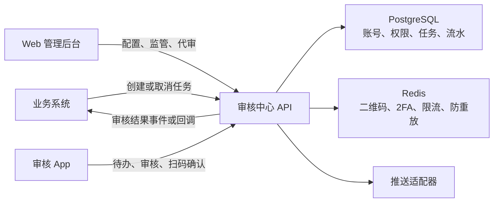

必须坚持以下边界：

1. App 不新增 `app_users`，直接使用 `admin_users`。
2. App 不直连数据库，只调用审核中心 API。
3. 按钮显隐不是安全边界，每个审核接口必须校验后端权限和任务资格。
4. 二维码只携带短期随机票据，不携带密码、JWT、Refresh Token 或 TOTP 密钥。
5. 扫描二维码不等于确认登录，用户必须看到目标并主动确认。
6. 通用 `operation_logs` 不能替代审核流水。
7. 审核状态、动作流水和结果 Outbox 必须在同一个事务中提交。

### 8.2 Web、App、后端和业务系统职责

#### Web 管理后台

- 管理账号、角色和审核权限
- 配置审核流程、步骤、角色、阈值和 2FA 要求
- 查询全部审核任务、当前步骤、负责人和超时状态
- 查看业务快照、附件、审核时间线和结果通知状态
- 按权限执行代审、转派、取消和重试通知
- 查看 App 设备、会话、最后活跃时间并执行撤销
- 为本人生成一次性审核 App 登录二维码
- 查看回调失败、推送失败和异常审核告警

#### 审核 App

- 账号密码和 TOTP 2FA 首次登录
- 由用户主动开启或关闭生物识别解锁；未开启时使用完整认证或本地 PIN
- 查看待办、已办和抄送
- 查看任务详情、风险信息、附件和审核历史
- 领取、释放、通过、驳回、转交和填写意见
- 扫描 Web 登录二维码并确认 Web 登录
- 扫描本人在 Web 后台生成的一次性 App 登录二维码
- 接收待办、转交、超时和安全通知
- 查看并撤销本账号的其他设备和会话

App 不提供角色授权、流程发布、管理员重置等后台管理能力。

#### 审核中心后端

- 身份认证、会话、设备绑定和 Token 撤销
- RBAC 权限和审核任务资格双重校验
- 流程匹配、任务创建、步骤推进和结果计算
- 并发控制、幂等、超时和任务取消
- 2FA challenge、限流和 TOTP 防重放
- 结构化审核流水、安全事件和普通操作日志
- 推送通知、审核结果 Outbox 和失败重试

#### 来源业务系统

订单、提现、KYC 等业务实体仍归来源系统所有。来源系统：

- 使用服务身份创建审核任务
- 提供稳定的 `source_request_id` 保证创建幂等
- 业务数据变化时取消旧任务并重新发起，禁止静默替换已审核快照
- 幂等接收审核结果事件或回调
- 在最终执行资金、订单等业务动作前再次校验业务状态

### 8.3 统一账号、可信设备和会话

#### 账号复用

App 继续使用现有 `admin_users`：

- `status`：账号禁用后拒绝所有请求
- `token_version`：密码、2FA 等安全状态变化后撤销旧 Token
- `permission_version`：角色权限变化后通知客户端刷新权限
- `two_fa_enabled / two_fa_secret`：Web 和 App 共用同一 TOTP 身份

不能新增第二套 App 密码或 App 角色，否则会出现后台已禁用但 App 仍能审核、两端权限不一致、
审核记录无法稳定关联后台操作员等问题。

#### `admin_devices`

新增可信设备表：

| 字段 | 说明 |
| --- | --- |
| `id` | UUID 设备 ID |
| `admin_user_id` | 关联管理员 |
| `device_name` | 用户可识别名称 |
| `platform` | `ios / android / web` |
| `app_version` | App 版本 |
| `public_key` | App 设备公钥 |
| `push_token_ciphertext` | 加密后的推送 Token |
| `attestation_status` | 设备完整性或应用证明状态 |
| `biometric_unlock_enabled` | 用户是否主动开启本地生物识别解锁，不保存生物特征 |
| `status` | `active / revoked` |
| `trusted_at / last_seen_at` | 绑定和最近活跃时间 |
| `last_ip` | 最近 IP |
| `revoked_at / revoked_by` | 撤销信息 |

App 首次绑定时在系统安全区域生成不可导出的设备私钥，服务端只保存公钥。所有登录交换、
会话刷新和敏感操作都可要求设备对服务端 nonce 签名，降低 Refresh Token 被复制到另一台
设备后的风险。`biometric_unlock_enabled` 只用于设备管理展示和安全通知，后端不能因为该
字段为 `true` 就跳过认证。服务端不采集、不上传、不保存指纹或面容数据。

#### `admin_sessions`

新增服务端会话表：

| 字段 | 说明 |
| --- | --- |
| `id` | UUID，会写入 JWT 的 `sid` |
| `admin_user_id` | 当前账号 |
| `device_id` | App 会话必须绑定设备 |
| `client_type` | `web / review_app` |
| `refresh_token_hash` | 只保存 Refresh Token 哈希 |
| `refresh_expires_at` | 刷新令牌过期时间 |
| `status` | `active / revoked / expired` |
| `strong_auth_at` | 最近一次密码 + 2FA 或有效 step-up 时间 |
| `created_at / last_seen_at` | 会话时间 |
| `revoked_at / revoked_reason` | 撤销信息 |

JWT 增加 `sid`、`client_type`、`device_id` 和 `jti`。鉴权时除现有账号状态和
`token_version` 外，还要校验会话和设备状态。

#### 登录优先级与生物识别设置

审核 App 提供三种进入方式，优先级如下：

1. **后台二维码快速登录**：主要方式。用户在已登录 Web 后台为本人生成一次性二维码，
   新 App 扫描并完成双端确认和设备绑定。
2. **账号密码 + 2FA**：二维码不可用时的完整认证方式。
3. **本地快速解锁**：设备已经绑定且会话仍有效时，由用户主动选择开启生物识别或本地 PIN。

生物识别必须满足：

- 默认关闭，只能由用户本人在 App 的“安全设置”中主动开启。
- 开启前校验系统已设置生物识别，并要求当前有效会话和设备签名。
- 最近 10 分钟内已经完成二维码强认证或密码 + 2FA 时直接复用，不重复弹验证码；超过窗口才
  使用 `GoogleCode.vue` 补一次 step-up。
- App 只调用系统生物识别 API，不读取、不上传、不保存生物特征。
- 系统生物识别配置变化或 App 重装后自动关闭；连续失败先锁定本地快速解锁并回退完整认证，
  不直接清除用户设置。
- 用户关闭后立即删除本地生物识别包裹密钥，不能只隐藏开关。
- 关闭生物识别是降低风险操作，不重复要求 2FA；校验当前设备签名后立即生效。
- 生物识别失败必须回退到完整登录，不能回退为弱口令或绕过 2FA。
- 生物识别只解锁本机安全区域中的会话能力，不自动授权通过、驳回、转交、流程发布等操作。

二维码或密码首次登录成功后：

1. App 在 Keychain、Keystore 或 Secure Enclave 中生成不可导出设备密钥。
2. 后端校验 `reviewApp-access`、账号状态、2FA 状态、设备证明和登录票据。
3. 后端创建 `admin_devices` 和 `admin_sessions`。
4. Access Token 仅放内存；Refresh Token 只放系统安全存储。
5. 后续刷新同时校验会话、设备状态、Token 轮换和设备私钥签名。

设备被后台撤销后，即使本机生物识别成功，也不能刷新会话或调用任何审核接口。

### 8.4 审核权限设计

App 和 Web 继续复用 `roles / menus / role_menus / admin_user_roles`。执行审核必须同时满足：

1. **动作权限**：用户拥有 `reviewTask-approve` 等后端能力。
2. **任务资格**：用户是当前步骤指定人，或仍属于当前步骤指定角色。

只拥有按钮权限不代表可以审核全系统任意任务。

建议权限树：

```text
reviewCenter                              审核中心目录
├── reviewTask                            审核任务
│   ├── reviewTask-viewAssigned           查看本人可处理任务
│   ├── reviewTask-viewAll                查看全部任务
│   ├── reviewTask-claim                  领取任务
│   ├── reviewTask-approve                审核通过
│   ├── reviewTask-reject                 审核驳回
│   ├── reviewTask-transfer               转交任务
│   ├── reviewTask-cancel                 取消任务
│   └── reviewTask-retryNotify            重试结果通知
├── reviewFlow                            审核流程配置
│   ├── reviewFlow-add
│   ├── reviewFlow-edit
│   ├── reviewFlow-publish
│   └── reviewFlow-disable
├── reviewAudit                           审核审计
│   ├── reviewAudit-view
│   └── reviewAudit-export
└── reviewDevice                          App 设备管理
    ├── reviewDevice-viewOwn
    ├── reviewDevice-revokeOwn
    ├── reviewDevice-viewAll
    └── reviewDevice-revokeAll

reviewApp-access                          允许登录审核 App
```

`reviewApp-access` 是客户端准入能力，不与某个 Web 路由名绑定。没有该权限时，后端不得签发
`client_type=review_app` 的会话。

建议角色：

| 角色 | 典型权限 |
| --- | --- |
| 初审员 | App 准入、本人待办、通过、驳回 |
| 复审员 | 初审能力 + 高风险或高金额任务 |
| 审核主管 | 查看全部、转交、取消和异常处理 |
| 流程管理员 | 流程配置和发布，不默认获得业务审核资格 |
| 审计员 | 只读全部任务、流水和受控导出 |

不建议因为用户是 `superadmin` 就自动获得所有业务代审资格。系统管理权限和业务审批职责应
分离。

角色或权限变化后：

- 递增 `permission_version`，App 清空权限缓存并重新请求。
- 每次审核动作实时校验角色，不能只信任任务打开时的缓存。
- 已领取任务的领取人失去资格后，自动释放或进入主管异常队列。
- 禁用账号、重置密码或重置 2FA 时撤销相关会话。

### 8.5 审核流程和任务数据模型

审核任务是独立业务域，不能把任务状态、审核意见或审核人塞进 `menus`。

#### `review_flows`

- `id`
- `code`：全局唯一稳定编码
- `name`
- `business_type`
- `status`
- `current_version`
- `created_by / updated_by`
- `created_at / updated_at`

#### `review_flow_versions`

- `id`
- `flow_id`
- `version`
- `match_condition`：币种、金额、风险等级等结构化条件
- `definition_snapshot`
- `status`
- `published_by / published_at`

流程发布后不可原地修改。已有任务固定引用创建时的版本，后续修改生成新版本。

#### `review_flow_steps`

- `id`
- `flow_version_id`
- `step_no / name`
- `approval_mode`：`any / all / quorum`
- `required_approvals`
- `assignee_type`：`role / user`
- `assignee_role_id / assignee_user_id`
- `require_2fa`
- `timeout_seconds`
- `reject_mode`

MVP 可以先启用顺序步骤和 `any` 模式，但表结构保留 `all / quorum`。

#### `review_tasks`

| 字段 | 说明 |
| --- | --- |
| `id` | UUID |
| `task_no` | 可展示任务号 |
| `source_system` | 来源系统 |
| `source_request_id` | 来源幂等键，联合唯一 |
| `business_type / business_id` | 业务类型和业务主键 |
| `flow_version_id` | 固定流程版本 |
| `title / summary` | 脱敏展示摘要 |
| `risk_level` | 风险级别 |
| `amount / currency` | 可选金额 |
| `payload_snapshot` | 审核依据的不可变业务快照 |
| `status` | 任务状态 |
| `current_step_no` | 当前步骤 |
| `version` | 并发版本号 |
| `requested_by / requested_at` | 发起信息 |
| `expires_at / completed_at` | 到期和完成时间 |

`payload_snapshot` 使用字段白名单和脱敏规则，禁止复制密码、密钥、完整银行卡号等与审核无关
的敏感数据。

#### `review_step_instances`

流程步骤在具体任务上的运行实例：

- `task_id / step_no`
- `status`
- `approval_mode / required_approvals`
- `assignee_type / assignee_ref_id`
- `started_at / completed_at / due_at`

#### `review_assignments`

- `task_id / step_instance_id`
- `assignee_user_id` 或 `assignee_role_id`
- `status`：`available / claimed / completed / void`
- `claimed_by / claimed_at`
- `completed_by / completed_at`

角色分配不必预先展开成所有角色成员，但提交审核时必须实时确认操作者仍是启用成员。

#### `review_actions`

不可变审核业务流水：

- `task_id / step_instance_id`
- `action`：`create / claim / release / approve / reject / transfer / cancel / expire`
- `from_status / to_status`
- `operator_user_id`
- `operator_role_ids_snapshot`
- `comment`
- `client_type`
- `device_id / session_id`
- `ip / user_agent`
- `idempotency_key`
- `fa_challenge_id`
- `payload_digest`
- `created_at`

该表只追加，不更新、不删除。数据更正通过新增纠正记录完成。

#### `review_outbox`

- `event_type`
- `aggregate_id`
- `payload`
- `status`
- `retry_count / next_retry_at`
- `created_at / delivered_at`

审核事务写入 Outbox，后台投递器负责可靠回调，避免数据库已通过但业务系统没有收到结果。

### 8.6 状态机、并发和幂等

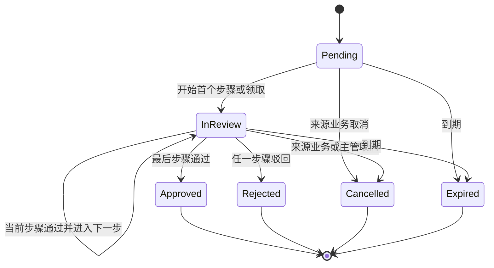

终态默认不可重新打开。需要再次审核时创建新任务，并通过 `previous_task_id` 关联历史任务。

通过或驳回必须在一个 PostgreSQL 事务内完成：

1. 按 `task_id` 查询并使用 `SELECT ... FOR UPDATE` 锁定任务。
2. 校验 `expected_version`，不一致返回 `409`。
3. 校验任务和步骤仍可处理。
4. 校验账号、会话、动作权限和当前步骤资格。
5. 根据流程风险策略校验匹配的短时 step-up；如本次要求新 2FA，则校验并消费一次性 challenge。
6. 使用 `idempotency_key` 判断是否已经处理同一客户端请求。
7. 写入 `review_actions`。
8. 更新分配、步骤、任务状态和 `version`。
9. 写入 `review_outbox`。
10. 事务提交后异步发送推送和审核结果。

幂等约束：

- 创建任务：`source_system + source_request_id` 唯一。
- 审核动作：`operator_user_id + idempotency_key` 唯一。
- 二维码交换：`qr_id` 只能成功消费一次。
- Refresh Token 每次刷新都轮换；旧 Token 再出现时撤销整个会话链。

两人同时提交同一任务时最多一人成功。失败方收到“任务已被处理或版本已变化”，不能返回模糊
系统错误。

### 8.7 Web 后台功能

#### 审核任务

- 待审核、审核中、已通过、已驳回、已取消、已过期 Tab
- 展示任务号、业务类型、业务号、金额、风险、当前步骤、处理人和剩余时间
- 按权限显示查看、代审、转交、取消和重试通知
- 详情展示业务快照、流程、附件、动作时间线和结果通知状态
- 快照和附件按字段权限脱敏

#### 流程配置

- 按业务类型建立流程
- 配置匹配条件、顺序步骤、审核角色或具体用户
- 配置步骤超时、通过模式、驳回模式和是否要求 2FA
- 支持草稿预览、发布、停用和复制新版本
- 发布前检查角色有效、步骤连续、条件不冲突且存在有效审核人

流程发布属于高风险操作。Web 必须先做业务确认，再打开
`frontend/src/components/GoogleCode.vue` 独立 2FA 弹窗。

#### 审核审计

- 按任务、业务号、审核人、角色、动作、时间和设备查询
- 展示动作前后状态、意见、客户端、设备和 IP
- 导出使用单独权限，并限制时间范围、行数和敏感字段
- 每次导出写入审计和水印信息

#### App 设备管理

- 展示设备名称、平台、App 版本、首次绑定、最后活跃和最近 IP
- 标识当前设备
- 撤销单个设备或账号全部 App 会话
- 为当前登录用户本人生成审核 App 快速登录二维码
- 查看、开启或关闭本人设备的生物识别解锁状态

后台二维码只能由当前用户为本人生成。普通管理员、超级管理员都不能直接为其他账号生成可
登录二维码，避免“账号管理权限”变成“账号接管权限”。账号恢复如有业务需要，应设计独立
双人复核流程，不能复用普通 App 登录二维码。

### 8.8 App 审核体验

#### 首页和列表

- 待办数量、即将超时、高风险待办和最近已处理
- 待办、已办、抄送三个入口
- 按业务类型、风险级别和时间筛选
- 服务端分页，默认只返回本人有资格查看的数据
- 推送点击后通过任务 ID 深链进入详情

#### 详情和操作

详情按摘要、风险、业务数据、附件、流程和历史组织。通过或驳回：

1. 先校验审核意见等业务字段。
2. 展示任务号、金额、动作和影响范围。
3. 根据详情返回的风险策略检查当前 step-up 是否仍有效。
4. 仅在 step-up 过期或本任务要求逐单验证时，申请 challenge 并打开独立六位数字输入弹窗。
5. 提交任务 ID、版本、幂等键和意见；需要新 2FA 时再附带 challenge 和验证码。
6. 成功后刷新列表；冲突时提示任务已被其他人处理。

详情接口应返回当前用户可执行动作及认证要求，例如 `requiresStepUp`、
`stepUpValidUntil` 和 `confirmationMode`。后端提交时仍重新判断，不能只信任详情结果。
若短时授权刚好过期，返回明确的 `STEP_UP_REQUIRED`，App 保留意见并打开
`GoogleCode.vue`，验证后自动重试一次。

当前项目所有 2FA 前端操作都必须复用 `frontend/src/components/GoogleCode.vue`。因此 App
默认采用能够复用该 Vue 组件的移动容器方案，并共享同一 challenge 契约。若后续决定采用
无法复用 Vue 组件的原生技术栈，必须先由项目负责人修改项目级强制规则并明确原生共享规范；
在规则变更前不得为 App 单独实现另一套验证码输入组件。

#### 推送

- 新待办
- 高风险待办
- 即将超时
- 被转交任务
- 审核结果
- 账号或设备安全事件

推送正文只包含任务号和脱敏摘要，不包含完整账户、证件号或附件。点击后必须先恢复有效会话，
再在线读取最新任务状态。

### 8.9 扫码快速登录

扫码分为两个独立登录方向，使用不同的票据类型、action 和状态空间，不能互相交换：

1. 后台生成二维码，审核 App 扫码登录。这是审核 App 的主要快速登录方式。
2. 已登录审核 App 扫描 Web 登录页，授权 Web 登录。这是辅助能力。

#### 场景 A：后台生成审核 App 快速登录二维码

用户已经通过账号密码和 2FA 登录 Web 后台，在“我的安全设置 / 审核 App”中为本人生成
一次性二维码。未登录的新审核 App 扫描后完成设备绑定和登录。

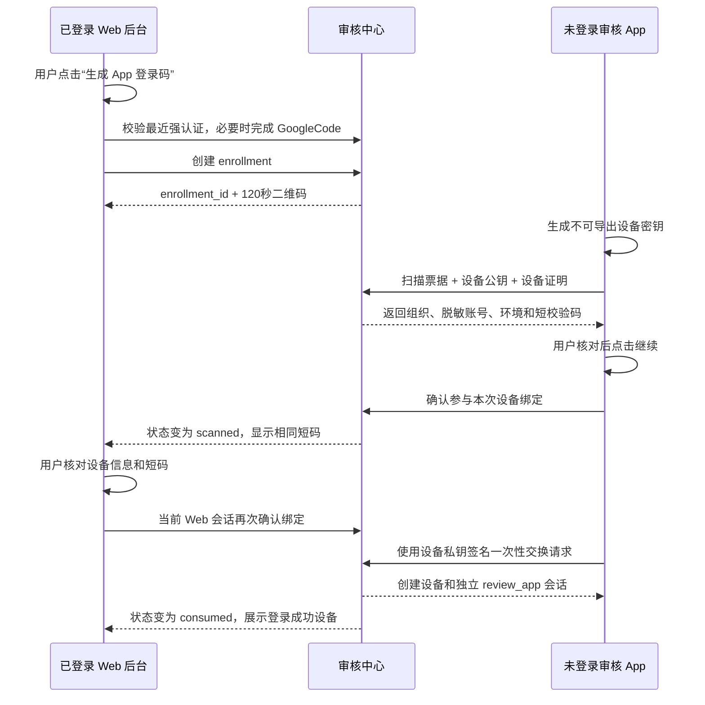

二维码内容只包含不可预测的短期票据：

```text
reviewapp://app-login?v=1&enrollment_id=<opaque-id>&secret=<random>
```

服务端只保存 `secret` 的哈希。二维码不包含用户名、JWT、Refresh Token、密码、TOTP Secret
或角色权限。

状态机：

```text
created -> scanned -> web_confirmed -> consumed
   |          |              |
expired   cancelled       expired
```

安全规则：

- 只能由当前 Web 登录用户为本人生成，不能指定其他 `userId`。
- 生成前必须先完成业务确认和强认证。如果当前 Web 会话在最近 10 分钟内已经完成密码 + 2FA
  或等价强认证，则直接复用；超过窗口或风险上下文变化时才打开 `GoogleCode.vue`。
- 后端校验 Web 会话、账号状态、`reviewApp-access`、2FA challenge 和设备数量限制。
- 默认有效期 120 秒；同一用户同一时间只允许一个有效 App 登录二维码。过期后可一键刷新，
  不要求用户重新进入页面。
- 二维码绑定签发用户、Web 会话、浏览器 nonce、环境、用途和到期时间。
- App 扫描后先生成设备密钥，并提交设备公钥、App 签名信息和设备完整性证明。
- App 必须展示组织、脱敏账号和环境，用户点击继续后 Web 才进入待确认状态。
- Web 必须显示设备型号、平台、App 版本、粗略位置和相同的六位配对短码。
- 用户在 Web 主动确认前，App 不能获得任何登录 Token。
- App 交换登录态时必须证明持有刚才提交的设备私钥。
- `consumed`、`expired` 或 `cancelled` 票据不能再次使用。
- 票据状态转换在 Redis Lua 或等价原子操作中完成，防止并发重复交换。
- 绑定成功后创建独立 `admin_devices` 和 `admin_sessions`，立即销毁二维码票据。
- Web、App 和已有可信设备收到新设备登录安全通知。
- 检测到明确越狱、Root、调试注入或非官方签名时拒绝绑定。设备证明服务暂时不可用但没有
  明确风险信号时可进入“受限设备”模式：允许登录和普通读取，暂不允许高风险审核，证明恢复
  后自动解除，避免第三方服务波动让全部用户无法登录。
- 平台本身不支持设备证明时按组织策略处理，默认允许密码 + 2FA 登录和 `R1/R2` 操作，禁止
  `R3/R4`，而不是让该平台所有用户永久无法使用。

即使二维码被截图，攻击者仍缺少 Web 端主动确认、匹配短码、设备私钥证明和一次性交换条件，
不能只凭截图登录。用户发现扫描设备不符时可立即取消，票据随即失效。

#### 场景 B：已登录 App 扫码授权 Web 登录

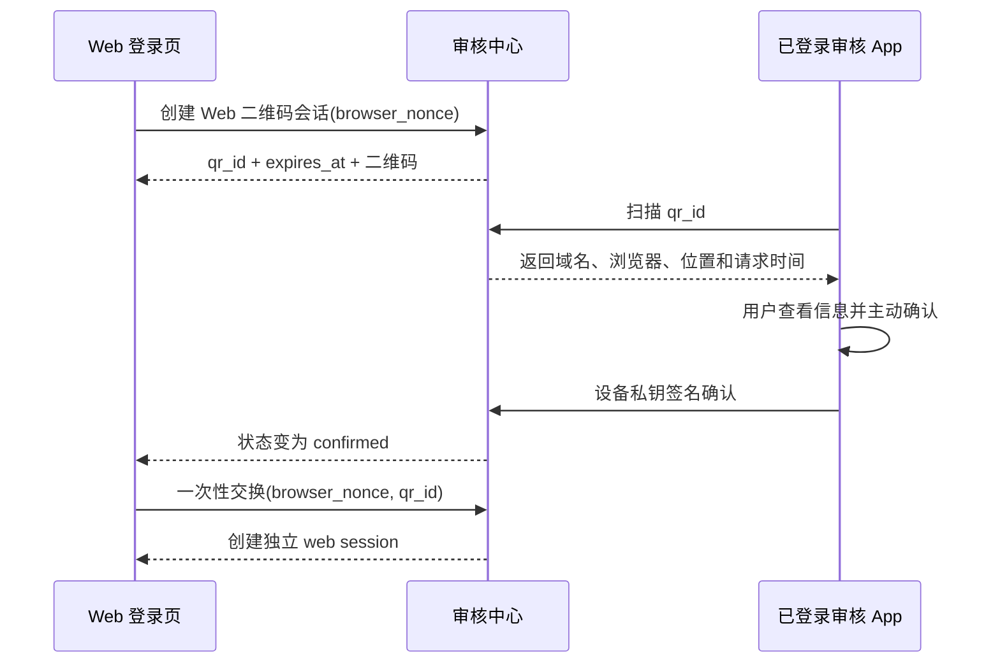

规则：

- 默认有效期 120 秒。
- `scanned` 只表示已经扫描，Web 显示“等待 App 确认”。
- App 展示域名、浏览器、粗略位置和请求时间。
- 用户主动确认；如用户已开启生物识别，可以用它解锁设备签名，但不能强制要求用户开启。
- App 使用设备私钥签名确认，Web 使用自身 `browser_nonce` 一次性交换独立 Web 会话。
- Web 不能获得或复用 App 的 Token。
- 二维码不能跨浏览器、跨环境或重复消费。

#### 场景 C：用户可选的生物识别解锁

生物识别不是账号登录凭据，也不是使用二维码的前提。只有设备已绑定、用户主动开启且会话
仍有效时，才能用它解锁本地安全存储中的会话能力。

- 开启或关闭都在 App 安全设置中由用户本人操作。
- 开启使用最近 10 分钟强认证；窗口过期才要求一次完整 2FA。
- 关闭不要求 2FA，并立即销毁本地包裹密钥。
- 不支持或不愿开启的用户继续使用完整登录或本地 PIN。
- 生物识别不能单独完成审核通过、驳回、转交、流程发布、设备绑定或会话撤销。

#### 扫码明确禁止项

- 二维码中放 JWT、Refresh Token、密码、用户名或 TOTP Secret
- 后台为其他账号直接生成可登录二维码
- 只扫描不确认就自动登录
- 仅 App 确认、不需要后台签发会话确认
- 使用长期有效或可重复消费的二维码
- 在服务端保存二维码明文 Secret
- Web 轮询接口返回 App Token
- App 不生成设备密钥或不做持钥证明就交换登录态
- 仅靠客户端判断二维码状态和有效期
- 通过扫码绕过账号禁用、`reviewApp-access`、设备风控或 2FA
- 将生物识别设为强制前提或用其替代高风险操作的 2FA

### 8.10 API 契约

所有动态路径参数必须位于最后一个 URL 片段。列表、筛选和分页参数进入 `POST` 请求体。

#### 登录、会话和设备

| 方法 | 路径 | 说明 |
| --- | --- | --- |
| `POST` | `/api/v1/login` | 扩展 `clientType` 和设备信息，保留现有登录 |
| `POST` | `/api/v1/auth/refresh` | 轮换 Refresh Token |
| `POST` | `/api/v1/auth/logout` | 撤销当前会话 |
| `POST` | `/api/v1/auth/sessions/list` | 查询本人或授权账号会话 |
| `POST` | `/api/v1/auth/sessions/revoke` | 撤销指定会话 |
| `POST` | `/api/v1/auth/devices/list` | 查询设备 |
| `POST` | `/api/v1/auth/devices/revoke` | 撤销设备 |
| `POST` | `/api/v1/auth/devices/biometric` | 用户开启或关闭当前设备生物识别解锁状态 |
| `POST` | `/api/v1/auth/device-enrollments` | Web 本人 2FA 后创建 App 登录二维码 |
| `POST` | `/api/v1/auth/device-enrollments/status` | Web 查询扫码和确认状态 |
| `POST` | `/api/v1/auth/device-enrollments/scan` | App 扫描并提交设备公钥 |
| `POST` | `/api/v1/auth/device-enrollments/confirm` | Web 确认绑定 |
| `POST` | `/api/v1/auth/device-enrollments/cancel` | Web 或 App 取消登录票据 |
| `POST` | `/api/v1/auth/device-enrollments/exchange` | App 一次性交换登录态 |

#### Web 扫码登录

| 方法 | 路径 | 说明 |
| --- | --- | --- |
| `POST` | `/api/v1/auth/qr/sessions` | Web 创建二维码会话 |
| `POST` | `/api/v1/auth/qr/status` | Web 轮询二维码状态 |
| `POST` | `/api/v1/auth/qr/scan` | 已登录 App 扫描 |
| `POST` | `/api/v1/auth/qr/confirm` | App 用户确认并提交设备签名 |
| `POST` | `/api/v1/auth/qr/cancel` | 任一端取消 |
| `POST` | `/api/v1/auth/qr/exchange` | Web 一次性交换独立会话 |

#### 审核任务

| 方法 | 路径 | 权限或身份 |
| --- | --- | --- |
| `POST` | `/api/v1/review-tasks` | 来源业务服务身份 |
| `POST` | `/api/v1/review-tasks/list` | `viewAssigned` 或 `viewAll` |
| `GET` | `/api/v1/review-tasks/detail/:id` | 查看权限 + 任务可见资格 |
| `POST` | `/api/v1/review-tasks/claim` | `reviewTask-claim` |
| `POST` | `/api/v1/review-tasks/release` | 当前领取人 |
| `POST` | `/api/v1/review-tasks/approve` | `reviewTask-approve` + 步骤资格 |
| `POST` | `/api/v1/review-tasks/reject` | `reviewTask-reject` + 步骤资格 |
| `POST` | `/api/v1/review-tasks/transfer` | `reviewTask-transfer` |
| `POST` | `/api/v1/review-tasks/cancel` | 来源服务或 `reviewTask-cancel` |
| `POST` | `/api/v1/review-tasks/retry-notify` | `reviewTask-retryNotify` |

通过或驳回请求体基础字段：

```json
{
  "taskId": "uuid",
  "expectedVersion": 3,
  "idempotencyKey": "uuid-from-client",
  "comment": "审核意见"
}
```

本次需要新 2FA 时追加：

```json
{
  "faChallengeId": "uuid",
  "facode": "123456"
}
```

存在匹配且未过期的服务端 step-up 时，不提交验证码字段。后端不得因为客户端传了
`requiresStepUp=false` 就跳过校验。

#### 流程和审计

| 方法 | 路径 | 说明 |
| --- | --- | --- |
| `POST` | `/api/v1/review-flows/list` | 流程列表 |
| `GET` | `/api/v1/review-flows/detail/:id` | 流程详情 |
| `POST` | `/api/v1/review-flows` | 新增草稿 |
| `PUT` | `/api/v1/review-flows/:id` | 修改草稿，动态 ID 位于末尾 |
| `POST` | `/api/v1/review-flows/publish` | 2FA 后发布版本 |
| `POST` | `/api/v1/review-flows/status` | 启停流程 |
| `POST` | `/api/v1/review-actions/list` | 审核流水查询 |

`POST /review-tasks` 不使用管理员 JWT。来源系统使用进程内 Service 调用、内网 mTLS、短期服务
Token 或包含时间戳、nonce 和 body digest 的 HMAC 签名。服务身份只能创建被授权的
`source_system` 和 `business_type`。

### 8.11 2FA、安全和审计

#### 2FA

- 所有确实需要输入 2FA 的 Web 操作继续统一使用 `GoogleCode.vue`。
- challenge 绑定用户、会话、动作、任务和目标版本。
- challenge 默认 2 分钟有效，只能消费一次。
- 同一 TOTP 时间片不能重复执行第二次高风险操作。
- 失败次数按用户和设备限流。
- 登录、审核和设备绑定使用不同 action，禁止串用。
- 一次成功的 TOTP 可以签发服务端短时 `step-up grant`，默认 10 分钟，只绑定当前用户、会话、
  设备、动作类别和最高风险等级。客户端不能把它转移到其他设备或其他操作类别。
- `step-up grant` 同时设置最大动作次数和累计金额上限，任一条件达到后立即要求重新验证，
  防止在窗口期内连续处理大量小额任务。
- challenge 仍然一次性消费；后续低风险操作使用的是短时授权，不是重复使用验证码。
- 账号状态、权限版本、设备、审核金额或风险等级变化时立即废止短时授权。IP 仅在国家、
  ASN、代理风险等异常变化时触发，不因正常移动网络切换频繁打断用户。
- 高金额、资金出账、流程发布、代审和批量敏感导出可以配置为每次操作重新 2FA，不复用窗口。

建议 action：

```text
review.task.approve
review.task.reject
review.task.transfer
review.flow.publish
review.device.enroll
review.device.revoke
review.device.biometric.enable
review.audit.export
```

#### 全操作安全分级

“所有操作注意安全”采用分层控制，不能只依赖登录成功，也不能为了表面安全让所有读取都重复
输入验证码。

| 操作级别 | 示例 | 必须校验 |
| --- | --- | --- |
| 基础读取 | 首页数量、本人待办列表 | TLS、有效会话、设备状态、Token 轮换、RBAC、本人数据范围、限流 |
| 敏感读取 | 任务详情、附件、完整账户信息 | 基础读取 + 任务资格 + 字段脱敏 + 短期签名 URL + 访问审计；正常会话不反复输 2FA |
| 普通写入 | 领取、释放、备注 | App 设备签名或 Web 防 CSRF + 动作权限 + 任务资格 + 版本号 + 幂等键，不要求 TOTP |
| 标准审核 | 低、中风险通过或驳回 | 每单明确确认 + 普通写入校验；最近 10 分钟有匹配 step-up 时不重复输码 |
| 高风险审核 | 高金额通过、转交、取消、资金类审核 | 每单明确确认 + 一次性 2FA challenge + TOTP 防重放，可配置每次输码 |
| 安全管理 | 生成 App 登录码、开启生物识别、撤销其他设备 | 当前用户本人 + 独立确认 + 最近强认证；窗口过期才补 2FA |
| 降低风险操作 | 关闭生物识别、退出当前会话 | 当前设备和会话校验后立即执行，不额外要求 2FA |
| 系统级操作 | 发布流程、代审、批量敏感导出 | 单独权限 + 操作者和目标绑定 + 新鲜 2FA + 必要时双人复核 |

审核流程发布时必须配置风险等级和再认证策略：

| 风险等级 | 默认策略 |
| --- | --- |
| `R1` 低风险 | 首次审核做 step-up，10 分钟内同类操作复用；每单仍需明确点击确认 |
| `R2` 中风险 | step-up 窗口缩短为 5 分钟；金额、收款方或风险上下文变化时重新验证 |
| `R3` 高风险 | 每单重新 2FA，不使用复用窗口 |
| `R4` 关键风险 | 每单重新 2FA + 双人或多级复核，不允许单人完成 |

默认不开放批量通过。确有业务需要时，只允许 `R1` 且必须逐项展示结果、设置数量上限并保留
每条独立审核流水。

所有接口还必须满足：

- 全链路 HTTPS，生产环境拒绝明文 HTTP。
- 每个请求带 `request_id` 或 trace ID，审核动作可以从业务流水追溯到 HTTP 请求。
- 服务端不信任客户端提交的用户 ID、角色、设备状态、任务状态和权限结果。
- 请求体、二维码、Token、2FA、设备证明和回调都设置大小、格式、时效和重放限制。
- 对登录、二维码、2FA、审核动作、导出和附件访问分别限流，不能共用一个宽松阈值。
- 错误响应避免泄露账号是否存在、角色详情、内部 SQL、密钥或完整风控原因。
- 客户端检测到证书错误、系统时间异常、调试注入或完整性风险时停止敏感操作。
- 任何安全状态变化都写入 `security_events`，并通知用户已有可信渠道。

#### 易用性基线

在不降低关键安全边界的前提下，默认交互应满足：

- 用户刚完成 Web 登录 2FA 后生成 App 登录二维码，不再次输入验证码。
- App 首次扫码登录只需要：后台点击生成、App 扫描并确认、后台核对短码并确认。
- 二维码过期可原地刷新，不重复进入菜单或重新填写信息。
- 设备绑定后不要求每天重新扫码；仅在主动退出、设备撤销、Refresh Token 重用、会话最长
  期限到期或高风险异常时重新完整登录。
- 建议 Access Token 约 15 分钟并自动静默刷新；Refresh 会话按 30 天不活跃或组织策略失效，
  具体值配置化。
- App 进入后台超过默认 5 分钟后做本地锁定。开启生物识别的用户一次识别即可恢复；未开启
  的用户使用本地 PIN，不要求每次重新扫码。
- 本地 PIN 只用于解锁设备安全存储，不是后台账号密码；连续失败应指数退避，达到上限后要求
  完整登录。
- 普通浏览和领取、备注不弹 2FA；标准审核在短时 step-up 窗口内不重复弹码。
- 所有确认页清楚显示任务、金额、收款方、动作和风险，不用多层重复“是否确认”弹窗。
- 验证失败保留用户已填写的审核意见，避免因为验证码或网络错误重新录入。
- 风控拦截给出可操作的恢复方式，例如重新验证、换用密码登录或联系管理员，避免只有“失败”。

易用性验收指标：

| 场景 | 目标 |
| --- | --- |
| 最近已完成 Web 2FA 后生成 App 登录码 | 不再重复输入验证码 |
| 首次 App 扫码登录 | 4 步内完成：生成、扫描、App 确认、Web 确认 |
| 已绑定 App 日常进入 | 1 次生物识别或本地 PIN，不重新扫码 |
| 连续处理 `R1` 任务 | 10 分钟内只做 1 次 step-up，每单仍明确确认 |
| 验证码或网络失败 | 已填写意见、筛选条件和当前任务上下文不丢失 |
| 二维码过期 | 当前页面一键刷新，不重新导航 |

上线后监控扫码完成率、平均登录时长、2FA 弹出次数、审核放弃率和风控误拦截率。如果安全
事件没有增加但放弃率明显偏高，应优先调整窗口、文案和恢复路径，不能通过放松任务权限或
审计要求来换取体验。

#### 数据保护

- 数据库只保存 Refresh Token 哈希。
- 推送 Token 加密保存。
- `payload_snapshot` 使用字段白名单和脱敏。
- 附件使用短期签名 URL，并记录访问审计。
- 推送不包含完整敏感业务信息。
- App 按数据敏感级别限制截图、后台预览和剪贴板。
- 日志继续脱敏密码、Token、Secret、`facode` 和 challenge。

#### 三类日志

| 记录 | 用途 |
| --- | --- |
| `operation_logs` | HTTP 请求排障和普通操作追踪 |
| `review_actions` | 审核业务事实和合规证据 |
| `security_events` | 登录、扫码、设备绑定、撤销和风险事件 |

`security_events` 记录事件类型、用户、会话、设备、IP、结果和失败原因，不记录凭据明文。

#### 关键指标

- 待审核数量和最老等待时间
- 各流程平均处理时间和超时率
- 审核冲突率和重复提交率
- Outbox 积压、失败和重试次数
- 推送成功率
- 二维码创建、扫描、确认、过期和异常交换次数
- 登录失败、2FA 失败、设备撤销和 Refresh Token 重用告警

### 8.12 分阶段实施

每个阶段都要形成可演示、可运行、可测试的增量。

#### Sprint 1：审核领域最小闭环

**目标：** 后端创建、查询、通过和驳回真实审核任务。

1. 新增 `review_*` 表迁移、约束和索引。
2. 实现流程匹配、流程版本冻结和任务幂等创建。
3. 实现本人待办、全量监管列表和详情。
4. 实现通过、驳回、并发锁、版本号、动作幂等和 Outbox。
5. 增加 Service、Repository 和真实 PostgreSQL 集成测试。

**演示：** 创建两级审核任务，初审通过后进入复审，复审完成后能看到完整动作流水。

#### Sprint 2：Web 审核管理

**目标：** Web 能配置权限和流程、查看任务与审计。

1. 增加 `reviewCenter` 权限树迁移并授权 `superadmin`。
2. 建设审核任务列表、详情和异常操作。
3. 建设流程草稿、步骤编辑、发布、版本和停用。
4. 建设审核流水查询和受控导出。
5. 发布、取消、代审等敏感操作接入 `GoogleCode.vue`。

**演示：** 后台发布流程、接收任务，不同角色只能看到被授权的数据和动作。

#### Sprint 3：App 基础审核

**目标：** App 安全登录并完成移动审核。

1. 确定 App 技术栈和工程目录；默认选择可复用 `GoogleCode.vue` 的 Vue 移动容器方案，原生
   方案必须先完成项目级规则评审。
2. 实现后台本人强认证生成 App 登录二维码、App 扫描、双端短码确认和设备持钥交换。
3. 实现密码 + 2FA 备用登录、设备密钥和安全存储。
4. 实现待办、详情、通过、驳回、意见和冲突处理。
5. 实现用户可选的生物识别设置、关闭清理和完整登录回退。
6. 实现账号禁用、设备撤销和权限变化后的强制刷新或退出。

**演示：** 后台生成二维码，App 扫描绑定设备并登录，完成一条审核，Web 实时看到结果和
设备信息。

#### Sprint 4：扫码登录和设备中心

**目标：** 增加 App 授权 Web 登录，并完善设备和会话中心。

1. 复用已验证的 Redis 状态机，实现 Web 登录二维码。
2. 实现 App 扫描 Web 二维码、目标信息展示、用户确认和设备签名。
3. 实现设备和会话列表、单设备撤销、全部撤销和安全通知。
4. 增加设备证明异常、二维码异常和会话重用告警。
5. 覆盖截图、重放、并发交换、跨浏览器、超时和取消测试。

**演示：** App 扫码登录 Web；后台查看并撤销手机后，其会话立即失效。

#### Sprint 5：推送、可靠回调和上线加固

**目标：** 完成生产所需通知、恢复和监控。

1. 实现新待办、超时、转交和安全事件推送。
2. 实现 Outbox 指数退避、死信和手工重试。
3. 增加审核积压、二维码异常、Token 重用和 2FA 暴力尝试告警。
4. 使用功能开关先只读、再低风险、最后高风险灰度。

### 8.13 测试和验收

#### 后端

- 流程条件匹配和版本冻结
- 任务创建幂等
- 指定用户和角色任务资格
- 多级步骤推进
- 通过、驳回、取消和超时状态机
- 行锁和版本冲突
- 审核动作幂等
- 2FA challenge 串用、重放和限流
- 设备、会话和 Refresh Token 轮换
- 后台 App 登录二维码状态机、双端确认、设备证明和一次性交换
- App 授权 Web 登录二维码状态机
- Outbox 失败重试

#### Web

- 菜单、按钮、Tab 和直接 URL 权限
- 任务列表、详情和动作时间线
- 流程草稿、发布和版本
- 所有策略要求新 2FA 的操作统一使用 `GoogleCode.vue`，短时授权内不重复弹码
- 后台生成 App 登录码、轮询、双端确认、过期和取消
- App 扫码授权 Web 登录
- 设备撤销

#### App

- 后台二维码首次登录、密码备用登录、2FA 和设备注册
- 生物识别默认关闭、用户开启、关闭清理、失败和回退
- 待办推送、深链和最新状态刷新
- 通过、驳回、弱网重试和并发冲突
- 扫描后台 App 登录二维码并完成双端短码确认
- 扫描 Web 登录二维码并确认
- 账号禁用和设备撤销后的强制退出

#### 安全

- 抓包确认二维码和日志不包含长期凭据
- 二维码截图、重放、并发交换和跨浏览器攻击
- 越权查看和越权审核
- 篡改任务 ID、版本、action 和 challenge target
- Refresh Token 重用检测
- App 本地存储和后台任务快照
- 敏感附件 URL 过期和越权访问

### 8.14 上线、回滚和待确认项

上线顺序：

1. 部署数据库表和后端只读接口。
2. 上线 Web 审核监管页面，不开放审核动作。
3. 为试点角色授予 App 权限和低风险流程。
4. 上线 App 基础审核。
5. 上线扫码登录和设备绑定。
6. 指标稳定后开放高风险审核。

建议功能开关：

```text
REVIEW_CENTER_ENABLED
REVIEW_ACTION_ENABLED
REVIEW_APP_LOGIN_ENABLED
QR_WEB_LOGIN_ENABLED
REVIEW_APP_QR_LOGIN_ENABLED
REVIEW_PUSH_ENABLED
```

回滚原则：

- 停止新审核动作时保留查询和审计。
- 关闭扫码不影响密码和 2FA 登录。
- 关闭推送不影响 App 主动拉取待办。
- Outbox 可暂停投递，但不能删除审核结果和待发送事件。
- 已发布流程版本只停用，不删除历史。
- 数据库回滚不得删除已产生的审核动作和合规记录。

Sprint 3 开发前需要确认：

1. App 技术栈，以及 iOS、Android 是否同时首发。
2. 第一批接入的业务类型和业务快照字段。
3. 首期只做顺序单人审核，还是同时启用 `all / quorum`。
4. 各业务类型对应 `R1-R4` 哪个风险等级；生物识别不替代需要执行的审核 2FA。
5. 推送通道、部署区域和消息合规要求。
6. 审核流水、设备安全日志和业务快照的保留期限。

这些问题不阻塞 Sprint 1 和 Sprint 2。应先完成审核中心的事实数据、权限边界和 Web 监管，
再根据最终 App 技术栈接入移动端。
