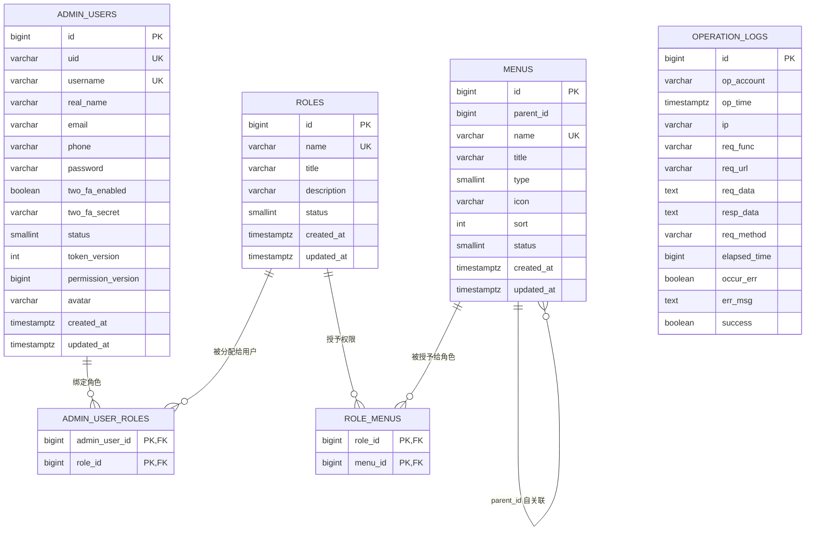
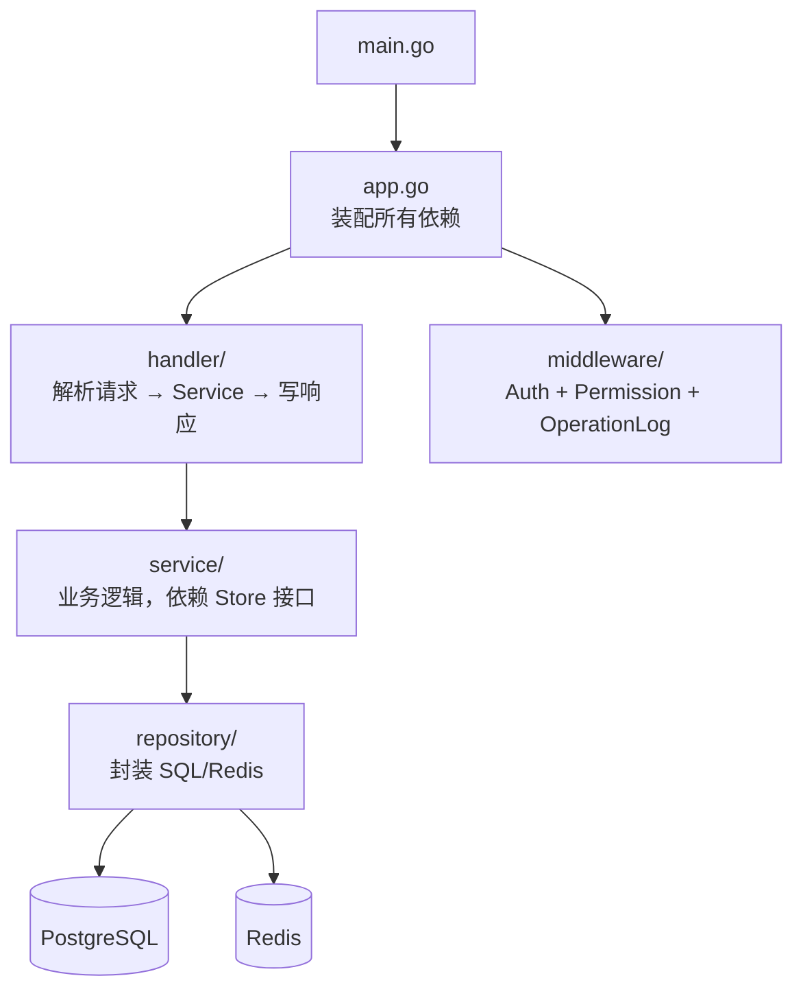
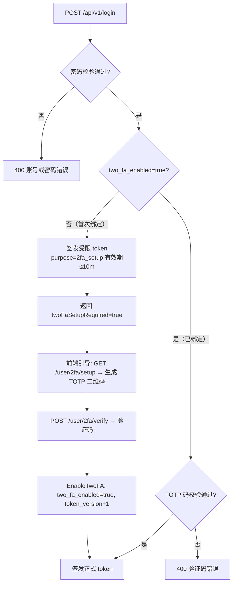
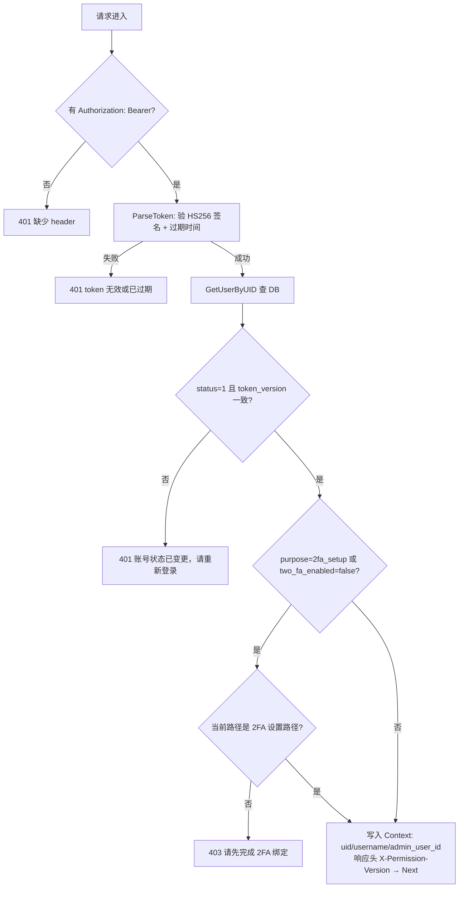
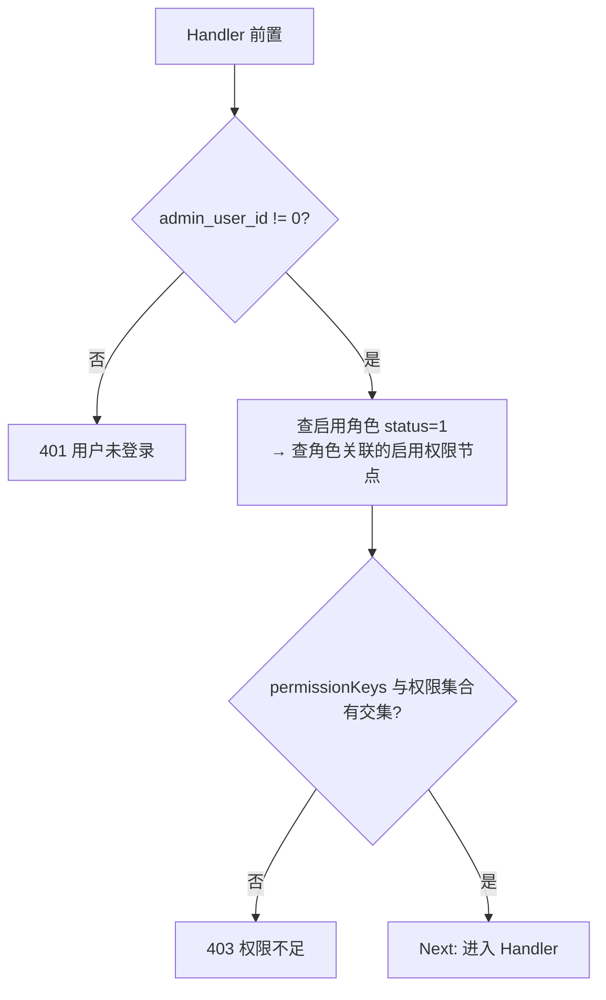
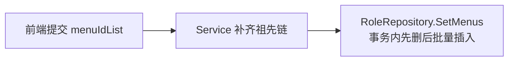
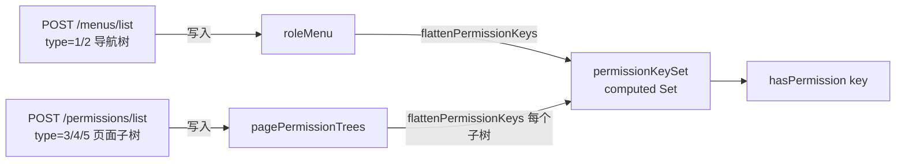
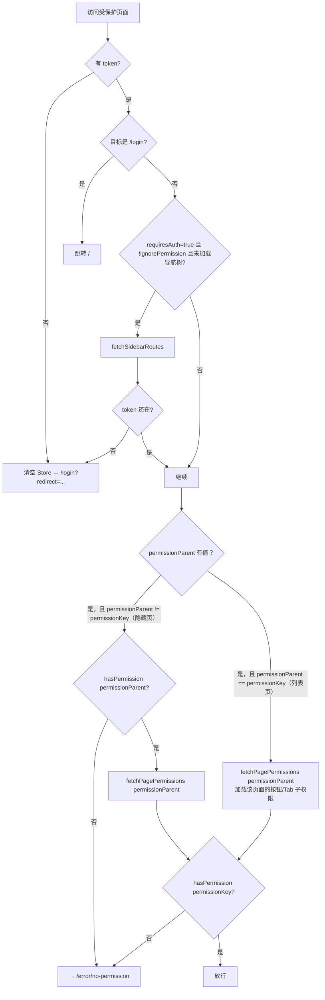

# 后台管理系统权限设计

> 版本：7.1 | 更新：2026-06-02
> 范围：Vue 3 管理后台 + Gin API + PostgreSQL
> 状态：已按实现核对，重构为前端 / 后端 / 前后端契约三层结构

---

## 目录

1. [系统概述](#1-系统概述)
2. [数据库设计](#2-数据库设计)
3. [后端实现](#3-后端实现)
4. [前端实现](#4-前端实现)
5. [前后端接口契约](#5-前后端接口契约)
6. [新增权限模块手册](#6-新增权限模块手册)
7. [已知缺陷与上线检查](#7-已知缺陷与上线检查)

---

## 1. 系统概述

### 1.1 RBAC 三层结构

```
管理员账号 → 角色（并集）→ 权限节点（menus 树）
```

- 一个管理员可绑定多个角色，权限取并集
- 权限节点统一存入 `menus` 表，用 `type` 区分节点类型
- 前端根据权限控制导航和按钮可见性；后端对每个 API 独立鉴权

### 1.2 安全边界原则

1. 前端菜单隐藏、按钮隐藏、路由守卫只是体验层，**不是安全边界**
2. 后端 `RequireAnyPermission` 中间件是**唯一安全边界**
3. 权限 key 全局唯一，前后端用同一个 key 对接

### 1.3 权限节点类型（`menus.type`）

| `type` | Go 常量 | 语义 | 侧边栏 | 路由 | 允许的父节点 |
| --- | --- | --- | --- | --- | --- |
| `1` | `MenuTypeDir` | 目录（不可点，如"系统管理"） | 是 | 否 | 根节点或目录 |
| `2` | `MenuTypePage` | 列表页（可点击，进侧边栏） | 是 | 是 | 目录 |
| `3` | `MenuTypeHidden` | 隐藏业务页（不进侧边栏，需独立授权） | 否 | 是 | 列表页 |
| `4` | `MenuTypeButton` | 按钮/操作（无路由） | 否 | 否 | 列表页或 Tab |
| `5` | `MenuTypeTab` | 页面内 Tab（可挂子 Tab 或按钮） | 否 | 前端本地注册 | 列表页或 Tab |

### 1.4 权限 key 命名规则

```
目录：          systemManage
列表页：        accountManage
隐藏页面：      accountManage-add
按钮：          accountManage-resetPassword
Tab：           accountManage-auditTab
Tab 内按钮：    accountManage-auditTab-approve
```

> 同一业务动作（如新增账号）的按钮、隐藏页入口和 API 权限统一用同一个 key（如 `accountManage-add`），避免入口可见但接口被拒。

---

## 2. 数据库设计

### 2.1 表关系



### 2.2 `admin_users` — 管理员账号

**设计决策：**
- 对外用 `uid`（UUID），内部 SQL Join 用 `id`（自增整数），防止业务 ID 暴露内部规律
- `password` 存 bcrypt 哈希，序列化时 `json:"-"` 隐藏
- `token_version` 是 JWT 版本号，安全事件发生后递增，旧 token 立即失效，无需等待 JWT 过期
- `permission_version` 是前端权限缓存版本号，权限来源变化后递增，通知前端主动刷新菜单和页面子权限树

| 字段 | 类型 | 说明 |
| --- | --- | --- |
| `id` | `BIGINT PK` | 内部自增主键，仅用于 SQL join |
| `uid` | `VARCHAR(36) UNIQUE` | 对外稳定 ID（UUID） |
| `username` | `VARCHAR(64) UNIQUE` | 登录账号 |
| `real_name` | `VARCHAR(64)` | 真实姓名（迁移 010 新增） |
| `email` | `VARCHAR(255)` | 邮箱 |
| `phone` | `VARCHAR(32)` | 手机号 |
| `password` | `VARCHAR(255)` | bcrypt 哈希；`json:"-"` |
| `two_fa_enabled` | `BOOLEAN DEFAULT FALSE` | 是否已完成 2FA 绑定 |
| `two_fa_secret` | `VARCHAR(128) NULL` | TOTP 密钥；`json:"-"`；重置时清空 |
| `status` | `SMALLINT DEFAULT 1` | `1` 启用、`2` 禁用、`3` 冻结 |
| `token_version` | `INT DEFAULT 1` | JWT 版本，安全事件时递增 |
| `permission_version` | `BIGINT DEFAULT 1` | 前端权限缓存版本，权限来源变化时递增（迁移 011 新增） |

**`token_version` 递增时机：**

| 操作 | Repository 方法 | SQL 行为 |
| --- | --- | --- |
| 密码重置 | `UpdatePassword` | `token_version+1` |
| 2FA 绑定成功 | `EnableTwoFA` | `token_version+1` |
| 重置 2FA | `ResetTwoFA` | `token_version+1` |
| 状态变更 | `Update` | `CASE WHEN status <> $5 THEN token_version+1` |

**`permission_version` 主动失效机制：**

| 操作 | Repository 方法 | 影响范围 |
| --- | --- | --- |
| 管理员改绑角色 | `AdminUserRepository.SetRole` | 目标管理员 |
| 角色基本信息或状态变化 | `RoleRepository.Update` | 已绑定该角色的管理员 |
| 删除角色 | `RoleRepository.Delete` | 已绑定该角色的管理员 |
| 覆盖角色权限 | `RoleRepository.SetMenus` | 已绑定该角色的管理员 |

`AuthMiddleware` 会在每个鉴权响应中写入 `X-Permission-Version`。前端将最近一次版本存入 `sessionStorage`；发现响应版本变化时执行 `sidebarStore.refreshPermissions()`，重新加载导航树并清空页面子权限缓存。

跨域部署时，Gin CORS 配置必须将 `X-Permission-Version` 加入 `ExposeHeaders`，否则浏览器端 Axios 无法读取该响应头。复刻时需要同时落地：

1. `admin_users.permission_version` 字段和模型扫描
2. Repository 权限变更后的版本递增
3. `AuthMiddleware` 响应头
4. CORS `ExposeHeaders`
5. 前端 `sessionStorage` 版本记录和 Axios 响应拦截刷新

> 当前菜单节点 CRUD 尚未同步递增受影响账号的 `permission_version`，见 §7.1 P2。通过迁移脚本直接写入 `menus` 或 `role_menus` 时，也必须显式递增版本号。

### 2.3 `roles` — 角色

**设计决策：** `name` 是程序标识（英文唯一），`title` 是展示名。`status != 1` 的角色不参与权限计算（查询带 `AND r.status = 1`）。

| 字段 | 类型 | 说明 |
| --- | --- | --- |
| `id` | `BIGINT PK` | 主键 |
| `name` | `VARCHAR(64) UNIQUE` | 角色标识，如 `superadmin` |
| `title` | `VARCHAR(64)` | 展示名称，如 `超级管理员` |
| `description` | `VARCHAR(255)` | 备注 |
| `status` | `SMALLINT DEFAULT 1` | `1` 启用；其他值角色失效 |

### 2.4 `menus` — 权限节点

**设计决策：** 用一张表统一存储目录、菜单页、隐藏页、按钮、Tab，`parent_id=0` 表示根节点。`name` 即权限 key，全局唯一，前后端以此对接。不使用自关联外键，由 Service 校验父子合法性。

| 字段 | 类型 | 说明 |
| --- | --- | --- |
| `id` | `BIGINT PK` | 主键 |
| `parent_id` | `BIGINT DEFAULT 0` | `0` = 根节点 |
| `name` | `VARCHAR(128) UNIQUE` | 权限 key（全局唯一） |
| `title` | `VARCHAR(64)` | 展示标题或 i18n key |
| `type` | `SMALLINT CHECK(1-5)` | 节点类型，见 §1.3 |
| `icon` | `VARCHAR(64)` | 图标，主要用于目录和列表页 |
| `sort` | `INT DEFAULT 0` | 同级排序，越小越靠前 |
| `status` | `SMALLINT DEFAULT 1` | `1` 启用；停用节点不参与权限计算 |

**树操作说明：**
- **构建**：`model.BuildMenuTree()` 用 `nodeMap[id]` 一次遍历，O(n)
- **删除**：Repository 用递归 CTE 删除整个子树，外键级联清理 `role_menus`
- **保存角色权限时祖先链补全**：Service 自动补齐所有祖先。例如只提交 `accountManage-auditTab-approve`，后端会同时写入 `systemManage → accountManage → accountManage-auditTab → accountManage-auditTab-approve`

### 2.5 关联表

**`admin_user_roles`：** 表结构支持多角色（联合主键），权限取并集。当前 `SetRole` 是先删后插单角色（UI 也只做单角色选择），与表结构存在不一致（见 §7.1 P2）。

| 字段 | 说明 |
| --- | --- |
| `admin_user_id` | PK, FK → `admin_users.id` ON DELETE CASCADE |
| `role_id` | PK, FK → `roles.id` ON DELETE CASCADE |

**`role_menus`：** `SetMenus` 在事务内先删后批量插入，保证权限覆盖的原子性。

| 字段 | 说明 |
| --- | --- |
| `role_id` | PK, FK → `roles.id` ON DELETE CASCADE |
| `menu_id` | PK, FK → `menus.id` ON DELETE CASCADE |

### 2.6 `operation_logs` — 操作日志

**设计决策：** 异步写入；中间件拦截所有鉴权路由；写入前递归脱敏 `password`、`token`、`secret`、`code`、`facode`、`otpauth_url`（替换为 `[REDACTED]`）；正文最多保留 4096 字节。

| 字段 | 类型 | 说明 |
| --- | --- | --- |
| `id` | `BIGINT PK` | 主键 |
| `op_account` | `VARCHAR(64)` | 操作账号 |
| `op_time` | `TIMESTAMPTZ` | 操作时间 |
| `ip` | `VARCHAR(64)` | 客户端 IP |
| `req_func` | `VARCHAR(128)` | Gin 路由模板（如 `/api/v1/admin-users/:id`） |
| `req_url` | `VARCHAR(512)` | 实际请求 URL |
| `req_data` | `TEXT` | 已脱敏请求体 |
| `resp_data` | `TEXT` | 已脱敏响应体 |
| `req_method` | `VARCHAR(16)` | HTTP 方法 |
| `elapsed_time` | `BIGINT` | 耗时（毫秒） |
| `occur_err` | `BOOLEAN` | 是否发生错误 |
| `success` | `BOOLEAN` | HTTP 状态码 < 400 |

### 2.7 索引与约束

| 项目 | 作用 |
| --- | --- |
| `admin_users.uid UNIQUE` | 对外 ID 唯一 |
| `admin_users.username UNIQUE` | 登录账号唯一 |
| `roles.name UNIQUE` | 角色标识唯一 |
| `menus.name UNIQUE` | 权限 key 唯一 |
| `CHECK menus.type BETWEEN 1 AND 5` | 拒绝未定义节点类型 |
| `idx_menus_parent_id` | 加速权限树查询 |
| `idx_role_menus_role_id` | 加速按角色查权限 |
| `idx_role_menus_menu_id` | 加速按权限反查角色 |
| `idx_operation_logs_op_account` | 加速按账号查日志 |
| `idx_operation_logs_op_time` | 加速按时间倒序查日志 |

---

## 3. 后端实现

### 3.1 目录结构

```
backend/
├── cmd/server/main.go              # 程序入口，加载 .env，调用 app.Run
├── internal/
│   ├── app/app.go                  # 依赖装配 + 路由初始化 + 优雅退出
│   ├── config/
│   │   ├── config.go               # 从环境变量加载 Config 结构体
│   │   ├── db.go                   # 初始化 PostgreSQL 连接池
│   │   ├── redis.go                # 初始化 Redis 客户端
│   │   └── jwt.go                  # JWT 签发与解析（JWTManager）
│   ├── consts/
│   │   ├── code.go                 # 业务状态码（复用 HTTP 语义）
│   │   └── iv.go                   # IV 相关常量
│   ├── crypto/aes_gcm.go           # AES-GCM 加解密（密码传输）
│   ├── handler/
│   │   ├── handler.go              # Handler 结构体 + 路由注册（RegisterRoutes）
│   │   ├── me_handler.go           # GET /userInfo、POST /menus/list、POST /permissions/list
│   │   ├── menu_handler.go         # 菜单 CRUD
│   │   ├── role_handler.go         # 角色 CRUD + 权限设置
│   │   ├── admin_user_handler.go   # 账号管理
│   │   └── operation_log_handler.go# 操作日志查询
│   ├── middleware/
│   │   ├── auth_middleware.go      # AuthMiddleware + RequireAnyPermission
│   │   └── operation_log_middleware.go # 请求/响应自动记录
│   ├── model/                      # 数据结构（AdminUser / Menu / Role / OperationLog）
│   ├── repository/                 # 所有 SQL / Redis 操作封装
│   ├── response/response.go        # 统一响应包装 Success[T] / Error
│   └── service/
│       ├── interfaces.go           # UserStore / MenuStore / RoleStore 接口
│       ├── user_service.go         # 登录、2FA、账号 CRUD
│       ├── permission_service.go   # GetMyMenus / GetMyPagePermissions / HasAnyPermission
│       ├── menu_service.go         # 菜单树查询与维护
│       ├── role_service.go         # 角色 CRUD + SetMenus（含祖先链补全）
│       ├── iv_service.go           # AES-GCM IV 挑战值
│       └── operation_log_service.go# 操作日志查询
├── migrations/                     # *.up.sql / *.down.sql
├── .env.example
├── docker-compose.yml
└── go.mod                          # 模块名：auth-service
```

### 3.2 分层职责与依赖方向



**核心原则：**
- 所有依赖通过构造函数注入，仅在 `app.go` 完成装配，无全局变量
- Service 只依赖 `interfaces.go` 定义的接口，不直接引用 Repository 类型
- Handler 只做翻译：请求解析 → 调用 Service → 写 HTTP 响应
- Repository 只写 SQL/Redis，不含业务逻辑

**`app.go` 装配顺序：**

```go
db          = config.OpenDB(cfg.DatabaseDSN)
redis       = config.NewRedisClient(cfg)
jwtManager  = config.NewJWTManager(cfg.JWTSecret, cfg.JWTExpirePeriod)

// Repository
ivRepo      = repository.NewIVRepository(redis)
userRepo    = repository.NewAdminUserRepository(db)
menuRepo    = repository.NewMenuRepository(db)
roleRepo    = repository.NewRoleRepository(db)
opLogRepo   = repository.NewOperationLogRepository(db)

// Service
ivService   = service.NewIVService(ivRepo)
userService = service.NewUserService(userRepo, ivService, jwtManager, cfg.PasswordCryptoKey, cfg.AppName)
permService = service.NewPermissionService(roleRepo, menuRepo)
menuService = service.NewMenuService(menuRepo)
roleService = service.NewRoleService(roleRepo, menuRepo)
opLogService= service.NewOperationLogService(opLogRepo)

// Handler
h = handler.New(userService, ivService, permService, menuService, roleService, opLogService, jwtManager)
handler.RegisterRoutes(router, h, middleware.OperationLogMiddleware(opLogRepo))
```

### 3.3 环境变量

| 变量 | 必填 | 默认值 | 说明 |
| --- | --- | --- | --- |
| `DATABASE_DSN` | **是** | 无 | PostgreSQL 连接串 |
| `JWT_SECRET` | 生产必填 | `dev-secret-change-me` | HS256 签名密钥 |
| `PASSWORD_CRYPTO_KEY` | 生产必填 | `dev-password-crypto-key` | AES-GCM 密钥原文，服务端经 SHA-256 派生为 32 字节密钥 |
| `REDIS_ADDR` | 否 | `127.0.0.1:6379` | Redis 地址 |
| `REDIS_PASSWORD` | 否 | 空 | Redis 密码 |
| `REDIS_DB` | 否 | `0` | Redis DB 编号 |
| `JWT_EXPIRE` | 否 | `24h` | JWT 有效期 |
| `HTTP_ADDR` | 否 | `:8800` | HTTP 监听地址 |
| `APP_ENV` | 否 | `development` | `production` 时启用 ReleaseMode，禁止默认密钥 |
| `APP_NAME` | 否 | `Auth Service` | 2FA TOTP 发行方名称 |
| `CORS_ORIGINS` | 否 | `http://localhost:60001` | 允许跨域来源（逗号分隔） |
| `SEED_USERNAME` / `SEED_PASSWORD` | 否 | 空 | 开发环境种子用户 |

### 3.4 统一响应格式与错误码

所有接口统一返回（`internal/response/response.go`）：

```json
{ "code": 200, "msg": "请求成功", "data": { ... } }
```

- `code` 与 HTTP 状态码一致，错误时 `data` 为 `null`

| `code` | 语义 | 前端行为 |
| --- | --- | --- |
| `200` | 成功 | 返回 `data` 字段 |
| `400` | 参数错误或凭据校验失败 | 弹出 `msg` |
| `401` | 未登录或 token 失效 | 清除 token → 跳转 `/login` |
| `403` | 权限不足 | 弹出 `msg`（特例：`403 + msg="请先完成 2FA 绑定"` → 跳转登录） |
| `404` | 资源不存在 | 弹出 `msg` |
| `409` | 数据冲突（如用户名重复） | 弹出 `msg` |
| `500` | 服务内部错误 | 弹出 `msg` |

### 3.5 登录与 2FA 流程



**JWT Payload（`internal/config/jwt.go`）：**

```json
{
  "uid": "管理员 UID",
  "username": "登录账号",
  "token_version": 1,
  "purpose": "(可选) 2fa_setup",
  "iat": 1717286400,
  "exp": 1717372800
}
```

两类 token：

| 类型 | 签发场景 | `purpose` | 可访问范围 |
| --- | --- | --- | --- |
| 正式 token | 2FA 验证通过 | 空 | 全部鉴权路由 |
| 受限 token | 未绑定 2FA 的首次登录 | `2fa_setup` | 仅 2FA 设置相关接口 |

> **为何不把权限列表写入 JWT：** 避免角色变更后旧 token 带有失效权限。每次请求实时从数据库查询权限，`token_version` 保证安全事件后立即吊销。

### 3.6 鉴权中间件链

两个中间件在 `RegisterRoutes` 中按序叠加，文件均在 `internal/middleware/auth_middleware.go`。

#### `AuthMiddleware`（JWT 校验）



#### `RequireAnyPermission`（权限校验）



路由注册示例（`internal/handler/handler.go`）：

```go
// 单一权限
r.POST("/roles", RequireAnyPermission(permSvc, "rolePermissions-add"))

// 多选一（view 或 edit 任意一个均可访问）
r.GET("/roles/info/:id", RequireAnyPermission(permSvc, "rolePermissions-view", "rolePermissions-edit"))
```

### 3.7 权限计算逻辑（`permission_service.go`）

```
admin_user_id
  → roles.GetByAdminUserID: 查启用角色（AND r.status=1）
  → menus.GetByRoleIDs: 查角色关联的启用权限节点（DISTINCT，AND m.status=1）
  → HasAnyPermission: menu.Name 集合与 permissionKeys 是否有交集
```

- `GetMyMenus`：只返回 type=1/2，用于侧边栏导航树
- `GetMyPagePermissions(pageKey)`：返回 type≥3 的子树，根节点 `parentId` 重置为 0

### 3.8 角色权限保存（祖先链补全）



示例：前端只勾选 `accountManage-auditTab-approve`，后端自动写入：
```
systemManage → accountManage → accountManage-auditTab → accountManage-auditTab-approve
```

**菜单节点类型校验（新增/编辑时）：**
- 目录只能挂在根节点或目录
- 列表页只能挂在目录
- 隐藏页面只能挂在列表页
- 按钮/Tab 只能挂在列表页或 Tab
- 不允许循环父链或将自身/后代设为父节点

---

## 4. 前端实现

### 4.1 目录结构与模块职责

```
frontend/src/
├── routes/permissionRoutes.ts        # 所有受权限控制的路由声明
├── setup/router-setup.ts             # beforeEach 守卫
├── store/sideBar.ts                  # 权限核心状态（Pinia Store）
├── api/sys/role.ts                   # 权限相关 API 封装
├── plugins/http.ts                   # Axios 请求/响应拦截器
├── use/
│   ├── useButtonRole.ts              # 普通页面按钮权限 hook
│   └── useTabsRole.ts                # Tab 和 Tab 内按钮权限 hook
└── components/TableSearchWrap/
    └── components/PermissionButton.vue # 列表页工具栏按钮鉴权组件
```

### 4.2 `sideBar` Store — 核心权限状态

文件：`src/store/sideBar.ts`

**所有权限判断收口到 `sidebarStore.hasPermission(key)`，组件/hook 只负责拼装 key。**

**状态字段：**

| 字段 | 类型 | 写入时机 | 用途 |
| --- | --- | --- | --- |
| `roleMenu` | `MenuItem[]` | `fetchSidebarRoutes` 完成后 | 侧边栏渲染源；拍平提供 type=1/2 权限 key |
| `pagePermissionTrees` | `Record<string, MenuItem[]>` | `fetchPagePermissions(pageKey)` 首次进入该页面时 | 按父页面缓存 type=3/4/5 子树 |
| `routes` | `RouteRecordRaw[]` | `fetchSidebarRoutes` 完成后 | 注入 Vue Router 的动态路由 |
| `permissionKeySet` | `computed Set<string>` | 响应上述两个 ref 变化 | 所有 `hasPermission` 的数据源 |
| `hasFetchedRoleMenu` | `boolean` | `fetchSidebarRoutes` 完成后置 true | 守卫判断是否需要触发导航树加载 |

**数据流向：**



`flattenPermissionKeys` 递归遍历节点，取 `item.component || item.name` 作为权限 key。

**生命周期：**

```
登录成功
  → 首次访问受保护页面 → fetchSidebarRoutes → roleMenu / routes 填充
  → 进入列表页或隐藏页 → fetchPagePermissions → pagePermissionTrees 填充

登出 / token 失效 / 刷新侧边栏
  → resetPermissions() → 全部清空

任意鉴权响应返回新的 X-Permission-Version
  → http.ts 检测到版本变化 → refreshPermissions()
  → 重新加载导航树 + 清空页面子权限缓存
```

**并发保护：** 同一 `pageKey` 只有一个 in-flight 请求（`fetchPagePromises Map`）。

### 4.3 路由守卫（`beforeEach`）

文件：`src/setup/router-setup.ts`

`beforeEach` 并行执行 4 个 handler：`setLanguage`、`setTitle`、`setRequiresAuth`（核心）、`setRedirect`。

**`setRequiresAuth` 完整流程：**



> 列表页（type=2）在代码里 `permissionParent` 等于 `permissionKey`，守卫也会调用 `fetchPagePermissions` 加载按钮/Tab 权限，但不需要额外校验父页面权限（因为是同一个 key）。

### 4.4 路由 meta 字段约定

```ts
interface RouteMeta {
    requiresAuth?: boolean        // true = 必须登录
    ignorePermission?: boolean    // true = 跳过权限校验（首页等公共页面）
    permissionKey?: string        // 对应 menus.name；缺省时取 route.name
    permissionParent?: string     // 隐藏页面的父列表页 key（type=3 路由必填）
}
```

### 4.5 按钮与 Tab 权限

所有路径最终收口到 `sidebarStore.hasPermission(key)`：

**列表页工具栏按钮（`PermissionButton.vue`）：**

```html
<PermissionButton button-key="add">新增</PermissionButton>
```

`PermissionButton` 默认按 `${route.name}-${buttonKey}` 拼出完整权限 key。

**普通页面按钮（`useButtonRole.ts`）：**

```ts
const { isShowBtn } = useButtonRole()
isShowBtn('resetPassword')      // → hasPermission('accountManage-resetPassword')
isShowBtn('edit', 'otherPage')  // → hasPermission('otherPage-edit')
```

> 自动拼接 `${route.name}-${btnRole}`，跨模块时传第二个参数覆盖 routeName。

**Tab 和 Tab 内按钮（`useTabsRole.ts`）：**

```ts
const { fetchShowTabs, isShowTabsBtn } = useTabsRole(tabs, defaultKey)
// fetchShowTabs: 过滤出 hasPermission(item.role) 为 true 的 Tab
// isShowTabsBtn: 直接传完整 key，如 'accountManage-auditTab-approve'
```

支持任意深度嵌套：`列表页(type=2) → Tab(type=5) → 子Tab(type=5) → 按钮(type=4)`

### 4.6 HTTP 拦截器（`src/plugins/http.ts`）

**请求拦截（自动附加）：**

| Header | 值 |
| --- | --- |
| `Authorization` | `Bearer <token>` |
| `Token` | `<token>`（兼容旧字段） |
| `pretreatment` | `true` |
| `X-B3-Traceid` | 随机 trace ID |
| `language` | 当前 i18n 语言 |

**响应拦截逻辑：**

```
每次鉴权响应:
  X-Permission-Version 变化 → refreshPermissions()，重新加载导航树和页面子权限

pretreatment=true（默认）:
  code [-1, 10005, 10021] → 跳转登录（兼容旧业务码）
  code 200               → 返回 data 字段（调用方直接拿业务数据）
  其他 code              → Message.error(msg)，Promise.reject

HTTP 错误:
  401                           → 清除 token + 跳转登录
  403 + "请先完成 2FA 绑定"    → 清除 token + 跳转登录
  403（其他）                  → 弹出 msg，不跳转
  其他                         → 弹出 msg，Promise.reject
```

**API 类约定：** 所有 API 类继承 `Api` 基类，`this.api` 已配置 `baseURL = VITE_APP_BASE_URL`（对应 `/api/v1`），方法路径不含版本前缀。

---

## 5. 前后端接口契约

### 5.1 权限 key 与路由对照（当前已注册）

> 列表页（type=2）的 `permissionParent` 在代码里写等于自身的 key，守卫会调用 `fetchPagePermissions(permissionParent)` 加载该页面的按钮/Tab 子权限。隐藏页（type=3）的 `permissionParent` 填父列表页 key，守卫还会额外检查父列表页权限。

| 路由 path | `route.name` | `permissionKey` | `permissionParent` | type |
| --- | --- | --- | --- | --- |
| `/systemManage/operationLog` | `operationLog` | `operationLog` | `operationLog`（自身） | 2 |
| `/systemManage/rolePermissions` | `rolePermissions` | `rolePermissions` | `rolePermissions`（自身） | 2 |
| `/systemManage/addRolePermissions` | `addRolePermissions` | `rolePermissions-add` | `rolePermissions` | 3 |
| `/systemManage/viewRolePermissions/:id/:see` | `viewRolePermissions` | `rolePermissions-view` | `rolePermissions` | 3 |
| `/systemManage/editRolePermissions/:id` | `editRolePermissions` | `rolePermissions-edit` | `rolePermissions` | 3 |
| `/systemManage/accountManage` | `accountManage` | `accountManage` | `accountManage`（自身） | 2 |
| `/systemManage/addAccount` | `addAccount` | `accountManage-add` | `accountManage` | 3 |
| `/systemManage/editAccount/:id` | `editAccount` | `accountManage-edit` | `accountManage` | 3 |

### 5.2 API 权限矩阵

| 接口 | 中间件 | 所需权限 key |
| --- | --- | --- |
| `POST /api/v1/login` | 无 | 公开 |
| `GET /api/v1/security/iv` | 无 | 公开 |
| `GET /api/v1/userInfo` | Auth | 登录态 |
| `POST /api/v1/menus/list` | Auth | 登录态 |
| `POST /api/v1/permissions/list` | Auth | 登录态 |
| `GET /api/v1/user/2fa/setup` | Auth | 登录态（含受限 token） |
| `POST /api/v1/user/2fa/verify` | Auth | 登录态（含受限 token） |
| `POST /api/v1/admin/menus/list` | Auth + Permission | `rolePermissions-add/view/edit` 任一 |
| `POST /api/v1/admin/menus` | Auth + Permission | `rolePermissions-menuManage` |
| `PUT /api/v1/admin/menus/:id` | Auth + Permission | `rolePermissions-menuManage` |
| `DELETE /api/v1/admin/menus/:id` | Auth + Permission | `rolePermissions-menuManage` |
| `POST /api/v1/roles/list` | Auth + Permission | `rolePermissions` 或 `accountManage` |
| `POST /api/v1/roles` | Auth + Permission | `rolePermissions-add` |
| `PUT /api/v1/roles/:id` | Auth + Permission | `rolePermissions-edit` |
| `DELETE /api/v1/roles/:id` | Auth + Permission | `rolePermissions-delete` |
| `GET /api/v1/roles/info/:id` | Auth + Permission | `rolePermissions-view/edit` 任一 |
| `GET /api/v1/roles/menus/:id` | Auth + Permission | `rolePermissions-view/edit` 任一 |
| `PUT /api/v1/roles/menus/:id` | Auth + Permission | `rolePermissions-edit` |
| `POST /api/v1/roles/add-update` | Auth（**⚠️ 无权限中间件**） | 仅登录态，前端角色授权页使用 |
| `POST /api/v1/admin-users/list` | Auth + Permission | `accountManage` |
| `GET /api/v1/admin-users/detail` | Auth + Permission | `accountManage-edit` |
| `POST /api/v1/admin-users` | Auth（动态校验） | Handler 内根据请求内容校验（见 §5.3） |
| `POST /api/v1/admin-users/reset-password` | Auth + Permission | `accountManage-resetPassword` |
| `POST /api/v1/admin-users/reset-2fa` | Auth + Permission | `accountManage-reset2FA` |
| `POST /api/v1/operation-logs/list` | Auth + Permission | `operationLog` |
| `POST /api/v1/users`（兼容旧接口） | Auth + Permission | `accountManage-add` |
| `POST /api/v1/users/list`（兼容旧接口） | Auth + Permission | `accountManage` |

> ⚠️ `/roles/add-update` 和 `/admin-users` 没有在路由注册层加 `requireAny` 中间件，权限校验在 Handler 内部用 `ensureAnyPermission` 动态完成。这两个接口是已知待优化点，P0 修复后应统一移到路由层。

### 5.3 接口 Request / Response 完整示例

> 响应拦截器自动解包，下面展示的是 `data` 字段内容（`code=200` 时）。

---

#### `POST /api/v1/login`

Request:
```json
{
  "username": "admin",
  "password": "<AES-GCM 加密后的密码>",
  "iv_id": "<GET /security/iv 返回的 iv_id>",
  "two_fa_code": "123456"
}
```

> 新客户端必须先请求 IV 挑战值并提交 `iv_id`。后端暂时兼容不传 `iv_id` 的旧客户端明文或遗留全局 IV 流程，见 §7.1 P1。

Response — 首次登录，未绑定 2FA:
```json
{
  "token": "<受限 JWT，purpose=2fa_setup>",
  "twoFaSetupRequired": true,
  "user": { "uid": "...", "username": "admin", "two_fa_enabled": false, "status": 1 }
}
```

Response — 已绑定 2FA，需要输入验证码:
```json
{ "twoFaRequired": true }
```

Response — 验证码正确，登录成功:
```json
{
  "token": "<正式 JWT>",
  "twoFaRequired": false,
  "user": { "uid": "...", "username": "admin", ... }
}
```

---

#### `GET /api/v1/security/iv`

Response:
```json
{ "iv_id": "uuid-string", "iv": "<12 字节随机 IV 的十六进制字符串>" }
```

---

#### `POST /api/v1/menus/list` — 当前用户导航树（type=1/2）

Request: `{}`

Response（树形）:
```json
[
  {
    "id": 1, "parent_id": 0, "name": "systemManage", "title": "系统管理", "type": 1,
    "children": [
      { "id": 2, "parent_id": 1, "name": "accountManage", "component": "accountManage",
        "title": "账号管理", "type": 2, "children": null }
    ]
  }
]
```

> 前端 `sysRoleApi.menuList()` 经 `normalizeMenuItem` 处理，保证 `name` 和 `component` 均有值，对应前端路由 `name` 即权限 key。

---

#### `POST /api/v1/permissions/list` — 页面子权限树（type=3/4/5）

Request:
```json
{ "parentKey": "accountManage" }
```

Response（根节点 `parentId` 重置为 0）:
```json
[
  { "id": 10, "parent_id": 0, "name": "accountManage-add",           "title": "新增",   "type": 3, "component": "accountManage-add" },
  { "id": 11, "parent_id": 0, "name": "accountManage-edit",          "title": "编辑",   "type": 3, "component": "accountManage-edit" },
  { "id": 12, "parent_id": 0, "name": "accountManage-resetPassword", "title": "重置密码","type": 4, "component": "accountManage-resetPassword" }
]
```

---

#### `POST /api/v1/admin-users/list`

Request:
```json
{ "account": "", "realName": "", "pageNo": 1, "pageSize": 20 }
```

Response:
```json
{
  "list": [
    {
      "userId": "uid-string", "account": "admin", "realName": "管理员",
      "roleId": "1", "roleName": "超级管理员",
      "state": 1, "lastLoginTime": "2026-06-02 10:00:00", "isFACode": 1
    }
  ],
  "total": 1
}
```

> `state`: `1` 启用、`2` 禁用、`3` 冻结；`isFACode`: `1` 已绑定 2FA、`0` 未绑定

---

#### `POST /api/v1/admin-users` — 新增 / 编辑 / 状态切换（共用接口）

**权限分支逻辑（Handler 内 `ensureAnyPermission` 动态校验）：**
- `id==""` → 新增，需要 `accountManage-add`
- `id` 非空 + 有实质字段 → 编辑，需要 `accountManage-edit`
- `id` 非空 + 只有 `state` → 状态切换，需要 `accountManage-disable`

Request（新增）:
```json
{ "id": "", "account": "newuser", "fullName": "新用户", "roleId": "2", "state": 1 }
```

Request（编辑）:
```json
{ "id": "uid-string", "account": "newuser", "fullName": "修改后", "roleId": "2", "state": 1 }
```

Request（仅状态切换）:
```json
{ "id": "uid-string", "state": 2 }
```

Response: `{}`

---

#### `GET /api/v1/admin-users/detail?userId=<uid>`

Response:
```json
{ "userId": "uid-string", "account": "admin", "fullName": "管理员", "roleId": "1", "roleName": "超级管理员", "state": 1 }
```

---

#### `POST /api/v1/admin-users/reset-password`

Request:
```json
{ "userId": "uid-string", "password": "<新密码>", "facode": "", "type": 0 }
```

Response: `{}`

---

#### `POST /api/v1/admin-users/reset-2fa`

Request:
```json
{ "userId": "uid-string", "password": "", "facode": "" }
```

Response: `{}`

---

#### `POST /api/v1/roles/list`

Request: `{}`

Response:
```json
{
  "roles": [
    { "id": 1, "name": "superadmin", "title": "超级管理员", "description": "", "status": 1 }
  ]
}
```

> 前端 `sysRoleApi.sysRoleList()` 将其转换为 `{ roleId: "1", roleName: "超级管理员" }` 供下拉使用。

---

#### `POST /api/v1/roles/add-update` — 新增 / 编辑角色

Request（新增，`roleId` 为空）:
```json
{
  "roleId": "", "roleName": "运营角色", "remark": "只读操作日志", "state": 1,
  "menuIdList": [{ "menuId": 1 }, { "menuId": 3 }]
}
```

Request（编辑，`roleId` 非空）:
```json
{
  "roleId": "2", "roleName": "运营角色", "remark": "修改后", "state": 1,
  "menuIdList": [{ "menuId": 1 }, { "menuId": 3 }, { "menuId": 7 }]
}
```

Response: `{}`

---

#### `GET /api/v1/roles/info/:id`

Response:
```json
{ "roleId": "2", "roleName": "运营角色", "remark": "只读操作日志", "state": 1 }
```

---

#### `GET /api/v1/roles/menus/:id`

Response:
```json
{ "menu_ids": [1, 3, 7] }
```

---

#### `POST /api/v1/admin/menus/list` — 完整权限树（角色配置用）

Request: `{}`

Response（树形，含全部 type）:
```json
[
  {
    "id": 1, "parent_id": 0, "name": "systemManage", "title": "系统管理", "type": 1,
    "children": [
      {
        "id": 2, "parent_id": 1, "name": "accountManage", "title": "账号管理", "type": 2,
        "children": [
          { "id": 10, "parent_id": 2, "name": "accountManage-add",           "title": "新增",   "type": 3 },
          { "id": 12, "parent_id": 2, "name": "accountManage-resetPassword", "title": "重置密码","type": 4 }
        ]
      }
    ]
  }
]
```

> 前端 `sysRoleApi.sysRoleMenuList()` 转换为 `{ menuId, menuName, parentId, type, children }` 供勾选树组件使用。

---

#### `POST /api/v1/operation-logs/list`

Request:
```json
{ "pageNo": 1, "pageSize": 20, "opAccount": "", "startTime": "", "endTime": "" }
```

Response:
```json
{
  "list": [
    {
      "id": 1, "op_account": "admin", "op_time": "2026-06-02T10:00:00Z",
      "ip": "127.0.0.1", "req_func": "/api/v1/admin-users",
      "req_data": "{\"account\":\"test\",\"password\":\"[REDACTED]\"}",
      "resp_data": "{\"code\":200,\"msg\":\"请求成功\",\"data\":{}}",
      "req_method": "POST", "elapsed_time": 45, "success": true
    }
  ],
  "total": 1
}
```

---

## 6. 新增权限模块手册

以新增「订单管理」（列表页 + 编辑隐藏页 + 两个按钮）为例。

### 6.1 开工前确认

先确认订单表结构、列表筛选字段、分页上限、详情响应、导出格式和删除规则。权限 key 固定为：

| 用途 | 权限 key | 节点类型 |
| --- | --- | --- |
| 订单列表与列表 API | `orderManage` | `2` |
| 编辑隐藏页与详情 API | `orderManage-edit` | `3` |
| 导出按钮与导出 API | `orderManage-export` | `4` |
| 删除按钮与删除 API | `orderManage-delete` | `4` |

### 6.2 后端（6 步）

**第 1 步：迁移文件写入权限节点，并提供回滚**

先查看 `migrations/` 已有编号，使用下一个未占用编号。当前仓库示例应新建 `migrations/012_order_permissions.up.sql`：

```sql
-- 列表页（挂在已有 systemManage 目录下）
INSERT INTO menus (parent_id, name, title, type, icon, sort, status)
SELECT id, 'orderManage', '订单管理', 2, 'orderManage', 10, 1
FROM menus WHERE name = 'systemManage'
ON CONFLICT (name) DO NOTHING;

-- 隐藏编辑页
INSERT INTO menus (parent_id, name, title, type, sort, status)
SELECT id, 'orderManage-edit', '编辑', 3, 0, 1
FROM menus WHERE name = 'orderManage'
ON CONFLICT (name) DO NOTHING;

-- 按钮：导出
INSERT INTO menus (parent_id, name, title, type, sort, status)
SELECT id, 'orderManage-export', '导出', 4, 0, 1
FROM menus WHERE name = 'orderManage'
ON CONFLICT (name) DO NOTHING;

-- 按钮：删除
INSERT INTO menus (parent_id, name, title, type, sort, status)
SELECT id, 'orderManage-delete', '删除', 4, 1, 1
FROM menus WHERE name = 'orderManage'
ON CONFLICT (name) DO NOTHING;

-- 给 superadmin 角色授权
INSERT INTO role_menus (role_id, menu_id)
SELECT r.id, m.id FROM roles r, menus m
WHERE r.name = 'superadmin'
  AND m.name IN ('orderManage', 'orderManage-edit', 'orderManage-export', 'orderManage-delete')
ON CONFLICT DO NOTHING;

-- 迁移脚本绕过 Repository，显式通知在线客户端刷新权限缓存
UPDATE admin_users
SET permission_version = permission_version + 1,
    updated_at = CURRENT_TIMESTAMP;
```

同时新建 `migrations/012_order_permissions.down.sql`：

```sql
-- role_menus 由外键级联清理
WITH RECURSIVE subtree AS (
    SELECT id FROM menus WHERE name = 'orderManage'
    UNION ALL
    SELECT m.id
    FROM menus m
    INNER JOIN subtree s ON m.parent_id = s.id
)
DELETE FROM menus WHERE id IN (SELECT id FROM subtree);

UPDATE admin_users
SET permission_version = permission_version + 1,
    updated_at = CURRENT_TIMESTAMP;
```

**第 2 步：新增 Repository 和消费方接口**

- 在 `internal/service/interfaces.go` 定义 `OrderStore`
- 新建 `internal/repository/order_repository.go`
- 列表查询使用参数化 SQL，分页和筛选参数来自 `POST` body
- 涉及多个表的写操作必须由 Repository 在事务内完成

**第 3 步：新增 Service**

新建 `internal/service/order_service.go`，实现列表、详情、删除和导出流程。Service 负责参数边界、状态规则和业务错误转换，不写 SQL，不感知 HTTP。

**第 4 步：新增 Handler**

新建 `internal/handler/order_handler.go`。Handler 只负责解析和校验请求、调用 `OrderService`、通过统一响应结构返回结果。

**第 5 步：注入依赖并注册权限路由**

在 `internal/app/app.go` 装配 `OrderRepository → OrderService → Handler`，在 `internal/handler/handler.go` 的 `Handler` 和 `New` 中注入 `OrderService`。动态路径参数只能放在最后一个片段：

```go
auth.POST("/orders/list",  h.requireAny("orderManage"),        h.ListOrders)
auth.GET("/orders/export", h.requireAny("orderManage-export"), h.ExportOrders)
auth.GET("/orders/:id",    h.requireAny("orderManage-edit"),   h.GetOrder)
auth.DELETE("/orders/:id", h.requireAny("orderManage-delete"), h.DeleteOrder)
```

**第 6 步：补后端测试**

- Service 测试：分页边界、资源不存在、删除规则
- Repository 测试：参数化筛选和多步写入事务回滚
- 路由测试：未登录返回 `401`，无权限返回 `403`，有权限返回 `200`
- 完成后执行 `go test ./...`、`go vet ./...`、`go build ./...`

### 6.3 前端（4 步）

**第 1 步：路由声明**（`src/routes/permissionRoutes.ts`）

```ts
{
    path: 'orderManage', name: 'orderManage',
    component: loadRouteView('SystemManage/order-manage/Index'),
    meta: { title: '订单管理', requiresAuth: true, permissionKey: 'orderManage', permissionParent: 'orderManage' },
},
{
    path: 'editOrder/:id', name: 'editOrder',
    component: loadRouteView('SystemManage/order-manage/form/Index'),
    meta: { title: '编辑订单', requiresAuth: true, isShow: true, permissionKey: 'orderManage-edit', permissionParent: 'orderManage' },
},
```

列表页必须让 `permissionParent` 等于自身 key，以便进入页面时加载按钮子树。隐藏页必须声明独立的 `permissionKey`，禁止复用父页面权限。

**第 2 步：新增页面和按钮权限**

```html
<!-- 列表页工具栏按钮 -->
<PermissionButton button-key="export">导出</PermissionButton>
```

```ts
// 页面内普通按钮
const { isShowBtn } = useButtonRole()
isShowBtn('delete')   // → hasPermission('orderManage-delete')
```

`PermissionButton` 和 `useButtonRole` 会按当前列表页路由名拼出 `${route.name}-${buttonKey}`。如果按钮跨模块操作，显式传入 `routeName`。

**第 3 步：新增 API 文件**（`src/api/sys/order.ts`）

```ts
import { Api } from '../api'
class SysOrderApi extends Api {
    listOrders(params: { pageNo: number; pageSize: number }) {
        return this.api.post('/orders/list', params)
    }
    deleteOrder(id: string) {
        return this.api.delete(`/orders/${id}`)
    }
}
export default new SysOrderApi()
```

**第 4 步：补前端测试并验证**

- 路由守卫：只有 `orderManage` 时不能直接访问编辑 URL
- 按钮：缺少 `orderManage-export` 或 `orderManage-delete` 时对应按钮隐藏
- 完成后执行 `pnpm run typecheck`、`pnpm run lint`

### 6.4 权限缓存失效规则

- 通过 `RoleRepository.SetMenus` 给已有角色增删订单权限时，Repository 会递增受影响账号的 `permission_version`
- 通过迁移脚本直接写 `menus` 或 `role_menus` 时，迁移必须显式递增 `permission_version`
- 前端不需要手工改 Store；任意鉴权响应返回新的 `X-Permission-Version` 后，HTTP 拦截器会刷新权限树

### 6.5 上线检查清单

| # | 检查项 | 验证方式 |
| --- | --- | --- |
| 1 | `up.sql` 可重复执行 | 连续执行两次，无唯一键冲突 |
| 2 | `down.sql` 可回滚完整子树 | 回滚后 `SELECT * FROM menus WHERE name LIKE 'orderManage%'` 返回 0 行 |
| 3 | 数据库有四条 `menus` 记录，`name` 全局唯一 | 执行 `up.sql` 后查询 `menus` |
| 4 | superadmin 角色已授权 | 查询 `role_menus JOIN menus` |
| 5 | 列表筛选和分页走 `POST` body | curl 请求 `/orders/list` |
| 6 | 未登录调用新接口返回 `401` | 不带 token curl |
| 7 | 无权限账号调用新接口返回 `403` | 用受限账号 curl |
| 8 | 有权限账号调用新接口返回 `200` | 用 superadmin curl |
| 9 | 关键写操作真实落盘 | 删除后查询数据库或详情接口 |
| 10 | 前端 `permissionKey` 和 `menus.name` 完全一致 | 对照路由和迁移 |
| 11 | 侧边栏显示新菜单 | 登录后侧边栏有“订单管理” |
| 12 | 无权限时直接访问隐藏页 URL 被拒绝 | 用无 `orderManage-edit` 的账号访问 URL |
| 13 | 按钮根据权限显隐正确 | 用无导出权限的账号，导出按钮不可见 |
| 14 | 权限版本变化会刷新前端缓存 | 调整角色权限后检查 `X-Permission-Version` 和菜单刷新 |
| 15 | 后端和前端检查通过 | 执行第 6 步和前端第 4 步命令 |
| 16 | 操作日志有记录且敏感字段已脱敏 | 查询 `operation_logs` 最新记录 |

---

## 7. 已知缺陷与上线检查

### 7.1 已知缺陷

| 优先级 | 缺陷 | 影响 | 建议 |
| --- | --- | --- | --- |
| `P0` | 没有系统角色保护和可授予范围上限 | 拥有编辑权限的管理员可绑定任意角色、授予超出自身的权限 | 为 `roles` 增加 `is_system`/`level`；保存时校验目标角色和权限集合 |
| `P0` | 重置密码/2FA 未校验操作者身份 | 高权限账号可能被直接接管 | 引入统一敏感操作验证器；保护超级管理员 |
| `P1` | 多步写入缺少统一事务 | 新建角色/账号后关联失败会留下孤立记录 | 将角色+权限、账号+角色保存收口为 Repository 事务 |
| `P1` | 存在早期兼容接口 `/users`、`/users/list` | 与正式契约重复，增加维护面 | 确认无调用后移除 |
| `P1` | 缺少完整的权限基线种子 | 新库可以建表，但不会自动生成基础角色、菜单树和超级管理员授权 | 增加可重复执行的权限基线种子 |
| `P1` | 密码传输兼容明文回退 | 旧客户端回退会扩大风险 | 生产环境强制 HTTPS；移除明文兼容 |
| `P2` | 菜单节点 CRUD 未递增 `permission_version` | 直接停用或删除菜单后，受影响账号的前端按钮可能短暂显示旧状态 | 菜单写入事务中反查受影响账号并递增权限版本 |
| `P2` | 多角色表结构与单角色 UI 不一致 | 表允许多角色，但写入/展示只支持单角色 | 明确选择单/多角色；若单角色补唯一约束 |
| `P2` | 列表分页无最大 `pageSize` 限制 | 可请求过大分页，增加 DB 压力 | Service 层统一限制最大页大小 |
| `P2` | `status` 缺少数据库检查约束 | 非法状态值可能绕过应用层 | 为账号、角色补 `CHECK` 约束 |

**在完成两个 P0 前，不建议将账号管理和角色授权能力下放给非可信管理员。**

### 7.2 上线检查

部署顺序：

1. 新环境按编号顺序执行 `001_init.sql` 和全部 `*.up.sql`
2. 已运行旧迁移的环境先备份数据库，再按序执行增量 `*.up.sql`
3. 发布后端，再发布前端
4. 用超级管理员和受限角色回归

`*.down.sql` 仅供人工回滚，不能自动执行。

最低回归场景：

| 场景 | 预期 |
| --- | --- |
| 未登录直接访问隐藏页面 URL | 跳转登录 |
| 只有列表权限，直接访问编辑 URL | 跳转无权限页 |
| 绕过前端直接调无权 API | 后端返回 `403` |
| 账号被停用后使用旧 token | 后端返回 `401` |
| 重置密码或 2FA 后使用旧 token | 后端返回 `401` |
| 角色停用或权限移除后调用 API | 权限立即失效 |
| 角色权限变化后继续发起鉴权请求 | 响应头 `X-Permission-Version` 变化，前端刷新权限树 |
| 删除父权限节点 | 子树和角色关联一并删除 |
| Tab 下嵌套按钮 | 前端递归判断正确 |
| 审计日志包含密码或验证码 | 数据库存储为 `[REDACTED]` |
