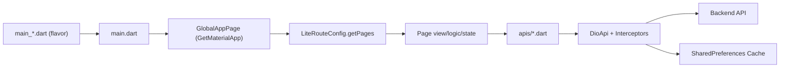

# 架构与分层

## 启动链路

1. Flavor 入口（`lib/main_qa.dart` 等）设置环境变量。
2. 调用 `lib/main.dart`：
3. 初始化 `SharedPreferences`、Firebase、Isar、FCM、屏幕方向。
4. `runApp(GlobalAppPage())` 进入根应用。
5. `GlobalAppPage` 挂载 `GetMaterialApp`，绑定路由、主题、多语言、全局弹窗。

## 全局应用层

`lib/global_app/` 负责全局状态与生命周期：

- `logic.dart`：全局初始化、用户数据预加载、网络监听、登出状态清理。
- `state.dart`：全局状态容器（账户信息、未读数、锁屏状态、币种列表等）。
- `view.dart`：根 Widget，管理深链、主题、锁屏覆盖层、国际化设置。

## 页面组织模式（GetX）

项目大量页面采用三件套：

- `view.dart`：UI 展示与交互触发
- `logic.dart`：业务逻辑、接口调用、状态更新
- `state.dart`：页面状态

这套模式在 `lib/lite_page/*`、`lib/pages/*`、`lib/new_pages/*` 中普遍存在。

## 网络与数据流

统一请求入口：

- `lib/apis/apis.dart`：`final ApiService api = DioApi.getInstance();`
- `lib/dio/dio_api.dart`：Dio 初始化与拦截器挂载

拦截器职责：

1. `BaseUrlInterceptor`：设置 `baseUrl`
2. `HeaderInterceptor`：注入语言、版本、设备信息、Token、时区等请求头
3. `MainInterceptor`：统一处理业务码（200、10005、10021、9003 等）
4. `LoggerInterceptor`：日志输出 + 指定接口响应缓存到 `SharedPreferences`

## 架构简图

## 注意点

1. `main.dart` 中存在 `HttpOverrides.badCertificateCallback = true`，属于放宽证书校验的实现，生产安全策略需谨慎评估。
2. `GlobalAppLogic` 同时承担初始化和登录后数据加载，新增全局能力时优先放入该层，避免散落到页面首屏逻辑中。
