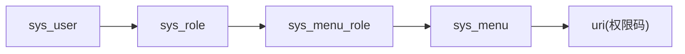

# 管理后台权限设计（upay-sys-api）

## 1. 文档目标与范围

本文基于 `UPayT/upay-sys-api` 现有实现，整理管理后台权限体系设计，覆盖：
- 登录认证（Token + 2FA）
- 访问授权（RBAC + URI 权限）
- 角色/菜单管理
- 权限缓存与限频
- 审计留痕

不包含：代理商端（broker）独立权限体系、APP端用户权限体系。

---

## 2. 总体设计

当前实现采用 **RBAC（用户-角色-菜单/资源）** 模式，权限校验粒度为 **URI**。

核心结论：
- 用户直接绑定一个角色：`sys_user.role_id`
- 角色绑定多个菜单：`sys_menu_role(role_id, menu_id)`
- 菜单维护权限URI：`sys_menu.uri`（可逗号分隔多个）
- 请求时校验：`当前请求URI` 是否在用户角色权限集中

---

## 3. 核心数据模型（权限相关）

### 3.1 `sys_user`
- 关键字段：
  - `id`
  - `account`
  - `password`
  - `role_id`
  - `state`（启用/禁用/冻结）
  - `secret_key`（Google 2FA 秘钥）
  - `google_state`
  - `password_error`

### 3.2 `sys_role`
- 关键字段：
  - `id`
  - `role_name`
  - `state`
  - `op_password_state`（操作密码相关字段）

### 3.3 `sys_menu`
- 关键字段：
  - `id`
  - `menu_name`
  - `menu_type`（目录/菜单/按钮）
  - `parent_id`
  - `component`
  - `uri`（权限URI，支持多个逗号分隔）
  - `check_password`
  - `state`

### 3.4 `sys_menu_role`
- 关键字段：
  - `id`
  - `role_id`
  - `menu_id`
  - `check_password`

---

## 4. 认证设计（Authentication）

## 4.1 请求入口
- 统一由 `AuthorityInterceptor` 拦截（`WebConfig#addInterceptors`）
- 上下文路径为 `/api`，内部鉴权时会去掉 `/api` 前缀再匹配URI

## 4.2 登录流程（两阶段）

1. 账号密码登录：`POST /v1/sys/login`（`@NoLogin`）
2. 服务端生成 `Token`，写入 Redis（`token:sys:{userId}`）
3. 初始状态 `useState=2`（未生效）
4. 二次校验 `POST /v1/sys/validateGoogle` 成功后，`useState=1`
5. 后续请求携带请求头 `Token`

## 4.3 Token校验规则
- Header 名称：`Token`
- JWT 签名校验 + 解密用户ID
- Redis 必须存在登录态
- 请求 token 必须与 Redis 中 `accessToken` 一致（单点会话）
- 每次请求成功后续期（TTL 重置）

## 4.4 2FA与冻结策略
- 密码错误次数超限会冻结账号
- Google验证码错误达到阈值（默认5次）会冻结账号
- 未绑定2FA时，仅允许部分初始化接口

---

## 5. 授权设计（Authorization）

## 5.1 授权入口
- `PermissionAspect` 在 `@GetMapping` / `@PostMapping` 前执行
- 从 `AuthContext` 读取当前用户权限集（`permissionList`）

## 5.2 权限码来源
- `UserServiceImpl#getPermissions(roleId)`：
  - 查 `sys_menu_role` 得菜单ID
  - 查 `sys_menu` 得 `uri`
  - `uri` 按 `,` 拆分成权限码集合
  - 缓存至 Redis：`perm:sys:{roleId}`

## 5.3 校验策略
- 命中以下任一条件即放行：
  - 在白名单 `authExcludeUriList`
  - 方法标注 `@NoLogin`
  - 请求URI在权限集合中精确匹配
  - 请求URI匹配正则权限（权限项以 `$` 结尾时作为正则）
- 不命中则返回 `403 FORBIDDEN`

---

## 6. 管理侧权限管理能力

## 6.1 用户与角色
- 用户管理：`/v1/sys/user/*`
  - 列表、新增/编辑、详情、重置密码、更新密码、退出登录
- 角色管理：`/v1/sys/role/*`
  - 角色列表、新增/编辑角色、角色详情

## 6.2 菜单与权限
- 菜单管理：`/v1/sys/menu/*`
  - 菜单列表（按当前角色）
  - 权限菜单列表（全量）
  - 角色勾选菜单列表（编辑回显）
  - 新增菜单

## 6.3 缓存失效
- 角色更新后删除 `perm:sys:{roleId}`，触发下次懒加载重建权限集

---

## 7. 配套安全机制

- 访问频控：按用户+URI限流（5次/5秒，80次/60秒）
- 审计日志：大量管理接口标注 `@OpRecordAnnotation`，落库 `sys_op_record`
- 追踪能力：`TraceIdInterceptor` 注入 `traceId` 到 MDC
- 请求域信息：`AuthContext` 保存 `ip/device/language/time-zone/user/role/permissions`

---

## 8. 当前实现中的设计注意点

1. 权限AOP目前只拦截 `GetMapping/PostMapping`。
2. 白名单URI较长，维护成本高，存在误配风险。
3. `SysRoleAddReq` 中 `allowStart/allowEnd/checkOpPassword` 字段当前未形成完整生效链路。
4. `RolesMenuListReq.checkUserPassword` 传入值当前未在角色授权落库时使用。
5. Token签名密钥当前在代码内固定，建议外置配置并支持轮换。

---

## 9. 建议的目标态（管理后台）

1. 将权限校验统一到“资源编码（resource_code）”，URI仅作为路由映射层。
2. 对白名单做分层：`NoAuth`（完全匿名）/`NoPerm`（登录免权限）/`InternalCallback`（签名校验）。
3. 补齐“操作密码 + 可操作时段”在服务层的强制校验。
4. 引入权限变更事件（角色菜单更新后主动广播失效缓存），降低短时脏权限窗口。
5. 新增权限配置审计：谁在什么时间给哪个角色增加/删除了哪些权限。

---

## 10. 落地清单（实施顺序）

1. 统一权限白名单配置化（移出硬编码列表）。
2. 完成 `checkUserPassword/opPasswordState/allowStart/allowEnd` 的端到端校验链路。
3. 扩展权限AOP到所有HTTP方法注解。
4. 增加权限变更审计明细表（角色-菜单差异记录）。
5. 完成Token密钥外置与轮换方案。

---

该设计文档以 `upay-sys-api` 当前代码实现为基线，可直接作为管理后台权限改造与验收参考。

