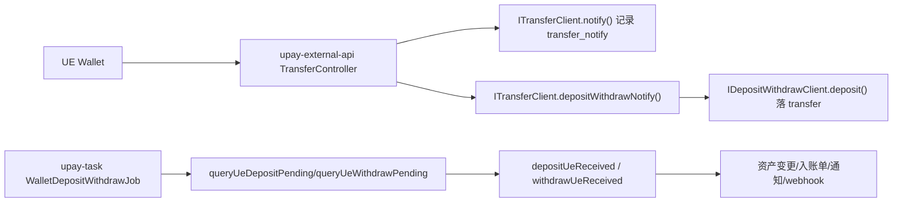

# UE钱包模块设计

## 1. 文档目标与范围

整理 UE 钱包（`wallet_type=1`）在 UPay 后端中的设计与落地，覆盖：

- UE 地址池管理（创建、补充、查询）
- UE 回调接入（签名、幂等、落库）
- 充值入账与提现出账（任务推进）
- 补偿与排障路径

不包含：Safeheron/FortPay 的完整实现细节（仅在对比或联动处点到）。

---

## 2. 总体设计

UE 钱包链路跨 3 个模块协同：

1. `upay-external-api`：HTTP 回调接入层  
   - `POST /api/v1/notify/depositWithdraw`
2. `upay-wallet-server`：钱包领域核心（Dubbo provider）  
   - `upay-wallet-client`（接口契约）  
   - `upay-wallet-service`（业务实现）
3. `upay-task`：定时任务推进与补偿

核心结论：

- UE 回调采用“先落通知表，再执行业务”的双阶段策略。
- 充值/提现都由 task 异步推进最终状态，回调本身不直接完成全部业务。
- 同时存在回调防重 + 业务防重 + 补偿任务，保障最终一致性。

---

## 3. 核心数据模型（UE相关）

### 3.1 `transfer`（交易主表）

作用：承载充提主状态机。  
UE 关键字段：

- `type`（充值/提现）
- `state`（`TransferStateEnum`：成功/确认中/失败等）
- `wallet_state`（UE 原始状态字符串）
- `wallet_type=1`（UE）
- `exchange_id`、`tx_hash`
- `account_id`、`agent_id`、`coin_id`、`chain_id`
- `risk_coin_status`、`risk_level`

### 3.2 `coin_address`（地址池）

作用：地址归属与可用性管理。  
关键字段：

- `address`
- `agent_id`
- `wallet_site_id`
- `coin_id` / `chain_tag`
- `wallet_type`（UE=1）
- `status`（`CoinAddressStateEnum`）
- `account_id`（是否已绑定）

### 3.3 `transfer_notify`（回调原始留痕）

作用：保存回调原文，支撑补偿重放。  
关键字段：

- `order_id`（对应 `exchange_id`）
- `tx_hash`
- `wallet_type`
- `order_type`
- `info`（原始 body）
- `create_time`

### 3.4 其他关键表

- `deposit`：充值入账单
- `wallet_site`：钱包站点（含加密 apiKey/secret）
- `wallet_site_coin` / `site_coin`：币链开关与可用性
- `agent_address_replenish`：地址余量补充策略

---

## 4. 地址能力设计（UE）

### 4.1 对外接口

- 契约：`IAddressClient`
- 实现：`AddressServiceImpl`

关键方法：

- `createUeAddress(List<AddressUeCreateReq>)`
- `agentAddressUeCreate()`
- `queryByUeAddress(String)`
- `newUEAddressCreate()`（临时能力，任务注解已注释）

### 4.2 地址创建流程

`createUeAddress` 主路径：

1. 校验代理商、钱包站点、币种、链状态。
2. 通过 `UEService.queryApiKeyBySiteId` 获取 UE token/apiKey/secret。
3. 调用 `WalletHttpUtil.createAddress` 访问 UE `/ThirdApi/Assets/addDepositAddress`。
4. 去重后写入 `coin_address`，固定 `wallet_type=UE`。

### 4.3 地址自动补充流程

任务：`upay-task` -> `AddressCreateJob.agentAddressCreate()`（`fixedDelay=60000`）  
调用：`addressClient.agentAddressUeCreate()`

策略来源：

- `CoinAddressMapper.queryAgentUeAddressRemainingNum()` 统计余量
- `AgentAddressReplenish` 查询代理商阈值与补充量
- 余量低于阈值即触发批量补充

---

## 5. 回调处理设计（UE）

### 5.1 回调入口

`upay-external-api`：`TransferController.depositWithdraw`

- 路径：`POST /api/v1/notify/depositWithdraw`
- 先执行 `transferClient.notify(notifyReq, body)` 落 `transfer_notify`
- 再执行 `transferClient.depositWithdrawNotify(...)` 进入钱包域

### 5.2 幂等策略（两层）

1. 外层（external-api）：  
   Redis key：`RedisKeyGener.coinDepositCacheKey + txid/exchange_id`，TTL 60 秒
2. 内层（wallet-service）：  
   Redis key：`wallet:callback:txid:{txid/exchange_id}`，TTL 20 秒

### 5.3 签名校验

`TransferClientServiceImpl.depositWithdrawNotify` 在有签名参数时：

1. 用 `to_address` 反查 `coin_address` -> `wallet_site`
2. 解密站点 `api_key/secret`
3. `WalletCallbackSignUtil.sign(params, apiKey, secret)` 复算签名
4. 不一致直接失败

### 5.4 回调落业务分发

按 `order_type` 分发：

- 充值：`depositWithdrawClient.deposit(...)`（进入充值交易落库）
- 提现：仅记录日志，后续由 task 推进出账确认

---

## 6. 充值设计（UE）

### 6.1 第一阶段：回调落交易

方法：`DepositWithdrawServiceImpl.deposit(...)`

关键逻辑：

1. 用 `txid/exchange_id` 对 `transfer` 做幂等检查。
2. 校验 UE 状态字符串（`success/faild`）。
3. 以 `coin + chainItemId + toAddress` 定位 `coin_address`。
4. 写入 `transfer`，UE充值默认 `state=CONFIRMING`。
5. 发送代理商 webhook 记录动作。

### 6.2 第二阶段：task 推进入账

任务：`WalletDepositWithdrawJob.depositReceived()`（20s）  
调用：`transactionService.checkUeDeposit()`

流程：

1. `queryUeDepositPending()` 查询待入账 UE 订单。
2. 校验 `site_coin` 与 `chain` 是否启用。
3. 调用 `depositUeReceived(transfer)` 完成入账推进。

### 6.3 入账推进核心

`depositUeReceived` 关键行为：

1. 地址有效性校验（含弃用规则）。
2. 调 UE 明细 + AML 结果，更新风控状态。
3. 高风险冻结时，地址转风控弃用并进入材料流程。
4. 处理最小入账金额（可合并历史未入账记录）。
5. 入账成功后：
   - 写 `deposit`
   - 更新 `transfer` 状态
   - 资产入账
   - 用户通知（邮件/站内）
   - 商户账单消息与 webhook

---

## 7. 提现设计（UE）

### 7.1 任务入口

任务：`WalletDepositWithdrawJob.withdrawReceived()`（20s）  
调用：`transactionService.checkUeWithdraw()`

### 7.2 待处理条件

`queryUeWithdrawPending()`：

- `type=WITHDRAW`
- `state=CONFIRMING`
- `wallet_type=UE`
- `limit 10`

### 7.3 出账确认逻辑

`withdrawUeReceived`：

1. 调 UE `depositWithdrawInfo` 查询最终链上状态。
2. 成功：
   - `transfer=SUCCESS`
   - 扣减冻结资产
   - 生成钱包流水
3. 失败：
   - `transfer=FAILD`
4. 成功/失败均发送：
   - 代理商 webhook
   - 用户通知
   - 商户账单消息

---

## 8. 补偿与重放设计

补偿入口：`WalletDepositWithdrawJob.depositCompensate()`（20s）

- 调用 `transferClient.depositCompensate()`
- 从 `transfer_notify` 查询“有回调但无 transfer”的充值通知重放

`queryDepositCompensate` SQL 规则：

1. `order_type=1`（充值）
2. 最近 2 天内，且距当前至少 10 分钟
3. `NOT EXISTS transfer.exchange_id = transfer_notify.order_id`
4. `wallet_type=1`（UE）
5. 按 `order_id` 取最新一条，单次最多处理 2 条

---

## 9. UE鉴权与密码设计

`UEServiceImpl` 负责站点级 UE 凭据与交易密码：

1. 从 `wallet_site` 解密 `apiKey/secret`。
2. 调 UE `/ThirdApi/User/getUserInfo` 获取 token。
3. 组装 `WalletUserTokenReq` 供后续调用。
4. 交易密码缓存：
   - key：`ue:withdraw:pwd:%s`
   - value：`md5(密码)` 再做 `AesCBC + salt` 加密

---

## 10. 配置与部署要点（wallet-service）

- 应用名：`upay_wallet_service`
- 端口：`20007`
- context-path：`/upay_wallet_service`
- 默认 profile：`test`
- Nacos 共享配置（示例）：`mysql.yml`、`redis.yml`、`wallet-api.yml`、`safeheron.yml`、`fortpay.yml` 等

`wallet.api.baseUrl` 由 `WalletAPIParam` 读取，UE API URI 常量位于 `WalletApiUri`。

---

## 11. 当前实现中的设计注意点

1. UE 回调幂等存在双层 Redis 锁（external-api 与 wallet-service），配置和排障时需同时关注。
2. `WalletHttpUtil.createPost` 中 `nonce` 当前固定值（`122345`），存在被质疑重放风险的可能。
3. 充值推进依赖 task 轮询，不是回调即终态，排障必须区分“回调已落库”和“已入账完成”。
4. 提现回调当前主要通过任务确认，不走“回调即出账完成”的同步模式。
5. 地址补充阈值与补充量由策略表控制，若策略缺失会导致余量不补。

---

## 12. 建议目标态（UE）

1. 统一回调幂等策略配置（TTL、key 规范、监控告警）。
2. 将 `nonce` 改为随机值并补充防重签名时间窗校验。
3. 对“回调落库 -> 入账推进”增加状态看板（便于运营排障）。
4. 抽象充值/提现任务通用重试框架，降低补偿逻辑分散度。
5. 增加 UE 接口异常分级（网络异常、签名异常、业务码异常）与对应恢复策略。

---

## 13. 落地清单（实施顺序）

1. 配置化整理 UE 回调幂等参数与监控指标。
2. 增加回调处理链路 trace（回调ID、exchange_id、txid 全链路贯通）。
3. 优化 `WalletHttpUtil` 签名参数策略（随机 nonce + 时间窗）。
4. 建立充值/提现待处理与失败重试可视化清单。
5. 完成 UE 链路运行手册（值班排障 SOP）。

---

该文档以当前代码为基线，适合作为 UE 钱包模块交接、排障与优化改造参考。

