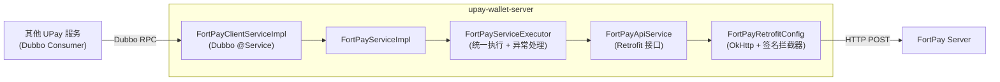
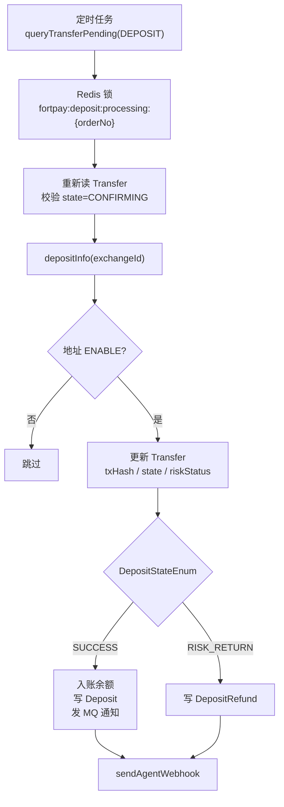
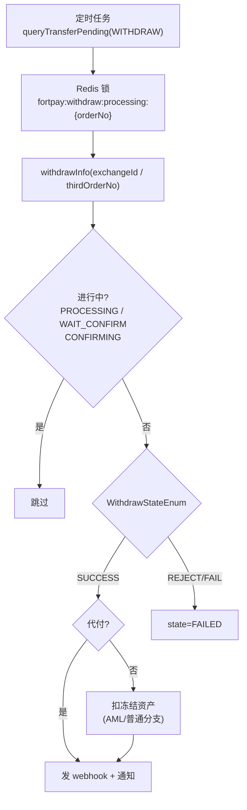
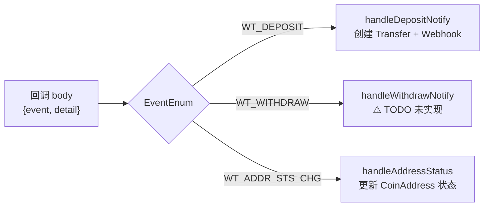

# UPay 集成 FortPay 钱包（upay-wallet-server）

## 1. 文档目标与范围

本文基于 `upay-wallet-server` 现有实现，整理 UPay 对接 FortPay 托管钱包的集成设计，覆盖：
- 对接层架构（Retrofit HTTP 客户端 + Dubbo 服务暴露）
- 充值 / 提现处理流程
- Webhook 回调处理
- 签名鉴权与错误码映射
- AML 风控数据查询

不包含：FortPay 内部实现（见 `05-FortPay钱包模块(fort-wallet-server).md`）、SafeHeron/Cobo 直连流程。

---

## 2. 总体设计

UPay 以 `upay-wallet-server` 为边界，通过 Retrofit HTTP 客户端调用 FortPay REST API，对上通过 Dubbo 接口 `IFortPayClient` 向其他服务暴露能力。

核心结论：
- `IFortPayClient`（wallet-client 模块）：Dubbo 契约，供外部服务调用
- `FortPayClientServiceImpl`：充提币主流程 + Webhook 路由 + 分布式锁，是业务中枢
- `FortPayServiceImpl`：薄封装层，将服务方法翻译为 Retrofit Call 并委托 Executor 执行
- `FortPayServiceExecutor`：统一处理 HTTP 响应、业务错误码转换、IO 异常兜底
- `FortPayRetrofitConfig`：构建 OkHttpClient，注册 `DynamicHeaderInterceptor` 注入签名头

---

## 3. HTTP 客户端与签名

配置前缀 `fortpay.*`（Nacos 下发），含 `baseUrl`、`apiKey`、`debug`。

OkHttpClient 超时：connect=30s，read/write=1min。

每次请求由 `DynamicHeaderInterceptor` 动态注入 4 个签名头：

| Header | 含义 |
|--------|------|
| `X-FORT-APIKEY` | 商户 API Key |
| `X-FORT-REQUESTID` | 请求 ID（通常为订单号，否则 UUID）|
| `X-FORT-TIMESTAMP` | 当前毫秒时间戳 |
| `X-FORT-SIGN` | 签名（**当前为占位符，未实现**）|

`requestId` 经 `ThreadLocal` 在调用链内传递，拦截器读取后立即清除。

**FortPay REST 端点（全部为 POST）：**

| 方法 | 路径 | 说明 |
|------|------|------|
| `createAddress` | `/api/v1/account/wallet/address/create` | 创建收款地址 |
| `depositInfo` | `/api/v1/transaction/deposit/info` | 查询充值详情 |
| `withdrawInfo` | `/api/v1/transaction/withdraw/info` | 查询提现详情 |
| `withdraw` | `/api/v1/transaction/withdraw` | 发起提现 |
| `amlRefundApply` | `/api/v1/transaction/aml/refund/apply` | AML 退款申请 |
| `refundInfo` | `/api/v1/transaction/refund/info` | 退款详情 |
| `accountAssetList` | `/api/v1/account/asset/list` | 商户资产列表 |
| `depositRiskSource` | `/api/v1/deposit/risk/source` | AML 原始风险数据 |
| `riskScore` | `/api/v1/deposit/risk/score` | 地址风险评分 |
| `amlEnter` | `/api/v1/transaction/aml/enter` | AML 入账 |
| `coinInfo` | `/api/v1/coin/info` | 查询币种手续费 |

---

## 4. 充值处理

### 4.1 轮询路径（定时任务触发）

- `Transfer.exchangeId` 存 FortPay 侧订单号，用于轮询查状态
- `RISK_CONTROL` 状态 → `riskCoinStatus=FREEZE`，`riskLevel=SEVERE`，不入账
- 成功后：`depositBalance()` 入账 → `sendDepositToAccountMsg` + `sendMerchantBillSaving`

### 4.2 Webhook 通知路径（`handleDepositNotify`）

- FortPay 推 `WT_DEPOSIT` 事件时触发（**当前无 HTTP 入口，触发路径待确认**）
- Redis 锁 `fortpay:deposit_withdraw:notify:{exchangeOrderNo}` 防重
- 幂等：检查 `Transfer` 是否已存在，否则新建 state=CONFIRMING
- **不入账**，仅通知代理商，等轮询完成最终确认

---

## 5. 提现处理

- `WithdrawPurpose=DEDUCTION`（代付）成功后**不扣**冻结资产
- 资产扣减分支：`assetType=AML` → `subAmlFrozenBalance`，其他 → `subFrozenBalance`
- 成功后统一执行：写 `TransferWalletLog` + `sendAgentWebhook` + `sendWithdrawSuccessMsg` + `sendMerchantBillSaving`

---

## 6. Webhook 回调路由

地址状态映射：FortPay `status >= 3` 统一映射为 `CLOSE_RISK`，其余按枚举匹配。

**错误码映射（`ResCodeConvertEnum`）：**

| FortPay 错误码 | UPay 枚举 | 说明 |
|--------------|----------|------|
| `1100` | `BALANCE_LACK_ERROR` | 余额不足 |
| `10008` | `FP_REFUND_NOT_OPERATE` | 退款不可操作 |
| `10012` | `WITHDRAW_FORTPAY_ERROR` | 提现错误 |
| 其他 | `SERVER_ERROR` | 兜底 |

---

## 7. 当前实现中的设计注意点

1. `generateSign()` 返回硬编码占位符 `"generated-sign-placeholder"`，**签名未实现，生产环境所有请求将被 FortPay 拒绝**。
2. `handleWithdrawNotify()` 为空（仅打日志），提现 Webhook 路径实际未生效。
3. `FortPayController` 仅有 `/v1/fortpay/createAddress` 调试接口，没有接收 FortPay 回调的 HTTP 入口；`depositWithdrawNotify` 的实际触发方式不明。
4. `DynamicHeaderInterceptor` 用 `ThreadLocal` 传 `requestId`，线程池异步场景下会泄漏或丢失。
5. 充值 Webhook 路径只创建 `Transfer` 不入账，依赖后续轮询；若轮询延迟较长，代理商 Webhook 与实际入账时间差较大。

---

## 8. 建议目标态

1. 实现 `generateSign()`，对接 FortPay 官方签名规范（HMAC-SHA256 或约定算法），解除连通性封锁。
2. 增加 `/v1/fortpay/webhook` HTTP 入口，完成验签后路由至 `depositWithdrawNotify()`。
3. 实现 `handleWithdrawNotify()`，与充值侧幂等逻辑对齐。
4. 将 `requestId` 改为方法参数显式传递，消除 `ThreadLocal` 跨线程风险。
5. 补充集成测试：模拟 FortPay 回调 + 轮询，覆盖 SUCCESS / RISK_CONTROL / RISK_RETURN / REJECT 各状态。

---

## 9. 落地清单（实施顺序）

1. 实现签名并验证 FortPay 联调连通性。
2. 新增 Webhook HTTP 入口 + 验签中间件。
3. 补全 `handleWithdrawNotify()` 业务逻辑。
4. 重构 `requestId` 传递方式（去 `ThreadLocal`）。
5. 补充各状态覆盖的集成测试。

---

本文以 `upay-wallet-server` 当前代码实现为基线，描述 UPay 侧对 FortPay 的集成架构，可作为联调排查与后续改造的验收参考。
