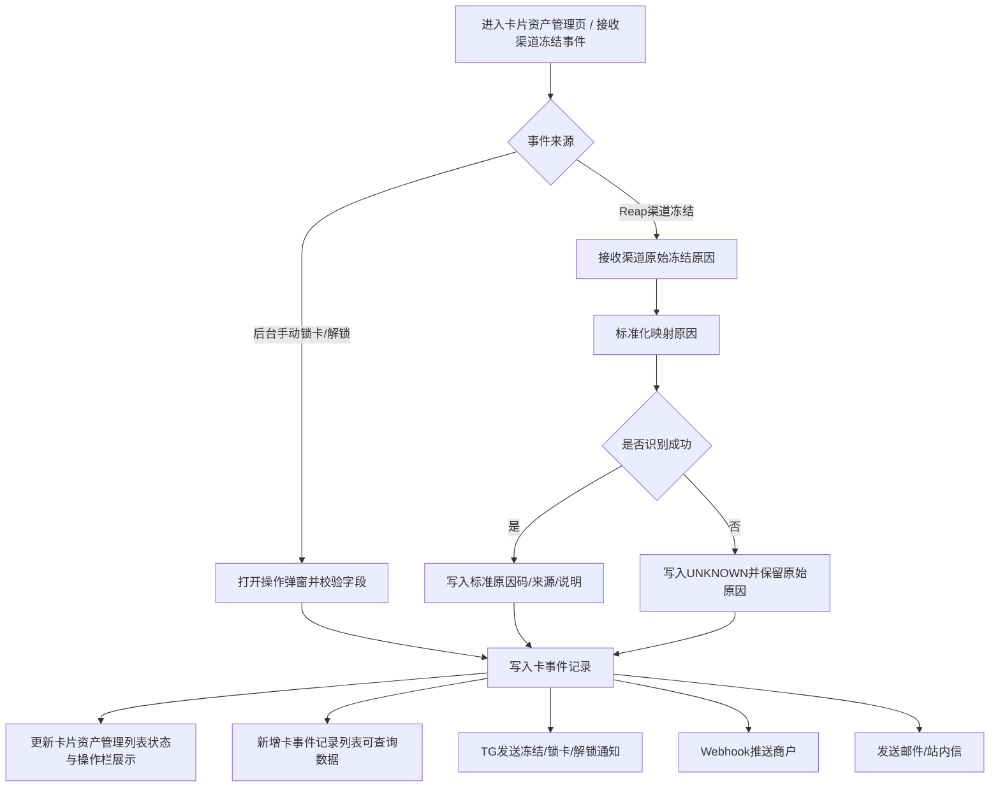
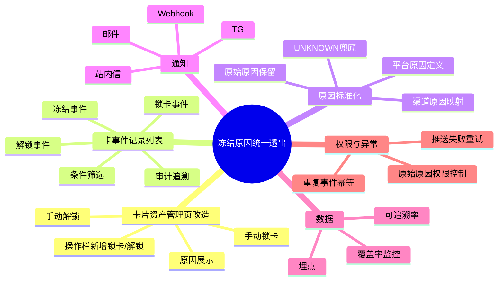

# 卡片冻结/锁卡原因统一透出优化 PRD（合并终稿）

---

# 📌 一、需求背景

## 1.1 业务背景
当前平台已存在“卡片资产管理”页面，用于卡片日常管理，并支持人工锁卡、解锁操作；`Reap` 渠道也已具备返回部分风控冻结原因的能力。但现有系统尚未建立统一的“冻结/锁卡原因接收、存储、展示、通知、对外返回”机制。

现状问题主要体现在：
- 卡片资产管理列表页可执行锁卡、解锁操作，但缺少结构化的原因记录和原因展示能力。
- 平台暂无独立的“卡事件记录列表”，无法对冻结、锁卡、解锁事件进行统一查询和追溯。
- TG 卡事件通知中未透出冻结/锁卡原因。
- API Webhook 未统一返回冻结原因与客户标识，商户无法明确获知原因。
- 用户邮件/站内信未展示冻结/锁卡原因，用户只能感知“卡片不可用”。

造成的影响包括：
- 运营/风控需额外查询交易记录、渠道信息或内部日志，单笔排查链路长，处理效率低。
- API 商户无法准确向终端用户解释卡片状态异常原因，增加沟通成本。
- 终端用户因无法理解冻结或锁卡原因，容易产生咨询、投诉与信任下降。

当前建议补充的基线数据如下，便于上线后复盘：
- 冻结相关客服工单量：待补充
- 单笔冻结原因排查平均耗时：待补充
- API 商户关于冻结原因的咨询量：待补充
- 冻结相关投诉率：待补充

---

## 1.2 用户痛点
- 终端用户在卡片被冻结或锁卡后，只知道卡片无法继续使用，但不知道具体原因，不清楚下一步应该修改支付信息、等待处理还是联系客服。
- API 商户在接收到卡片冻结事件后，只能知道“卡被冻结了”，但无法获取具体原因，难以及时向终端用户解释。
- 运营/风控人员在卡片资产管理或问题排查过程中，无法直接查看完整卡事件和对应原因，必须额外查找记录，处理路径长、效率低。

---

## 1.3 需求来源
来源：运营反馈 + 风控排查场景 + API 商户反馈 + 客服投诉场景 + 渠道能力梳理

---

# 🎯 二、决策

## 2.1 核心策略
建立统一的卡片状态变更原因标准模型，并将原因信息贯通卡片资产管理页、卡事件记录列表、TG 通知、Webhook 和用户通知，实现同一事件多端一致透出。

---

## 2.2 关键假设
1. `Reap` 返回的冻结原因字段稳定，且含义明确可映射为平台标准原因码。
2. 平台后台人工锁卡时，可以要求操作人选择标准原因并填写原因说明。
3. 商户侧能够兼容 Webhook 新增字段，不会影响现有接入。
4. 用户和商户在获得明确原因后，可减少重复咨询和投诉。
5. 历史卡事件允许存在原因缺失场景，本期可通过兜底文案满足上线要求。

---

# 📊 三、目标与指标

## 3.1 业务目标
- 提升卡片冻结/锁卡信息透明度
- 提高运营与风控排查效率
- 增强 API 商户对卡片异常状态的解释和处理能力
- 降低冻结/锁卡相关咨询与投诉成本
- 建立统一的卡事件追溯能力

---

## 3.2 核心指标（KPI）

| 指标名称 | 指标定义 | 计算方式 | 统计周期 | 目标值 |
|---|---|---|---|---|
| 冻结原因透出覆盖率 | 冻结/锁卡事件中成功生成标准原因的占比 | 有 `freeze_reason` 的冻结/锁卡事件数 / 全部冻结/锁卡事件数 | 日/周 | `Reap` 场景 ≥ 99% |
| TG 通知原因完整率 | TG 冻结/锁卡通知中包含原因字段的占比 | 含原因字段的 TG 冻结/锁卡通知数 / 全部 TG 冻结/锁卡通知数 | 日 | 100% |
| Webhook 原因返回完整率 | `card_frozen` Webhook 中返回 `customer_id` 与 `freeze_reason` 的占比 | 含 `customer_id` 和 `freeze_reason` 的 `card_frozen` 事件数 / 全部 `card_frozen` 事件数 | 日 | 100% |
| 冻结原因排查平均时长 | 单笔冻结/锁卡事件完成原因定位的平均耗时 | 原因排查总耗时 / 排查笔数 | 周 | 较现状下降 50% |
| 卡事件可追溯率 | 冻结/锁卡/解锁事件可在卡事件记录列表中查询到的占比 | 可查询事件数 / 全部状态变更事件数 | 日/周 | 100% |

---

# 🌍 四、需求影响范围

- [ ] APP
- [ ] H5
- [ ] Web
- [x] 后端
- [x] 后台
- [x] 第三方系统

说明：
- 本期核心改造范围为后端、后台、TG 通知、Webhook、通知中心及 `Reap` 渠道对接。
- 若站内信需要在 APP/H5/Web 端承载展示，则对应终端需补充联动改造。

---

# 🔄 五、用户流程

## 5.1 核心流程图



主流程说明：
- 现有卡片资产管理页承接人工锁卡、解锁操作。
- `Reap` 渠道冻结事件进入后，统一做原因标准化。
- 所有状态变更事件均写入卡事件记录列表，并同步影响通知与对外返回。

异常流程说明：
- 渠道原因映射失败时，统一写入 `UNKNOWN`。
- 历史原因缺失时，解锁通知展示“暂无法获取”。
- 重复事件按幂等处理，不重复入库、不重复通知。

---

# 🧠 六、功能脑图



---

# 🎨 七、原型描述

## 7.1 原型说明

| 序号 | 页面/模块 | 原型图 | 功能说明 |
|---|---|---|---|
| 1 | 卡片资产管理列表页（现有页改造） | 待补充 | 保持现有页面字段、筛选区和表格结构不变，仅在操作栏增加“锁卡 / 解锁”入口 |
| 2 | 锁卡弹窗 | 待补充 | 在现有页面操作栏点击“锁卡”后弹出，操作人选择标准原因并填写原因说明，提交前做必填和字数校验 |
| 3 | 解锁弹窗 | 待补充 | 在现有页面操作栏点击“解锁”后弹出，展示原锁卡/冻结原因，并支持填写解锁说明 |
| 4 | 卡事件记录列表（新增） | 待补充 | 新增独立列表页，统一查询冻结、锁卡、解锁事件及原因，样式沿用现有后台表格风格 |
| 5 | TG 模板-卡冻结通知 | 待补充 | 在 PRD 中展示文字样式示例，增加“原因码 + 原因说明”字段 |
| 6 | TG 模板-卡锁卡通知 | 待补充 | 在 PRD 中展示文字样式示例，增加“原因码 + 原因说明”字段，人工操作时展示操作人 |
| 7 | TG 模板-卡解锁通知 | 待补充 | 在 PRD 中展示文字样式示例，展示“原冻结/锁卡原因” |
| 8 | 用户通知模板-邮件 / 站内信 | 待补充 | 在 PRD 中保留样式与文案示例，不在 HTML 原型中单独输出 |

### 7.1.1 卡片资产管理列表页（现有页改造）

页面定位：
- 沿用现有“卡片资产管理”页面作为卡片人工操作主入口。
- 页面整体样式、颜色、筛选区结构、表格风格与当前后台保持一致，不做重新设计。
- 本期仅在操作栏增加“锁卡 / 解锁”弹窗入口，不调整现有列表字段结构。

现有页面字段沿用不变：
- 用户UID、所属代理商、用户标签、Broker Card ID、卡名称、资金类型、卡状态、卡号、卡ID、卡唯一ID、渠道卡ID、创建日期、更新时间、渠道ID、渠道名称、实/虚卡、Broker客户编号、渠道客户编号、卡模式、卡渠道资金、可用余额、冻结金额、消费手续费余额、显示卡余额、可消费金额(USD)、管理费收取方式、代理商管理费、免管理费管理、新卡减免、申请日期、操作栏。

操作规则：
- 保持现有“详情 / 更新数据”等操作不变。
- 卡状态为 `Active` 时，操作栏展示“锁卡”。
- 卡状态为 `Locked` 或 `Frozen` 时，操作栏展示“解锁”。
- 锁卡或解锁成功后，列表按现有刷新机制刷新状态字段和操作栏展示。
- 本页不新增“最近事件原因”类字段，冻结/锁卡原因的查询统一在新增“卡事件记录列表”中查看。

### 7.1.2 卡事件记录列表（新增）

页面定位：
- 新增“卡事件记录列表”页面，统一承接卡片冻结、锁卡、解锁事件查询。
- 用于运营、风控审计追溯和问题排查。
- 页面样式建议沿用当前后台的筛选区、工具栏和表格样式，与“卡片资产管理”页保持一致。

建议菜单路径：
- 卡管理 > 卡事件记录

列表字段：

| 字段 | 必填 | 说明 |
|---|---|---|
| 事件时间 | 是 | 默认倒序展示 |
| 事件类型 | 是 | 冻结 / 锁卡 / 解锁 |
| 卡号尾号 | 是 | 卡片识别信息 |
| 用户ID | 是 | 用户标识 |
| 渠道 | 是 | 如 `Reap` |
| 事件后卡状态 | 是 | `Active / Locked / Frozen` |
| 原因码 | 条件必填 | 冻结/锁卡时必有 |
| 原因说明 | 条件必填 | 冻结/锁卡时必有 |
| 原因来源 | 条件必填 | `CHANNEL / PLATFORM / UNKNOWN` |
| 发起方 | 是 | `Reap / UPay后台 / 风控系统` |
| 操作人 | 条件展示 | 仅人工操作时展示 |
| 原因备注 | 条件展示 | 人工冻结/锁卡时展示后台备注 |
| 解锁说明 | 条件展示 | 解锁场景展示 |
| 原始原因值 | 权限控制 | 仅有权限角色可查看 |

筛选条件：
- 时间范围
- 卡号尾号
- 用户ID
- 渠道
- 事件类型
- 原因码
- 原因来源
- 发起方
- 操作人

### 7.1.3 人工状态变更弹窗规则

说明：
- 当前卡片资产管理页仅需要新增“锁卡”与“解锁”弹窗。
- 渠道冻结属于系统自动事件，不通过本页人工发起，因此本页原型中不单独设计人工冻结弹窗。
- 用户通知和商户 Webhook 对外透出的仍为标准原因码和标准原因说明，不透出操作人填写的自由文本备注。

锁卡弹窗字段：

| 字段 | 类型 | 必填 | 规则 |
|---|---|---|---|
| 卡号尾号 | 文本 | 是 | 只读展示 |
| 卡ID | 文本 | 是 | 只读展示 |
| 当前状态 | 文本 | 是 | 只读展示 |
| 原因类型 | 下拉单选 | 是 | 当前平台原因支持 `UPay_Risk_Transaction`；后续可扩展 |
| 原因说明 | 多行文本 | 是 | 1-100 个字符，去除首尾空格后校验，不支持纯空格 |
| 操作确认 | 按钮 | 是 | 校验通过后可提交 |

交互校验：
- 输入框下方展示字数计数，如 `0/100`
- 超过 100 字不可提交，并提示“原因说明最多输入100个字符”
- 未填写时点击提交，提示“请输入原因说明”
- 前后端均需校验，防止绕过前端限制

解锁弹窗字段：

| 字段 | 类型 | 必填 | 规则 |
|---|---|---|---|
| 卡号尾号 | 文本 | 是 | 只读展示 |
| 卡ID | 文本 | 是 | 只读展示 |
| 当前状态 | 文本 | 是 | 只读展示 |
| 原冻结/锁卡原因 | 文本 | 否 | 只读展示，查无数据则显示“暂无法获取” |
| 解锁说明 | 多行文本 | 否 | 0-100 个字符，超出不可提交 |
| 操作确认 | 按钮 | 是 | 提交后执行解锁 |

补充说明：
- 弹窗风格需遵循当前后台系统弹窗样式，不做独立视觉风格设计。
- 若最终 UI 不区分“原因类型”和“原因说明”，而是仅保留一个“原因”输入框，则该字段仍按“必填、1-100 字、不支持纯空格”的规则处理。

### 7.1.4 通知模板样式示例

#### 1. TG 通知模板

样式规则：
- 标题单独一行，使用 `【】`
- 每个字段单独一行，顺序固定
- 原因码与原因说明分两行展示
- 人工操作场景增加“操作人”
- 解锁通知展示“原冻结/锁卡原因”

冻结通知示例：

```text
【卡冻结通知】
卡号尾号：2709
时间：2026-03-29 08:02:31 (UTC+4)
用户ID：1949395882457579521
渠道：Reap
发起方：Reap
原因码：SUSPECTED_FRAUD_CVV
原因说明：1小时内连续3次 CVV 输入错误
```

锁卡通知示例：

```text
【卡锁定通知】
卡号尾号：7002
时间：2026-03-29 08:09:23 (UTC+4)
用户ID：2015761546103136257
渠道：Reap
发起方：UPay后台
操作人：Luke
原因码：UPay_Risk_Transaction
原因说明：因检测到风险交易，卡片已被临时锁定
```

解锁通知示例：

```text
【卡解锁通知】
卡号尾号：7002
时间：2026-03-29 09:15:08 (UTC+4)
用户ID：2015761546103136257
渠道：Reap
发起方：UPay后台
操作人：Luke
原冻结/锁卡原因：UPay_Risk_Transaction
解锁说明：人工审核通过，恢复使用
```

#### 2. 邮件通知模板

样式建议：

| 模块 | 样式建议 |
|---|---|
| 容器 | 居中卡片布局，宽度 600px，白底，圆角 12px，边框 `#E5E7EB`，内边距 24px |
| 标题 | 20px，加粗，颜色 `#111827` |
| 正文 | 14px，颜色 `#374151`，行高 22px |
| 状态标签 | 已冻结：文字 `#DC2626`，底色 `#FEE2E2`；已锁卡：文字 `#D97706`，底色 `#FEF3C7`；已解锁：文字 `#16A34A`，底色 `#DCFCE7` |
| 原因区块 | 单独高亮展示，浅色背景，左侧强调色边条 |
| 辅助说明 | 12px，颜色 `#6B7280` |

冻结邮件样式示例：

```text
┌────────────────────────────────────────────┐
│ [已冻结] 卡片冻结通知                       │
│                                            │
│ 您的卡片（尾号 2709）已于                   │
│ 2026-03-29 08:02:31 被冻结。               │
│                                            │
│ 原因说明                                   │
│ 1小时内连续3次 CVV 输入错误                 │
│                                            │
│ 原因码：SUSPECTED_FRAUD_CVV                │
│                                            │
│ 如非本人操作或需要帮助，请联系客服处理。      │
└────────────────────────────────────────────┘
```

锁卡邮件样式示例：

```text
┌────────────────────────────────────────────┐
│ [已锁卡] 卡片锁定通知                       │
│                                            │
│ 您的卡片（尾号 7002）已于                   │
│ 2026-03-29 08:09:23 被临时锁定。            │
│                                            │
│ 原因说明                                   │
│ 因检测到风险交易，卡片已被临时锁定           │
│                                            │
│ 原因码：UPay_Risk_Transaction              │
│                                            │
│ 如需进一步协助，请联系客服处理。             │
└────────────────────────────────────────────┘
```

解锁邮件样式示例：

```text
┌────────────────────────────────────────────┐
│ [已解锁] 卡片恢复通知                       │
│                                            │
│ 您的卡片（尾号 7002）已于                   │
│ 2026-03-29 09:15:08 恢复使用。              │
│                                            │
│ 原冻结/锁卡原因：UPay_Risk_Transaction      │
│                                            │
│ 如有疑问，请联系客服处理。                   │
└────────────────────────────────────────────┘
```

#### 3. 站内信模板

样式建议：

| 模块 | 样式建议 |
|---|---|
| 外层容器 | 白底卡片，圆角 12px，阴影轻量，边距 16px |
| 标题 | 16px，加粗，标题右侧可加状态标签 |
| 正文 | 14px，颜色 `#374151` |
| 原因区块 | 单独高亮，优先展示原因说明，再展示原因码 |
| 时间信息 | 12px，颜色 `#6B7280`，置于底部 |

冻结站内信示例：

```text
标题：[已冻结] 卡片冻结通知

正文：
您的卡片（尾号 2709）已被冻结。
原因说明：1小时内连续3次 CVV 输入错误
原因码：SUSPECTED_FRAUD_CVV
时间：2026-03-29 08:02:31
```

锁卡站内信示例：

```text
标题：[已锁卡] 卡片锁定通知

正文：
您的卡片（尾号 7002）已被临时锁定。
原因说明：因检测到风险交易，卡片已被临时锁定
原因码：UPay_Risk_Transaction
时间：2026-03-29 08:09:23
```

解锁站内信示例：

```text
标题：[已解锁] 卡片恢复通知

正文：
您的卡片（尾号 7002）已恢复使用。
原冻结/锁卡原因：UPay_Risk_Transaction
时间：2026-03-29 09:15:08
```

## 7.2 原型链接
仓库内原型文件：[卡片冻结优化_原型.html](./卡片冻结优化_原型.html)

建议使用本地浏览器直接打开查看交互。

当前 HTML 原型覆盖现有“卡片资产管理”页面的锁卡 / 解锁弹窗，以及新增“卡事件记录列表”页面；通知模板样式保留在本 PRD 中描述，不在 HTML 中单独展示。

---

## 7.3 UI 图链接
待补充

---

# 🔌 八、接口与数据

## 8.1 接口清单

| 接口名称 | 类型 | 请求方 | 说明 | 备注 |
|---|---|---|---|---|
| 卡片资产管理列表查询接口 | 复用/微调 | `后台前端 -> UPay后端` | 沿用现有列表查询能力；如有必要，仅根据当前卡状态控制操作栏“锁卡 / 解锁”显隐 | 不新增列表字段 |
| 后台人工状态变更接口 | 修改 | `后台前端 -> UPay后端` | 支持锁卡、解锁，新增原因字段和字数校验 | 前后端均校验 |
| 卡事件记录列表查询接口 | 新增 | `后台前端 -> UPay后端` | 查询冻结、锁卡、解锁事件及原因信息 | 新增页面 |
| 渠道冻结事件接收接口 | 修改 | `Reap -> UPay后端` | 接收渠道返回的冻结原因原值并做标准化 | 一期仅支持 `Reap` |
| TG 卡事件通知服务 | 修改 | `卡事件中心 -> TG Bot` | 冻结/锁卡/解锁通知新增原因字段 | 解锁展示原原因 |
| 商户 Webhook：`card_frozen` | 修改 | `UPay后端 -> API商户` | 新增 `customer_id`、`freeze_reason` | 建议同步增加 `freeze_reason_source` |
| 用户通知模板渲染接口 | 修改 | `UPay后端 -> 通知中心` | 根据标准原因码渲染邮件/站内信文案 | 用户侧优先展示中文说明 |
| 原因码映射配置 | 新增 | `后端内部` | 维护渠道原始原因与标准原因码映射 | 便于后续扩展其他渠道 |

---

## 8.2 数据字段

| 字段名 | 类型 | 含义 | 必填 | 备注 |
|---|---|---|---|---|
| `card_id` | string | 卡片 ID | 是 | 全链路主标识 |
| `card_last_four` | string | 卡号尾号 | 是 | 页面和通知展示 |
| `user_id` | string | 用户 ID | 是 | 后台与通知使用 |
| `customer_id` | string | 客户 ID | Webhook 必填 | 一期要求新增到 Webhook |
| `event` | string | 事件名称 | 条件必填 | 如 `card_frozen` |
| `event_type` | string | 事件类型 | 是 | `frozen / locked / unlocked` |
| `card_status` | string | 事件后的卡状态 | 是 | `Active / Locked / Frozen` |
| `freeze_reason` | string | 标准冻结/锁卡原因码 | 冻结/锁卡时必填 | 对外统一返回 |
| `freeze_reason_source` | string | 原因来源 | 冻结/锁卡时建议必填 | `CHANNEL / PLATFORM / UNKNOWN` |
| `freeze_reason_raw` | string | 渠道原始原因值 | 条件必填 | 仅后台权限角色可见 |
| `freeze_reason_desc` | string | 标准原因说明 | 冻结/锁卡时必填 | 用于后台、TG、用户通知展示 |
| `initiator` | string | 发起方 | 是 | `Reap / UPay后台 / 风控系统` |
| `operator` | string | 操作人 | 条件必填 | 仅人工操作场景有值 |
| `reason_remark` | string | 人工锁卡原因说明 | 人工锁卡时必填 | 1-100 字，仅后台审计使用 |
| `unlock_remark` | string | 解锁说明 | 否 | 0-100 字 |
| `original_freeze_reason` | string | 原冻结/锁卡原因 | 解锁场景条件必填 | 解锁通知透出 |
| `channel` | string | 卡渠道 | 是 | 一期主要为 `Reap` |
| `timestamp` | datetime | 事件时间 | 是 | Webhook 使用 UTC |

标准原因码范围：

| 原因码 | 含义 | 来源 |
|---|---|---|
| `SUSPECTED_FRAUD_CVV` | 1 小时内连续 3 次 CVV 输入错误 | `CHANNEL` |
| `SUSPECTED_FRAUD_EXPIRY` | 1 小时内连续 3 次有效期输入错误 | `CHANNEL` |
| `SUSPECTED_FRAUD_PIN` | 连续 3 次交易 PIN 输入错误 | `CHANNEL` |
| `UPay_Risk_Transaction` | 平台识别到风险交易 | `PLATFORM` |
| `UNKNOWN` | 无法识别或暂无法获取具体原因 | `UNKNOWN` |

Webhook 示例：

```json
{
  "event": "card_frozen",
  "card_id": "xxx",
  "customer_id": "xxxx",
  "freeze_reason": "SUSPECTED_FRAUD_CVV",
  "freeze_reason_source": "CHANNEL",
  "timestamp": "2026-03-29T08:02:31Z"
}
```

---

# ⚠️ 九、异常处理

## 9.1 网络异常
- 场景：`Reap` 回调超时或网络中断
  处理方式：依赖渠道重试机制，并由平台补偿任务兜底；状态未确认前不发送用户通知。
- 场景：TG 通知发送超时
  处理方式：进入重试队列，失败后告警，不影响卡状态主流程。
- 场景：Webhook 推送超时
  处理方式：按现有重试机制补发，不影响卡状态更新。
- 场景：邮件/站内信发送超时
  处理方式：通知中心重试，失败后记录日志并告警。

---

## 9.2 服务端异常
- 场景：渠道返回冻结成功但原因字段为空
  处理方式：标准化为 `UNKNOWN`，状态照常更新，通知使用兜底文案。
- 场景：原因映射失败
  处理方式：写入 `UNKNOWN` 并保留 `freeze_reason_raw`，同时触发监控告警。
- 场景：写入卡事件记录失败
  处理方式：卡状态主流程失败回滚或进入补偿队列，避免状态变更与事件记录不一致。
- 场景：通知模板渲染失败
  处理方式：不阻塞卡状态主流程，进入失败重试队列。
- 场景：解锁时查不到历史冻结/锁卡原因
  处理方式：允许正常解锁，通知中展示“暂无法获取”。

---

## 9.3 边界条件
- 场景：同一卡片重复收到相同冻结事件
  处理方式：按事件唯一键幂等处理，不重复入库、不重复通知。
- 场景：人工冻结/锁卡时原因说明为空
  处理方式：禁止提交，并提示“请输入原因说明”。
- 场景：人工冻结/锁卡时原因说明超过 100 字
  处理方式：禁止提交，并提示“原因说明最多输入100个字符”。
- 场景：人工冻结/锁卡时原因说明仅输入空格
  处理方式：视为未填写，不允许提交。
- 场景：历史冻结记录无原因信息
  处理方式：后台与通知统一展示“暂无法获取”。
- 场景：非 `Reap` 渠道发生冻结
  处理方式：本期不做渠道原因透出，按现有流程处理，可统一落 `UNKNOWN`。
- 场景：冻结、锁卡、解锁状态定义不清
  处理方式：事件入库时必须明确 `event_type`，避免文案错配。

---

## 9.4 权限异常
- 场景：无风控权限账号查看卡事件
  处理方式：可查看标准原因码与说明，不可查看 `freeze_reason_raw`。
- 场景：无操作权限账号发起锁卡/解锁
  处理方式：按现有权限体系拦截。
- 场景：商户查询非本商户卡片数据
  处理方式：不返回数据，沿用现有鉴权逻辑。
- 场景：用户关闭部分通知权限
  处理方式：卡状态照常处理，按可用通知渠道下发并记录发送结果。

---

# 📈 十、埋点与指标

## 10.1 埋点说明
- 事件名：`card_manual_status_change_submit`
  触发时机：后台人工锁卡或解锁点击提交时触发
  参数：`card_id`、`event_type`、`operator_id`、`reason_type`、`submit_result`

- 事件名：`freeze_reason_standardized`
  触发时机：渠道冻结事件完成原因标准化后触发
  参数：`card_id`、`channel`、`event_type`、`freeze_reason`、`freeze_reason_source`、`mapping_result`

- 事件名：`card_event_record_search`
  触发时机：进入卡事件记录列表并发起查询时触发
  参数：`operator_id`、`filter_event_type`、`filter_reason_code`、`filter_channel`

- 事件名：`card_notice_tg_sent`
  触发时机：TG 通知发送后触发
  参数：`event_type`、`freeze_reason`、`send_result`

- 事件名：`card_frozen_webhook_sent`
  触发时机：`card_frozen` Webhook 发送后触发
  参数：`merchant_id`、`card_id`、`freeze_reason`、`send_result`

- 事件名：`card_notice_user_sent`
  触发时机：邮件/站内信发送后触发
  参数：`notice_channel`、`event_type`、`freeze_reason`、`send_result`

---

## 10.4 埋点参数表

| 事件名 | 参数名 | 参数说明 |
|---|---|---|
| `card_manual_status_change_submit` | `card_id` | 卡片 ID |
| `card_manual_status_change_submit` | `event_type` | 操作类型，`locked / unlocked` |
| `card_manual_status_change_submit` | `operator_id` | 操作人 ID |
| `card_manual_status_change_submit` | `reason_type` | 标准原因码 |
| `card_manual_status_change_submit` | `submit_result` | 提交结果 |
| `freeze_reason_standardized` | `card_id` | 卡片 ID |
| `freeze_reason_standardized` | `channel` | 卡渠道 |
| `freeze_reason_standardized` | `event_type` | 事件类型 |
| `freeze_reason_standardized` | `freeze_reason` | 标准原因码 |
| `freeze_reason_standardized` | `freeze_reason_source` | 原因来源 |
| `freeze_reason_standardized` | `mapping_result` | 映射结果，`success / unknown` |
| `card_event_record_search` | `filter_event_type` | 事件类型筛选条件 |
| `card_event_record_search` | `filter_reason_code` | 原因码筛选条件 |
| `card_notice_tg_sent` | `send_result` | TG 发送结果 |
| `card_frozen_webhook_sent` | `merchant_id` | 商户 ID |
| `card_frozen_webhook_sent` | `send_result` | Webhook 发送结果 |
| `card_notice_user_sent` | `notice_channel` | 通知渠道 |
| `card_notice_user_sent` | `send_result` | 用户通知发送结果 |

---

# 🧪 十一、测试用例

## 11.1 功能测试

| 用例ID | 场景 | 预期结果 |
|---|---|---|
| FT-01 | 卡片资产管理列表页展示现有字段 | 页面字段、筛选区和表格结构与现网保持一致，操作栏新增“锁卡 / 解锁”入口 |
| FT-02 | 在卡片资产管理页点击锁卡 | 成功弹出锁卡弹窗，字段展示完整 |
| FT-03 | 锁卡弹窗中原因说明为空 | 不允许提交，并提示必填 |
| FT-04 | 锁卡弹窗中原因说明超过 100 字 | 不允许提交，并提示超出字数限制 |
| FT-05 | 锁卡弹窗中原因说明仅空格 | 不允许提交，并提示必填 |
| FT-06 | 解锁弹窗可展示原冻结/锁卡原因 | 有历史记录时正确展示；无历史记录时展示“暂无法获取” |
| FT-07 | 解锁成功后生成卡事件记录 | 卡事件记录列表新增一条解锁记录 |
| FT-08 | `Reap` 返回 `SUSPECTED_FRAUD_CVV` | 后台、TG、Webhook、用户通知均展示正确原因 |
| FT-09 | `Reap` 返回 `SUSPECTED_FRAUD_EXPIRY` | 标准化成功，所有触点展示一致 |
| FT-10 | `Reap` 返回 `SUSPECTED_FRAUD_PIN` | 标准化成功，所有触点展示一致 |
| FT-11 | 后台人工锁卡并选择 `UPay_Risk_Transaction` | 锁卡成功，后台、TG、用户通知均展示平台原因 |
| FT-12 | 渠道返回未知原因值 | 系统写入 `UNKNOWN`，保留原始原因，通知使用兜底文案 |
| FT-13 | 卡事件记录列表按原因码筛选 | 可正确筛出目标记录 |
| FT-14 | 卡事件记录列表按事件类型筛选 | 可正确筛出冻结/锁卡/解锁记录 |
| FT-15 | `card_frozen` Webhook 推送 | 正确返回 `event / card_id / customer_id / freeze_reason / timestamp` |
| FT-16 | 冻结事件重复回调 | 系统幂等处理，不重复通知、不重复入库 |

---

## 11.2 兼容性测试
- 后台页面：Chrome、Edge 最新 2 个版本下字段展示、筛选、弹窗校验正常。
- 邮件通知：主流邮件客户端下变量渲染、样式、换行正常。
- 商户 Webhook：新增字段不影响旧字段解析、验签与重试机制。
- 如站内信需端内承载，需补测 APP/H5/Web 的时间格式、字段长度和文案换行展示。

---

## 11.3 回归测试
- 卡片资产管理页原有列表查询、锁卡、解锁能力不受影响。
- 其他卡类 TG 通知模板不受影响。
- Webhook 原有字段、重试机制、签名逻辑不受影响。
- 后台查询接口性能无明显退化。
- 通知中心其他邮件/站内信模板不受本次改造影响。

---

# ✅ 十二、验收标准

## 12.1 功能完整性
- 现有“卡片资产管理”列表页保持现有字段与布局不变，操作栏新增“锁卡 / 解锁”入口。
- 系统新增“卡事件记录列表”页面，可查询冻结、锁卡、解锁事件及原因信息。
- `Reap` 返回的 3 类冻结原因均可被系统正确接收、标准化、存储和展示。
- TG 冻结/锁卡通知均新增原因码和原因说明字段；解锁通知可展示原冻结/锁卡原因。
- `card_frozen` Webhook 成功返回 `customer_id` 与 `freeze_reason`。
- 用户邮件/站内信可展示冻结/锁卡原因说明。
- 人工冻结/锁卡弹窗中的原因说明字段具备必填和字数限制校验。

---

## 12.2 性能要求
- 卡状态更新成功后，TG、Webhook、用户通知发出时延不超过 60 秒。
- 后台卡事件相关查询接口 `P95` 响应时间不高于现网基线的 110%。
- 原因标准化处理不阻塞卡状态主流程。

---

## 12.3 兼容性
- 后台页面兼容 Chrome、Edge 最新 2 个版本。
- 邮件模板在主流邮件客户端中展示正常。
- 如涉及站内信展示，需覆盖现网支持的 APP/H5/Web 终端。

---

## 12.4 数据准确性
- 抽样核验 100 笔 `Reap` 冻结事件，标准原因码映射准确率为 100%。
- `card_frozen` Webhook 中 `customer_id`、`freeze_reason` 返回完整率为 100%。
- 卡事件记录列表中的事件数量与状态变更业务日志一致，偏差不超过 2%。

---

## 12.5 异常处理
- 未识别原因、历史原因缺失、重复回调、发送失败、权限不足、字数超限等场景均有明确处理结果。
- 任一通知链路失败不影响卡状态主流程。
- 失败场景均支持追踪、补偿或告警。
